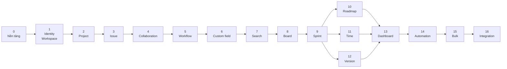

# Roadmap

Mười bảy phase, thứ tự do **phụ thuộc kỹ thuật** quyết định chứ không do độ khó
hay mức độ hấp dẫn. Mỗi phase làm **đầy đủ** rồi mới sang phase kế tiếp.

Trạng thái tiến độ không nằm ở đây mà nằm ở [feature catalog](README.md), để
tránh hai chỗ lệch nhau.

**Liên quan:** [Feature catalog](README.md) · [Brief](../01-brief/) · [functional.md](../02-requirement/functional.md) · [System Design](../04-system-design/)

---

## Tổng quan

| Phase | Tên | Vì sao ở vị trí này |
|---|---|---|
| 0 | Nền tảng | Local-first và realtime là kiến trúc, không bổ sung sau được |
| 1 | Identity & Workspace | Mọi dữ liệu đều thuộc về một workspace và một người |
| 2 | Project | Ranh giới tổ chức công việc và là scope đồng bộ thứ hai |
| 3 | Issue | Hạt nhân nghiệp vụ |
| 4 | Collaboration | Cần issue tồn tại trước |
| 5 | Workflow | Thay trạng thái cố định của Phase 3 bằng trạng thái động |
| 6 | Custom field | Cần cơ chế trường động cắm vào issue đã có |
| 7 | Search | Truy vấn phải bao gồm trường tuỳ biến, nên phải sau Phase 6 |
| 8 | Board | Board xác định phạm vi bằng truy vấn, nên phải sau Phase 7 |
| 9 | Sprint | Dựng trên board và backlog |
| 10–12 | Roadmap, Time, Version | Ba nhánh độc lập nhau, làm được song song |
| 13 | Dashboard | Tổng hợp dữ liệu của mọi phase trước |
| 14 | Automation | Cần đủ loại sự kiện và đủ loại hành động để có ý nghĩa |
| 15 | Bulk & import | Cần mô hình dữ liệu đã ổn định |
| 16 | Integration | Cần API nội bộ đã ổn định trước khi công khai |

---

## Phase 0 — Nền tảng

**Mục tiêu:** dựng toàn bộ hạ tầng mà local-first và realtime đòi hỏi, và chứng
minh nó chạy đúng trước khi có bất kỳ nghiệp vụ nào.

Đây là phase nặng nhất, ước tính **30–40% công sức của cả dự án**. Đó là hệ quả
đã được chấp nhận có ý thức ([Brief](../01-brief/)).

### Phạm vi

| Nhóm | Nội dung |
|---|---|
| Cấu trúc | Chốt phiên bản nền, khung package, Gradle multi-module, cấu trúc bốn thư mục, quy ước đặt tên và tổ chức code |
| Nhiều vai trò ứng dụng | Bốn profile, cấu hình connection pool riêng, khởi động đúng bean theo vai trò |
| Biên giới module | Công cụ kiểm tra tự động cho luật 1; **cơ chế riêng** cho luật 2 (tiền tố tên bảng và test quét); test chặn thư viện bị cấm trên classpath |
| Truy cập dữ liệu | Spring Data JDBC, jOOQ, `JdbcClient`, converter kiểu JSON, migration hai chiều |
| Tenancy | Context workspace, biến phiên theo giao dịch, bảo mật mức dòng, test bất biến schema |
| Outbox | Bảng chuyển tiếp, tiến trình chuyển tiếp với khoá dòng, đánh thức bằng thông báo, thử lại, thư chết, chống trùng, công cụ phát lại |
| Sự kiện | Định nghĩa domain event, phiên bản, đăng ký bên tiêu thụ, lần vết xuyên ranh giới bất đồng bộ |
| Sync — server | Nhật ký thay đổi, cấp số thứ tự, endpoint bắt kịp, bootstrap, phân quyền theo scope |
| Sync — realtime | Luồng SSE, xác thực, nhịp tim, nối lại và tiếp tục, phát tán qua Redis |
| Sync — client | SharedWorker, bản sao cục bộ chuẩn hoá, truy vấn phản ứng, hàng đợi mutation bền, hoàn tác, rebase, trạng thái offline |
| Redis | Trừu tượng hoá cache, khoá, giới hạn tần suất |
| Quan sát | Nhật ký có cấu trúc, định danh tương quan, chỉ số hàng đợi và kết nối |
| Hạ tầng | Docker Compose, Dockerfile, cấu hình máy chủ trung gian đã tắt đệm |
| Kiểm thử | Testcontainers, bộ test cho outbox và cho sync engine |

### Cách kiểm chứng

Dựng một thực thể nháp không mang ý nghĩa nghiệp vụ và cho nó đi **hết vòng**:

1. Tạo khi **đang offline** → hiện ngay trên giao diện
2. Có mạng trở lại → mutation được gửi, server chấp nhận
3. Ghi nghiệp vụ, nhật ký thay đổi và bản ghi sự kiện nằm trong **một giao dịch**
4. Tiến trình chuyển tiếp phát tán → tab thứ hai nhận được và cập nhật
5. **Tắt server giữa chừng, bật lại** → không mất thay đổi nào, client tự bắt kịp
6. Thu hồi quyền → dữ liệu cục bộ của scope bị xoá sạch
7. Xoá dữ liệu lưu trữ của trình duyệt → ứng dụng tải lại từ đầu, không hỏng

Đạt đủ bảy bước thì xoá thực thể nháp và bắt đầu Phase 1.

### Definition of Done

- Bảy bước kiểm chứng ở trên đều đạt
- Vi phạm biên giới module làm hỏng build
- Truy cập bảng của module khác bị test bắt — công cụ sẵn có **không** bắt được việc này
- Thư viện bị cấm xuất hiện trên classpath làm hỏng build
- Test bất biến schema chạy và bắt được vi phạm cố ý
- Bộ test outbox phủ: crash giữa chừng, thử lại, thư chết, chống trùng, thứ tự theo aggregate
- Bộ test sync phủ toàn bộ bảng kịch bản ở [testing-strategy.md](../04-system-design/testing-strategy.md)
- Chạy được toàn bộ môi trường phát triển bằng một lệnh

### Rủi ro

| Rủi ro | Giảm thiểu |
|---|---|
| Phase kéo dài, mất động lực vì chưa thấy gì | Bảy bước kiểm chứng là mốc cụ thể, đạt được từng bước một |
| Cấp số thứ tự theo scope gây tranh chấp khoá | Đo ngay từ đầu; phương án thay thế phải được thiết kế sẵn trên giấy |
| Kết nối lắng nghe thông báo bị pool thu hồi | Đã biết trước; dùng kết nối riêng ngoài pool, có chu kỳ quét dự phòng |
| Thiếu hỗ trợ SharedWorker | Làm phương án bầu tab chủ ngay trong phase này, không để sau |
| Khung package không khớp cách công cụ nhận diện module, build vẫn xanh trong khi không kiểm tra gì | Chốt khung package trước khi viết dòng code đầu tiên; test kiểm tra biên giới phải in ra danh sách module nhận diện được |

### Cố tình không làm

Không có nghiệp vụ nào. Không giao diện thật ngoài màn hình kiểm chứng.

---

## Phase 1 — Identity & Workspace

**Mục tiêu:** người dùng đăng nhập được, tạo được workspace, mời được người khác,
và hệ thống phân quyền hoạt động đầy đủ.

### Phạm vi

| Nhóm | Nội dung |
|---|---|
| Magic link | Gửi, liên kết kèm mã 6 số, dùng một lần, thời hạn, ràng buộc thiết bị, giới hạn tần suất, chống dò email |
| Phiên | Cấp, làm mới có xoay vòng, danh sách phiên, thu hồi từng phiên hoặc tất cả |
| Tài khoản | Onboarding, thông tin mặc định, xoá tài khoản kèm ẩn danh hoá |
| Workspace | Tạo, slug, cấu hình, xoá mềm kèm ân hạn, khôi phục |
| Member | Hồ sơ riêng theo workspace, trạng thái, vô hiệu hoá |
| Invite | Mời nhiều email, đủ mọi nhánh xử lý, gửi lại, thu hồi, giới hạn số lượng |
| Vai trò | Bốn vai trò mặc định gồm cả GUEST, đổi vai trò, chuyển quyền sở hữu |
| Group | Tạo group, gán thành viên, cấp quyền theo group |
| Phân quyền | Mặt nạ bit hai cấp, cache và xoá cache, **chỗ nối cho permission condition** |
| Sync | Scope workspace, danh bạ thành viên đồng bộ xuống client, xử lý thu hồi quyền |
| Kiểm toán | Ghi nhận mọi hành động liên quan tới quyền |

### Definition of Done

- Mọi nhánh trong [uc-01-auth.md](usecases/uc-01-auth.md),
  [uc-02-workspace.md](usecases/uc-02-workspace.md) và
  [uc-03-member-invite.md](usecases/uc-03-member-invite.md) đều chạy đúng và có test
- Người bị xoá khỏi workspace mất quyền **ngay**, dữ liệu cục bộ bị xoá
- GUEST không thấy được thứ không được phép thấy, kiểm chứng bằng test
- Ô chọn người hoạt động **hoàn toàn cục bộ**, kể cả khi offline
- Test rò rỉ dữ liệu xuyên workspace chạy trên mọi endpoint

### Rủi ro

| Rủi ro | Giảm thiểu |
|---|---|
| Chỗ nối cho permission condition bị bỏ qua vì "chưa cần" | Ghi thành mục bắt buộc trong Definition of Done |
| Email vào thư rác, không ai đăng nhập được | Coi việc gửi email là thành phần quan trọng, có giám sát từ đầu |
| Luồng invite nhiều nhánh, dễ sót | Use case liệt kê đầy đủ bảng nhánh, mỗi nhánh một test |

### Cố tình không làm

Đăng nhập một lần qua nhà cung cấp bên ngoài, cấp phát tài khoản tự động. Để lại
Phase 16.

---

## Phase 2 — Project

**Mục tiêu:** tổ chức công việc theo project, và có scope đồng bộ thứ hai.

### Phạm vi

Tạo và cấu hình project, quy tắc key, đổi key giữ liên kết cũ, loại project, hai
mức hiển thị, thành viên và vai trò trong project, component, danh sách project
với tìm kiếm và đánh dấu yêu thích, lưu trữ và khôi phục, permission scheme dùng
lại được, nhật ký thay đổi cấp project, scope đồng bộ `proj:`.

### Definition of Done

- Mọi nhánh trong [uc-04-project.md](usecases/uc-04-project.md) chạy đúng và có test
- Key duy nhất trong workspace, và kiểm chứng được là **không** duy nhất toàn cục
- Project ở chế độ chỉ người được mời không lộ ra với thành viên khác
- Scope `proj:` đăng ký, bootstrap và thu hồi đúng

### Rủi ro

Đổi key project mà vẫn giữ được liên kết cũ là chỗ dễ sinh lỗi; cần quyết định
sớm giữ lịch sử key ở đâu.

---

## Phase 3 — Issue

**Mục tiêu:** hạt nhân nghiệp vụ, làm trọn một lần vì tách ra sẽ phải sửa lại mô
hình dữ liệu.

### Phạm vi

Năm loại issue và cấu hình loại theo project, sinh mã an toàn khi tạo đồng thời,
đầy đủ trường hệ thống, mô tả định dạng phong phú kèm ảnh, phân cấp ba tầng có
chống vòng lặp, liên kết hai chiều với loại cấu hình được, thứ hạng để kéo thả,
nhân bản, di chuyển sang project khác, chuyển đổi loại, xoá mềm và khôi phục,
xem dạng bảng với cột cấu hình được, nhật ký thay đổi đầy đủ.

### Contract phải chốt trong phase này

**Tầng phân giải trường.** Phase 6 sẽ cắm trường tuỳ biến vào **đúng cơ chế** đọc,
ghi, kiểm tra hợp lệ và ghi nhật ký thay đổi này. Nếu Phase 3 gắn cứng danh sách
trường thì Phase 6 phải viết lại toàn bộ tầng trường.

### Definition of Done

- Tạo đồng thời nhiều issue không sinh trùng mã, kiểm chứng bằng test song song
- Thứ hạng cho phép chèn giữa hai phần tử bất kỳ mà không phải đánh số lại
- Di chuyển issue sang project khác giữ nguyên toàn bộ lịch sử
- Mọi thay đổi trường xuất hiện đúng trong nhật ký thay đổi và trong delta đồng bộ

### Rủi ro

| Rủi ro | Giảm thiểu |
|---|---|
| Tầng phân giải trường không đủ tổng quát | Viết thử một trường "giả tuỳ biến" trong phase này để kiểm chứng |
| Thứ hạng cạn chỗ chèn | Chọn cách đánh thứ hạng cho phép chèn vô hạn, có cơ chế cân bằng lại |

### Cố tình không làm

Trạng thái ở phase này là một tập cố định gồm ba giá trị. Workflow động thuộc
Phase 5 — đây là ngoại lệ duy nhất với nguyên tắc làm đầy đủ, và được chấp nhận
vì hai tính năng này phụ thuộc vòng nhau.

---

## Phase 4 — Collaboration

**Mục tiêu:** làm việc cùng nhau trên issue, và có hệ thống thông báo đầy đủ.

### Phạm vi

Bình luận định dạng phong phú với lịch sử sửa, nhắc tên người và group, trả lời
theo luồng, biểu tượng cảm xúc, giới hạn người xem bình luận, đính kèm nhiều tệp
với xem trước và điểm móc quét mã độc, theo dõi và bình chọn, dòng hoạt động gộp
và lọc được, thông báo trong ứng dụng, thông báo email có gom nhóm, cấu hình
thông báo theo project và tuỳ chọn cá nhân.

### Definition of Done

- Nhắc tên gửi đúng thông báo, kể cả nhắc tên một group
- Email gom nhóm đúng, không gửi trùng khi sự kiện được xử lý lại
- Dòng hoạt động hiển thị đúng thứ tự khi gộp nhiều nguồn
- Tệp đính kèm không truy cập được từ workspace khác

### Rủi ro

Gửi trùng email là lỗi dễ xảy ra nhất ở phase này, do sự kiện được giao ít nhất
một lần. Bắt buộc có test chống trùng cho bên tiêu thụ thông báo.

---

## Phase 5 — Workflow

**Mục tiêu:** thay tập trạng thái cố định bằng workflow do người dùng định nghĩa.

**Đây là phase rủi ro nhất của toàn bộ roadmap**, vì nó thay một khái niệm đã
được dùng khắp nơi từ Phase 3.

### Phạm vi

Trạng thái do người dùng định nghĩa kèm nhóm trạng thái, workflow với các bước
chuyển, điều kiện, kiểm tra hợp lệ và hành động sau bước chuyển, màn hình nhập
liệu khi chuyển, workflow scheme ánh xạ theo loại issue, trình soạn workflow có
bản nháp và bản xuất bản, chuyển đổi issue đang tồn tại khi đổi workflow, quản lý
kết quả xử lý.

### Definition of Done

- Đổi workflow của một project đang có hàng nghìn issue không làm mất hoặc sai
  trạng thái của issue nào
- Bước chuyển không hợp lệ bị từ chối ở cả giao diện lẫn API
- Kéo thả trên board tôn trọng workflow (chuẩn bị cho Phase 8)

### Rủi ro

| Rủi ro | Giảm thiểu |
|---|---|
| Chỗ nào đó ở Phase 3–4 gắn cứng ba trạng thái | Rà soát toàn bộ trước khi bắt đầu; đây là việc đầu tiên của phase |
| Chuyển đổi issue khi đổi workflow làm hỏng dữ liệu | Chạy thử trước khi áp dụng, có bản xem trước và có đường lùi |

---

## Phase 6 — Custom field & Screen

**Mục tiêu:** người dùng tự định nghĩa trường và bố trí màn hình.

### Phạm vi

Đầy đủ các kiểu trường, cấu hình theo ngữ cảnh project và loại issue, quy tắc bắt
buộc và hợp lệ, giá trị mặc định, màn hình và screen scheme cho ba thao tác tạo,
sửa, xem, sắp xếp và chia tab, xử lý dữ liệu khi xoá hoặc đổi trường.

### Definition of Done

- Một trường có cấu hình khác nhau ở hai project hoạt động đúng
- Xoá một trường đang có dữ liệu không làm hỏng issue nào
- Trường tuỳ biến xuất hiện trong nhật ký thay đổi và trong delta đồng bộ **y như
  trường hệ thống** — đây là bài kiểm tra cho contract đã chốt ở Phase 3

---

## Phase 7 — Search & Query

**Mục tiêu:** truy vấn dữ liệu theo cách người dùng muốn.

### Phạm vi

Ngôn ngữ truy vấn đầy đủ với bộ phân tích cú pháp, các hàm dựng sẵn, truy vấn
được cả trường tuỳ biến, tìm kiếm toàn văn, giao diện lọc cơ bản chuyển đổi hai
chiều với truy vấn văn bản, lưu và chia sẻ bộ lọc, xuất kết quả, tìm kiếm nhanh
toàn cục.

### Definition of Done

- Bộ phân tích cú pháp xử lý đúng mọi biểu thức trong tài liệu, kèm thông báo lỗi
  chỉ rõ vị trí sai
- Kết quả **chỉ** chứa dữ liệu người dùng có quyền xem, kiểm chứng bằng test
- Chuyển đổi hai chiều giữa giao diện lọc và truy vấn văn bản không mất thông tin

### Rủi ro

Đây là nơi phân quyền dễ bị rò rỉ nhất, vì truy vấn do người dùng viết. Điều kiện
phân quyền phải được ghép vào truy vấn ở tầng dựng SQL, không phải lọc sau.

---

## Phase 8 — Board

**Mục tiêu:** làm việc trực quan trên board Kanban.

### Phạm vi

Board gắn với bộ lọc, cột ánh xạ nhiều trạng thái, giới hạn số việc đang làm, làn
ngang theo nhiều tiêu chí, bộ lọc nhanh, tuỳ biến thẻ, kéo thả cập nhật trạng
thái và thứ hạng, backlog cho Kanban, biểu đồ dòng tích luỹ và biểu đồ kiểm soát.

### Definition of Done

- Kéo thả phản hồi **tức thì**, và hoàn tác đúng khi bước chuyển bị từ chối
- Hai người kéo cùng một thẻ cùng lúc cho kết quả nhất quán ở cả hai máy
- Board mượt với hàng nghìn issue

---

## Phase 9 — Sprint & Scrum

**Mục tiêu:** quy trình Scrum đầy đủ.

### Phạm vi

Backlog kéo thả và gom nhóm theo epic, vòng đời sprint gồm tạo, bắt đầu và kết
thúc kèm xử lý issue chưa xong, nhiều sprint song song, story point và lập kế
hoạch theo năng lực, board của sprint, và bộ báo cáo agile.

### Definition of Done

- Kết thúc sprint xử lý đúng mọi lựa chọn cho issue chưa hoàn thành
- Báo cáo khớp với dữ liệu thật, kiểm chứng bằng bộ dữ liệu dựng sẵn
- Báo cáo tính đúng cả khi issue được thêm hoặc bớt giữa sprint

---

## Phase 10 — Roadmap & Timeline

**Mục tiêu:** nhìn kế hoạch theo trục thời gian.

### Phạm vi

Trục thời gian theo epic, tổng hợp ngày từ issue con, phụ thuộc giữa epic kèm
cảnh báo xung đột, kéo để đổi ngày, thu phóng, lọc, chia sẻ và xuất ảnh.

### Definition of Done

- Ngày của epic cập nhật đúng khi issue con đổi, qua đường sự kiện
- Phụ thuộc vòng bị phát hiện và báo lỗi

---

## Phase 11 — Time tracking

**Mục tiêu:** theo dõi thời gian làm việc.

### Phạm vi

Ba giá trị thời gian, nhật ký công việc theo ngày, tự động điều chỉnh thời gian
còn lại, đơn vị cấu hình được, báo cáo theo người, project và khoảng thời gian.

### Definition of Done

Tổng thời gian luôn khớp giữa nhật ký công việc và giá trị tổng hợp trên issue,
kể cả sau khi sửa và xoá bản ghi.

---

## Phase 12 — Version & Release

**Mục tiêu:** quản lý phiên bản phát hành.

### Phạm vi

Tạo và quản lý version, gán version bị ảnh hưởng và version sẽ sửa, trang release
với tiến độ, cảnh báo khi còn issue chưa xong, sinh ghi chú phát hành, lưu trữ
version.

---

## Phase 13 — Dashboard & Report

**Mục tiêu:** tổng hợp và theo dõi.

### Phạm vi

Dashboard bố cục kéo thả, chia sẻ và đặt mặc định, đầy đủ các loại gadget, cấu
hình và tự làm mới, các báo cáo dựng sẵn.

### Definition of Done

Gadget chỉ hiển thị dữ liệu người xem có quyền — kể cả khi dashboard được chia sẻ
cho người có quyền thấp hơn người tạo.

---

## Phase 14 — Automation

**Mục tiêu:** người dùng tự động hoá công việc lặp lại mà không cần lập trình.

### Phạm vi

Quy tắc gồm điều kiện kích hoạt, điều kiện lọc và hành động, nhánh rẽ sang issue
liên quan, đầy đủ các loại kích hoạt và hành động, giá trị động trong nội dung,
nhật ký chạy, chống vòng lặp và giới hạn số lần chạy, bật tắt và phạm vi áp dụng.

### Definition of Done

- Một quy tắc tự kích hoạt chính nó bị chặn, không làm sập hệ thống
- Nhật ký chạy đủ chi tiết để người dùng tự gỡ lỗi quy tắc của mình
- Quy tắc chạy dưới danh nghĩa một người cụ thể và **tôn trọng quyền của người đó**

### Rủi ro

Vòng lặp vô hạn là rủi ro lớn nhất: quy tắc A kích hoạt quy tắc B, B lại kích
hoạt A. Cần cả giới hạn độ sâu lẫn giới hạn số lần chạy trong một khoảng thời gian.

---

## Phase 15 — Bulk & Import/Export

**Mục tiêu:** thao tác trên khối lượng lớn và di chuyển dữ liệu.

### Phạm vi

Thao tác hàng loạt với bước xem trước và xác nhận, nhập từ CSV với ánh xạ cột và
chạy thử, nhập từ các công cụ khác, xuất dữ liệu project, sao lưu và khôi phục
cấp workspace.

### Definition of Done

- Thao tác hàng loạt trên hàng nghìn issue không làm treo hệ thống và không làm
  ngập luồng đồng bộ của client
- Nhập dữ liệu thất bại giữa chừng không để lại dữ liệu nửa vời

### Rủi ro

Thao tác hàng loạt sinh ra rất nhiều bản ghi nhật ký thay đổi cùng lúc, có thể
làm ngập client. Cần cơ chế gộp delta hoặc buộc client tải lại scope.

---

## Phase 16 — Integration & Public API

**Mục tiêu:** mở hệ thống ra bên ngoài.

### Phạm vi

REST API công khai kèm tài liệu, token có phạm vi quyền, webhook đi ra với thử
lại và nhật ký gửi, tích hợp Git gồm nhận diện mã issue và bảng thông tin phát
triển, lệnh trong commit, thông báo sang công cụ chat, và đăng nhập một lần qua
nhà cung cấp bên ngoài.

### Definition of Done

- API công khai có tài liệu đầy đủ và phiên bản hoá
- Token có phạm vi quyền không vượt quá quyền của người tạo ra nó
- Webhook thất bại không ảnh hưởng tới luồng nghiệp vụ

---

## Những gì nằm ngoài roadmap

| Không làm | Lý do |
|---|---|
| Service desk, SLA, cổng yêu cầu | Là một sản phẩm khác |
| Phân quyền tới từng issue | Phức tạp lớn, nhu cầu nhỏ ở quy mô nhắm tới |
| Marketplace và plugin bên thứ ba | Chỉ có ý nghĩa khi đã có người dùng thật |
| Ứng dụng di động native | Web responsive là đủ |
| Tài liệu kiểu wiki | Ngoài phạm vi |
| Soạn thảo cộng tác thời gian thực | **Có thể** làm sau Phase 16 như một hệ thống riêng với kênh truyền riêng |
