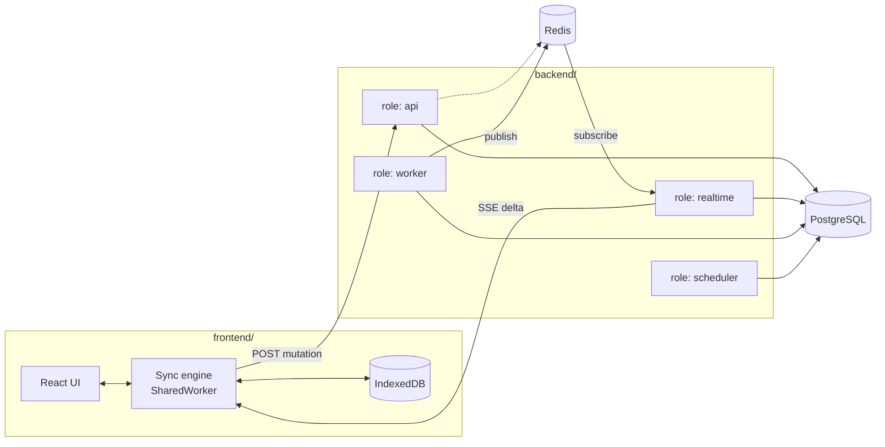

# 04 — System Design

Phần này mô tả **cách** hệ thống được xây dựng: kiến trúc triển khai, biên giới
module, truy cập dữ liệu, sự kiện, đồng bộ realtime, frontend, danh tính và vận hành.

Lý do đằng sau từng quyết định nằm ở [ADR](../adr/); tài liệu ở đây chỉ diễn giải
và chỉ ra cách áp dụng, không lặp lại phần biện luận.

**Liên quan:** [Requirement](../02-requirement/) · [ADR](../adr/) · [Glossary](../glossary.md) · [Roadmap](../03-features/roadmap.md)

---

## Các tài liệu

| Tài liệu | Nội dung |
|---|---|
| [architecture.md](architecture.md) | Kiến trúc triển khai: bốn vai trò ứng dụng, vai trò Postgres và Redis, luồng đi xuyên hệ thống |
| [backend-modules.md](backend-modules.md) | Kiến trúc bên trong `backend/`: module, biên giới, tầng DDD, aggregate |
| [data-access-and-tenancy.md](data-access-and-tenancy.md) | Spring Data JDBC, jOOQ, cách ly tenant, chuẩn bị cho phân mảnh |
| [events-and-outbox.md](events-and-outbox.md) | Domain event, bảng chuyển tiếp, tiến trình chuyển tiếp, chống trùng, thử lại |
| [realtime-and-sync.md](realtime-and-sync.md) | Sync engine hai đầu: nhật ký thay đổi, giao thức SSE, mutation, hoà giải xung đột |
| [sync-engine.md](sync-engine.md) | Mục đích, cách hoạt động và cách hiện thực sync engine: bảng, thuật toán, vòng đời mutation, lưu trữ ở client, thứ tự xây dựng |
| [frontend.md](frontend.md) | Kiến trúc bên trong `frontend/`: local-first, sync engine phía client, thư viện giao diện |
| [identity-and-permission.md](identity-and-permission.md) | Cơ chế magic link, phiên, mô hình danh tính hai tầng, mặt nạ quyền |
| [infrastructure.md](infrastructure.md) | Thành phần hạ tầng cần thiết, khi nào cần, mất thì sao, và các nhóm thư viện phụ thuộc |
| [environments.md](environments.md) | Bốn bậc môi trường, mỗi bậc bắt được loại lỗi gì |
| [git-flow.md](git-flow.md) | Quy trình nhánh: nhánh nào tồn tại, merge kiểu gì, thăng cấp và quay lui |
| [ci-cd.md](ci-cd.md) | Quy trình tích hợp liên tục, cổng chặn merge, đường đi lên các bậc |
| [observability-and-ops.md](observability-and-ops.md) | Nội dung `infra/`, nhật ký, chỉ số, cấu hình, vận hành |
| [testing-strategy.md](testing-strategy.md) | Các tầng kiểm thử và những thứ bắt buộc phải có test riêng |

### Thứ tự đọc

`architecture.md` → `backend-modules.md` → `data-access-and-tenancy.md` →
`events-and-outbox.md` → `realtime-and-sync.md` → `sync-engine.md` →
`frontend.md`. Các tài liệu còn lại đọc khi cần.

---

## Cấu trúc repository

```
kaiju/
├── .github/     # quy trình tích hợp liên tục
├── docs/        # tài liệu
├── backend/     # Spring Boot, Gradle multi-module
├── frontend/    # Next.js
└── infra/       # Docker Compose, Dockerfile, reverse proxy, script vận hành
```

| Thư mục | Chứa gì | Không chứa gì |
|---|---|---|
| `docs/` | Toàn bộ tài liệu, ADR, use case | Không chứa mã nguồn chạy được |
| `backend/` | Mã nguồn Java, Gradle multi-module, migration của cơ sở dữ liệu, test backend | Không chứa cấu hình triển khai; không chứa asset của frontend |
| `frontend/` | Mã nguồn Next.js, sync engine phía client, test frontend | Không gọi trực tiếp cơ sở dữ liệu; không chứa logic nghiệp vụ trùng lặp với backend |
| `infra/` | Tệp compose cho từng bậc môi trường, Dockerfile, cấu hình máy chủ trung gian, bản kê khai cho nền tảng điều phối, script khởi tạo và seed | Không chứa bí mật thật; chỉ chứa giá trị mẫu |
| `.github/` | Quy trình CI, script kiểm tra dùng chung | Không chứa logic chỉ tồn tại trong tệp cấu hình CI — mọi script phải chạy được từ máy cá nhân |

### Vì sao một repository

Ba lý do, theo thứ tự quan trọng:

1. **Giao thức đồng bộ có hai đầu.** Mỗi lần đổi định dạng delta hay cách mã hoá
   vị trí đồng bộ, cả backend lẫn frontend phải đổi cùng lúc. Tách repo nghĩa là
   mọi thay đổi như vậy thành một cuộc phối hợp hai phía.
2. **Triển khai đồng bộ.** Backend và frontend lên cùng nhau; không có nhu cầu
   phát hành độc lập.
3. **Một người phát triển.** Chi phí phối hợp nhiều repo không đổi lại được gì.

Đánh đổi: pipeline CI phải phân biệt được thay đổi thuộc thư mục nào để không
chạy lại toàn bộ khi chỉ sửa tài liệu.

---

## Bản đồ nhanh



Chi tiết từng thành phần: [architecture.md](architecture.md).
