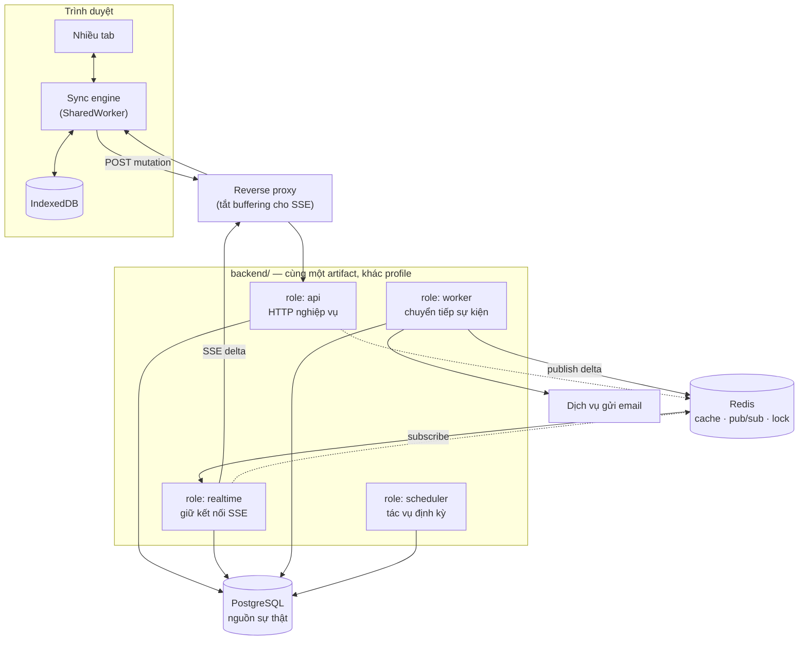
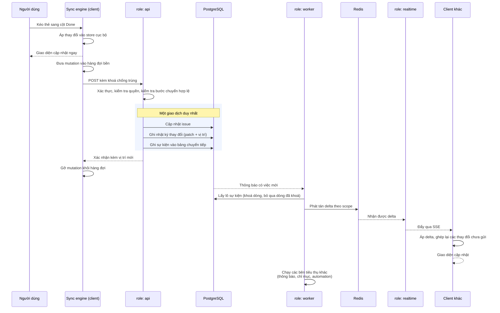
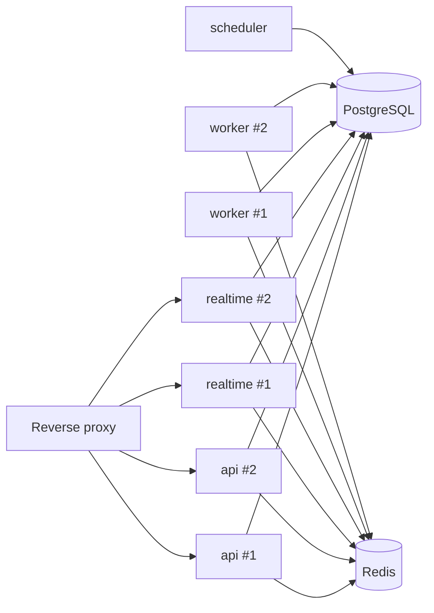

# Kiến trúc hệ thống

Một codebase backend duy nhất, build ra một artifact, triển khai thành bốn vai
trò ứng dụng scale độc lập. PostgreSQL là nguồn sự thật duy nhất; Redis chỉ đóng
vai trò phụ trợ và mất đi không làm hệ thống sai.

**Liên quan:** [ADR-0001](../adr/0001-modular-monolith-multi-app.md) · [ADR-0002](../adr/0002-postgres-only.md) · [ADR-0003](../adr/0003-redis-scope.md) · [backend-modules.md](backend-modules.md) · [realtime-and-sync.md](realtime-and-sync.md)

---

## Toàn cảnh

---

## Bốn vai trò ứng dụng

Cùng một image, khác `SPRING_PROFILES_ACTIVE`. Việc chọn vai trò quyết định tập
bean nào được kích hoạt.

| Vai trò | Trách nhiệm | Đặc tính tải | Scale theo |
|---|---|---|---|
| `api` | Xử lý request HTTP nghiệp vụ, ghi dữ liệu, sinh sự kiện | Nhiều request ngắn | Số request mỗi giây |
| `realtime` | Giữ kết nối SSE, đẩy delta xuống client, kiểm tra quyền theo scope | Ít CPU, rất nhiều kết nối mở lâu | Số kết nối đồng thời |
| `worker` | Đọc bảng chuyển tiếp, dispatch sự kiện tới bên tiêu thụ, gửi email, cập nhật chỉ mục | Tải nền, chạy lâu, có lúc dồn cục | Độ trễ hàng đợi |
| `scheduler` | Tác vụ định kỳ: đóng sprint quá hạn, email tổng hợp, dọn dữ liệu cũ | Rất nhẹ, theo lịch | Không scale; chạy một hoặc hai instance có khoá |

### Nguyên tắc

- **Cấu hình theo vai trò, không rải điều kiện khắp nơi.** Dùng `@Profile` trên
  lớp cấu hình, không rải trên từng bean. Một người đọc code phải trả lời được
  "vai trò này chạy cái gì" bằng cách nhìn vào một chỗ.
- `worker` và `scheduler` tắt tầng web nghiệp vụ, chỉ giữ endpoint kiểm tra sức khoẻ.
- **Mỗi vai trò cấu hình connection pool riêng.** Đây không phải tối ưu vặt:
  `api` cần nhiều kết nối ngắn, `worker` cần ít hơn nhưng giữ lâu, `realtime` gần
  như không cần cơ sở dữ liệu ngoài lúc bắt kịp. Dùng chung một cấu hình sẽ cạn
  giới hạn kết nối của PostgreSQL ngay khi scale.
- `scheduler` chạy nhiều instance phải có khoá phân tán, nếu không mọi tác vụ
  định kỳ sẽ chạy lặp.

### Vì sao không tách microservice

Xem [ADR-0001](../adr/0001-modular-monolith-multi-app.md). Tóm tắt: bốn loại tải
cần scale khác nhau nhưng **không** cần vòng đời phát hành khác nhau, và một
giao dịch cơ sở dữ liệu duy nhất là điều kiện để cơ chế chuyển tiếp sự kiện hoạt
động đúng.

**Điều kiện để tách một module thành service riêng về sau:** module đó không đọc
bảng của module khác, chỉ giao tiếp qua sự kiện và API công khai, và có lý do vận
hành thật (khác vòng đời phát hành, hoặc khác yêu cầu tuân thủ). Nếu biên giới
được giữ nghiêm thì việc tách chỉ là đổi tầng truyền tải.

---

## Vai trò của PostgreSQL và Redis

| | PostgreSQL | Redis |
|---|---|---|
| Là nguồn sự thật | ✅ | ❌ |
| Dữ liệu nghiệp vụ | ✅ | ❌ |
| Bảng chuyển tiếp sự kiện | ✅ | ❌ |
| Nhật ký thay đổi cho đồng bộ | ✅ | ❌ |
| Phiên đăng nhập, token | ✅ (bền) | Chỉ cache |
| Cache quyền hiệu lực | ❌ | ✅ |
| Phát tán delta giữa các instance | ❌ | ✅ |
| Khoá phân tán | ❌ | ✅ |
| Giới hạn tần suất | ❌ | ✅ |
| Trạng thái hiện diện, đang gõ | ❌ | ✅ |

**Bất biến: mất sạch Redis thì hệ thống chậm đi và suy giảm, nhưng không sai và
không mất dữ liệu.** Mọi đường đọc từ Redis phải có đường dự phòng đọc từ
PostgreSQL. Xem [ADR-0003](../adr/0003-redis-scope.md).

Cơ chế phát tán của Redis là gửi rồi quên: thông điệp phát ra lúc một instance
đang khởi động lại coi như mất. Điều này **chấp nhận được** vì client luôn bắt
kịp được bằng vị trí đồng bộ của mình — nhưng nghĩa là việc phát tán chỉ dùng để
**thúc** gửi, không bao giờ là nguồn duy nhất của một thay đổi.

---

## Luồng end-to-end: chuyển trạng thái một issue

Đây là đường đi đầy đủ của một thao tác, xuyên mọi thành phần. Hiểu luồng này là
hiểu phần lớn hệ thống.

### Những điểm cần chú ý trong luồng trên

| Điểm | Vì sao quan trọng |
|---|---|
| Giao diện cập nhật **trước** khi request rời máy | Đây là nguồn gốc của cảm giác tức thì. Độ trễ mạng không nằm trong đường phản hồi |
| Ba thao tác ghi nằm trong **một giao dịch** | Nếu tách, sẽ có lúc dữ liệu đã đổi mà client không được báo, hoặc sự kiện phát ra cho một thay đổi chưa commit |
| Khoá chống trùng đi cùng mutation | Client gửi lại khi mạng chập chờn; server phải nhận ra đó là cùng một ý định |
| Nhật ký thay đổi ghi **patch**, không ghi cả bản ghi | Giảm băng thông và cho phép ghép nhiều nguồn thay đổi |
| Việc phát tán đi qua `worker`, không đi thẳng từ `api` | Giữ `api` chỉ làm việc của nó, và đảm bảo delta chỉ được phát sau khi giao dịch đã commit |
| Client khác **ghép lại** thay đổi chưa gửi của mình lên trên | Nếu không, thay đổi cục bộ chưa gửi sẽ bị delta của người khác đè mất |

---

## Triển khai

### Yêu cầu với reverse proxy

| Yêu cầu | Hệ quả nếu thiếu |
|---|---|
| Tắt đệm cho đường dẫn của luồng đồng bộ | Delta bị giữ lại, triệu chứng là "realtime không chạy" mà không có lỗi nào |
| Thời gian chờ nhàn rỗi dài hơn chu kỳ nhịp tim | Kết nối bị đóng liên tục, client nối lại liên tục |
| Bật HTTP/2 | Giới hạn số kết nối trên mỗi nguồn không còn là vấn đề |

### Triển khai phiên bản mới

Thay thế cuốn chiếu. Client mất kết nối đồng bộ vài giây rồi tự nối lại và bắt
kịp từ vị trí cũ, nên không mất thay đổi nào. Hai ràng buộc:

- Thay đổi cấu trúc dữ liệu phải **tương thích ngược** trong thời gian có hai
  phiên bản chạy song song
- Định dạng sự kiện chỉ được thêm trường, không đổi ý nghĩa trường cũ trong cùng
  một phiên bản sự kiện

---

## Cố tình không làm ở giai đoạn này

| Không làm | Điều kiện để xem xét lại |
|---|---|
| Message broker ngoài | Khi cần nhiều nhóm tiêu thụ độc lập hoặc phát lại sự kiện dài hạn |
| Bắt thay đổi ở tầng cơ sở dữ liệu | Không dự kiến; sự kiện cần mang ý nghĩa nghiệp vụ, không phải thay đổi mức dòng |
| Phân mảnh cơ sở dữ liệu thật | Khi một instance PostgreSQL không còn đủ, và có số đo chứng minh |
| Tách microservice | Xem điều kiện ở mục trên |
| Máy chủ tìm kiếm riêng | Khi tìm kiếm toàn văn trên PostgreSQL không còn đủ ở Phase 7 |
| Chạy nhiều vùng địa lý | Không nằm trong phạm vi sản phẩm |
