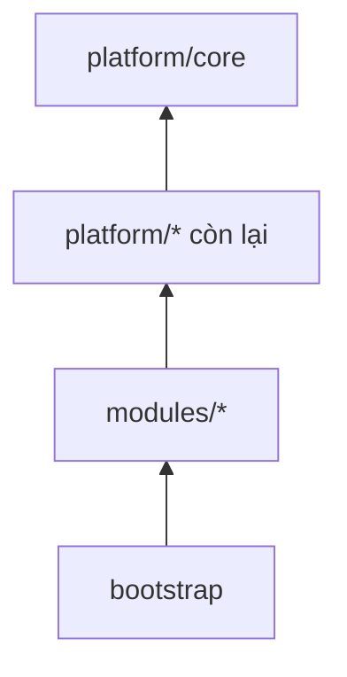

# Kiến trúc bên trong `backend/`

Backend là một Gradle multi-module, chia theo bounded context. Biên giới giữa các
module được kiểm tra tự động; vi phạm làm hỏng build chứ không chỉ bị nhắc nhở.

**Liên quan:** [ADR-0001](../adr/0001-modular-monolith-multi-app.md) · [ADR-0004](../adr/0004-spring-data-jdbc.md) · [architecture.md](architecture.md) · [data-access-and-tenancy.md](data-access-and-tenancy.md) · [events-and-outbox.md](events-and-outbox.md)

---

## Cấu trúc Gradle

```
backend/
├── settings.gradle.kts
├── build.gradle.kts              # cấu hình chung, version catalog
├── platform/                     # hạ tầng dùng chung, không chứa nghiệp vụ
│   ├── core/                     # kiểu dùng chung, lỗi, tiện ích, ScopedValue context
│   ├── persistence/              # cấu hình Spring Data JDBC, jOOQ, converter, Flyway
│   ├── tenancy/                  # WorkspaceContext, thiết lập biến phiên, chính sách bảo mật mức dòng
│   ├── events/                   # domain event, bảng chuyển tiếp, tiến trình chuyển tiếp, chống trùng
│   ├── sync/                     # nhật ký thay đổi, cấp vị trí, giao thức đồng bộ phía server
│   ├── security/                 # xác thực, kiểm tra quyền, mặt nạ bit
│   ├── cache/                    # trừu tượng hoá Redis, khoá, giới hạn tần suất
│   └── observability/            # nhật ký có cấu trúc, định danh tương quan, chỉ số
├── modules/
│   ├── identity/
│   ├── workspace/
│   ├── project/
│   ├── issue/
│   ├── workflow/
│   ├── field/
│   ├── board/
│   ├── sprint/
│   ├── search/
│   ├── activity/
│   ├── notification/
│   └── automation/
└── bootstrap/                    # một ứng dụng Spring Boot duy nhất
```

### Luật phụ thuộc giữa các Gradle module



| Luật | |
|---|---|
| `platform/*` **không được** phụ thuộc vào `modules/*` | Hạ tầng không biết gì về nghiệp vụ |
| `modules/*` phụ thuộc `platform/*` | Bình thường |
| `modules/a` phụ thuộc `modules/b` | **Chỉ được** qua `modules/b/public`, và phải khai báo tường minh trong `build.gradle.kts` của `a` |
| `bootstrap` phụ thuộc mọi module | Nó chỉ lắp ráp, không chứa logic |

Khai báo phụ thuộc giữa hai module nghiệp vụ trong Gradle là một hành động **có ý
thức**: nó hiện lên trong review và buộc phải tự hỏi "quan hệ này có nên là đồng
bộ không, hay nên là sự kiện?".

---

## Danh sách module

| Module | Trách nhiệm | Sở hữu khái niệm |
|---|---|---|
| `identity` | Danh tính toàn cục, magic link, phiên đăng nhập | account, session, token đăng nhập |
| `workspace` | Workspace, thành viên, lời mời, vai trò cấp workspace | workspace, member, invitation, group |
| `project` | Project, thành viên project, component, vai trò cấp project | project, component |
| `issue` | Issue và mọi thứ gắn trực tiếp vào nó | issue, liên kết, nhãn, bình luận, đính kèm, theo dõi |
| `workflow` | Trạng thái, bước chuyển, điều kiện, kết quả xử lý | status, transition, workflow, resolution |
| `field` | Trường tuỳ biến, cấu hình theo ngữ cảnh, màn hình | custom field, screen |
| `board` | Board, cột, làn, bộ lọc nhanh | board, column, swimlane |
| `sprint` | Backlog, sprint, năng lực, báo cáo agile | sprint, story point |
| `search` | Phân tích truy vấn, chỉ mục, bộ lọc đã lưu | truy vấn, saved filter |
| `activity` | Dòng hoạt động và nhật ký thay đổi hiển thị cho người dùng | activity entry |
| `notification` | Thông báo trong ứng dụng và qua email, cấu hình thông báo | notification, notification scheme |
| `automation` | Quy tắc tự động, điều kiện kích hoạt, hành động | rule, trigger, action |

**Một khái niệm chỉ có một chủ sở hữu.** Module khác muốn dùng thì đi qua API
công khai hoặc nghe sự kiện, không tự đọc bảng.

---

## Ba luật biên giới

Đây là ba luật quan trọng nhất của toàn bộ backend. Vi phạm bất kỳ luật nào làm
hỏng build.

### 1. Không import package nội bộ của module khác

Mỗi module có đúng một package lộ ra ngoài:

```
modules/issue/
└── src/main/java/dev/kaiju/issue/
    ├── domain/            # nội bộ
    ├── application/       # nội bộ
    ├── infrastructure/    # nội bộ
    └── api/               # ← duy nhất được import từ ngoài
        ├── IssueQuery.java        # interface đọc
        ├── IssueCommand.java      # interface ghi
        ├── dto/                   # DTO phẳng, không phải entity
        └── event/                 # định nghĩa domain event
```

Kiểm tra bằng Spring Modulith trong test. Xem [mục kiểm thử](#kiểm-thử-biên-giới).

### 2. Không truy vấn bảng thuộc sở hữu của module khác

Kể cả khi biết tên bảng và câu SQL sẽ nhanh hơn. Một câu `JOIN` xuyên module là
một phụ thuộc không nhìn thấy được trong Gradle, không kiểm tra được bằng công cụ,
và là cách monolith trở nên không tách được.

Cần dữ liệu của module khác thì có hai lựa chọn:
- **Đồng bộ**: gọi `api` của module đó. Chấp nhận thêm một vòng truy vấn.
- **Bất đồng bộ**: nghe sự kiện và giữ bản sao dữ liệu cần thiết trong module mình.

Lựa chọn thứ hai đúng khi dữ liệu được đọc nhiều hơn hẳn số lần đổi, chẳng hạn
tên hiển thị của thành viên.

### 3. Giao tiếp bất đồng bộ chỉ qua domain event

Không gọi trực tiếp vào module khác để "làm hộ" một việc phụ. Đổi trạng thái
issue thì `issue` phát sự kiện; `notification`, `activity`, `automation`,
`search` tự nghe và tự làm phần của mình.

Nhờ đó, thêm một hành vi mới khi issue đổi trạng thái **không phải sửa module
`issue`** — đó là toàn bộ giá trị của kiến trúc hướng sự kiện ở đây.

---

## Vai trò của Spring Modulith

**Chỉ dùng để kiểm tra biên giới module.** Không dùng Event Publication Registry
của nó, vì bên tiêu thụ sự kiện chạy ở vai trò ứng dụng khác và registry chỉ
dispatch trong cùng tiến trình. Xem [ADR-0005](../adr/0005-outbox-db-job.md).

### Kiểm thử biên giới

Một test duy nhất, chạy trong CI, kiểm tra toàn bộ đồ thị phụ thuộc giữa các
module và làm hỏng build khi có vi phạm. Test này cũng sinh được tài liệu sơ đồ
module, dùng để đối chiếu với tài liệu viết tay.

> **Chưa chốt:** có sinh sơ đồ module tự động vào `docs/` hay không. Sinh tự động
> thì luôn đúng, nhưng thêm một bước trong build và một thư mục do máy quản lý.

---

## Bốn tầng bên trong một module

```
modules/<tên>/
├── domain/            # aggregate root, value object, domain event, invariant
├── application/       # command handler, query handler, điều phối giao dịch
├── infrastructure/    # repository, truy vấn đọc, tích hợp ra ngoài
└── api/               # interface, DTO, định nghĩa sự kiện — lộ ra ngoài
```

| Tầng | Được biết gì | Không được biết gì |
|---|---|---|
| `domain` | Chỉ nghiệp vụ và các kiểu của chính nó | Không biết Spring, không biết cơ sở dữ liệu, không biết HTTP |
| `application` | `domain` và các interface do `infrastructure` hiện thực | Không biết chi tiết SQL, không biết HTTP |
| `infrastructure` | Mọi thứ kỹ thuật | Không chứa quy tắc nghiệp vụ |
| `api` | Chỉ kiểu dữ liệu phẳng | Không lộ kiểu thuộc `domain` ra ngoài |

### Khi nào được giản lược còn hai tầng

Module thuần CRUD không có invariant đáng kể — ví dụ quản lý nhãn hay component —
được phép chỉ có `application` và `infrastructure`. Dựng đủ bốn tầng cho một bảng
ba cột là nghi thức rỗng, làm code khó đọc hơn chứ không an toàn hơn.

**Dấu hiệu phải nâng lên bốn tầng:** xuất hiện quy tắc "nếu … thì không được …",
hoặc một thao tác phải sửa nhiều bảng cùng lúc để giữ đúng một điều kiện.

---

## Nguyên tắc chia aggregate

Aggregate được giữ **nhỏ**. Đây không phải sở thích: Spring Data JDBC xoá và chèn
lại toàn bộ collection con mỗi lần lưu, nên aggregate lớn vừa chậm vừa làm hỏng
nhật ký thay đổi ([ADR-0004](../adr/0004-spring-data-jdbc.md)).

| Aggregate | Gồm | Không gồm |
|---|---|---|
| `Issue` | Trường của issue, nhãn, liên kết tới component | Sub-task, bình luận, đính kèm, nhật ký công việc |
| `Comment` | Nội dung, lịch sử sửa | Không gồm issue |
| `Sprint` | Thông tin sprint | Không gồm danh sách issue (là bảng nối riêng) |
| `Workflow` | Trạng thái, bước chuyển, điều kiện | Không gồm issue đang ở trạng thái nào |

### Ba quy tắc

1. **Tham chiếu xuyên aggregate bằng định danh**, không bằng tham chiếu đối tượng.
   Spring Data JDBC có kiểu dành riêng cho việc này, và nó làm biên giới hiện rõ
   ngay trong code.
2. **Một giao dịch sửa một aggregate.** Cần sửa nhiều thì chia thành nhiều bước
   nối bằng sự kiện.
3. **Điều kiện xuyên aggregate không ép trong giao dịch.** Ví dụ "mọi sub-task
   xong thì issue cha xong" được xử lý bằng sự kiện và nhất quán dần — và đây
   chính là chỗ automation engine cắm vào ở Phase 14.

---

## Quy ước

### Đặt tên

| Loại | Quy ước | Ví dụ |
|---|---|---|
| Aggregate root | Danh từ số ít | `Issue`, `Sprint` |
| Command | Động từ ở thể mệnh lệnh | `TransitionIssue`, `InviteMember` |
| Command handler | Tên command + `Handler` | `TransitionIssueHandler` |
| Query | Mô tả kết quả | `BoardView`, `IssueDetail` |
| Domain event | Danh từ + động từ quá khứ | `IssueTransitioned`, `MemberRemoved` |
| Interface công khai | Tên module + vai trò | `IssueQuery`, `IssueCommand` |

### Tổ chức command và query

Ghi và đọc đi hai đường khác nhau:

- **Command** đi qua `application` → `domain` → repository. Trả về định danh và
  vị trí đồng bộ mới, **không** trả về toàn bộ dữ liệu đã ghi — client đã có bản
  cục bộ rồi.
- **Query** đi thẳng từ `application` xuống tầng đọc, trả DTO phẳng, **không đi
  qua `domain`**. Dựng aggregate chỉ để đọc là lãng phí.

### Ranh giới giao dịch

Nằm ở **command handler**, không nằm ở repository và không nằm ở controller. Một
command là một giao dịch. Trong giao dịch đó phải có đủ: thay đổi nghiệp vụ, bản
ghi nhật ký thay đổi, và bản ghi sự kiện.

---

## Checklist thêm một module mới

1. Tạo thư mục Gradle, khai báo trong `settings.gradle.kts`
2. Khai báo phụ thuộc — chỉ `platform/*` và `api` của các module thật sự cần
3. Đánh dấu module cho công cụ kiểm tra biên giới
4. Dựng package `api` **trước**: viết interface và định nghĩa sự kiện trước khi
   viết hiện thực. Nếu `api` trông xấu thì biên giới đang đặt sai chỗ
5. Viết migration cho bảng của module — nhớ cột định danh workspace và chính sách
   bảo mật mức dòng ([data-access-and-tenancy.md](data-access-and-tenancy.md))
6. Đăng ký bên tiêu thụ sự kiện nếu có, kèm cơ chế chống trùng
7. Xác định thay đổi nào của module cần đi vào nhật ký thay đổi cho client
8. Chạy test kiểm tra biên giới
9. Cập nhật bảng module trong tài liệu này và
   [feature catalog](../03-features/README.md)
