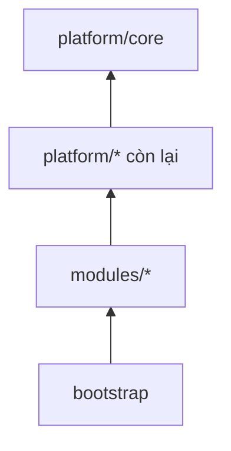

# Kiến trúc bên trong `backend/`

Backend là một Gradle multi-module, chia theo bounded context. Biên giới giữa các
module được kiểm tra tự động; vi phạm làm hỏng build chứ không chỉ bị nhắc nhở.

**Liên quan:** [ADR-0001](../adr/0001-modular-monolith-multi-app.md) · [ADR-0004](../adr/0004-spring-data-jdbc.md) · [architecture.md](architecture.md) · [data-access-and-tenancy.md](data-access-and-tenancy.md) · [events-and-outbox.md](events-and-outbox.md)

---

## Cấu trúc Gradle

```
backend/
├── settings.gradle.kts
├── build.gradle.kts              # cấu hình chung, version catalog
├── platform/                     # hạ tầng dùng chung, không chứa nghiệp vụ
│   ├── core/                     # kiểu dùng chung, lỗi, tiện ích, ScopedValue context
│   ├── persistence/              # cấu hình Spring Data JDBC, jOOQ, converter, Flyway
│   ├── tenancy/                  # WorkspaceContext, thiết lập biến phiên, chính sách bảo mật mức dòng
│   ├── events/                   # domain event, bảng chuyển tiếp, tiến trình chuyển tiếp, chống trùng
│   ├── sync/                     # nhật ký thay đổi, cấp vị trí, giao thức đồng bộ phía server
│   ├── security/                 # xác thực, kiểm tra quyền, mặt nạ bit
│   ├── cache/                    # trừu tượng hoá Redis, khoá, giới hạn tần suất
│   └── observability/            # nhật ký có cấu trúc, định danh tương quan, chỉ số
├── modules/
│   ├── identity/
│   ├── workspace/
│   ├── project/
│   ├── issue/
│   ├── workflow/
│   ├── field/
│   ├── board/
│   ├── sprint/
│   ├── search/
│   ├── activity/
│   ├── notification/
│   └── automation/
└── bootstrap/                    # một ứng dụng Spring Boot duy nhất
```

### Luật phụ thuộc giữa các Gradle module



| Luật | |
|---|---|
| `platform/*` **không được** phụ thuộc vào `modules/*` | Hạ tầng không biết gì về nghiệp vụ |
| `modules/*` phụ thuộc `platform/*` | Bình thường |
| `modules/a` phụ thuộc `modules/b` | **Chỉ được** qua package `api` của `b`, và phải khai báo tường minh trong `build.gradle.kts` của `a` |
| `bootstrap` phụ thuộc mọi module | Nó chỉ lắp ráp, không chứa logic |

Khai báo phụ thuộc giữa hai module nghiệp vụ trong Gradle là một hành động **có ý
thức**: nó hiện lên trong review và buộc phải tự hỏi "quan hệ này có nên là đồng
bộ không, hay nên là sự kiện?".

---

## Quy ước package (bắt buộc)

**Công cụ kiểm tra biên giới nhận diện module theo cấu trúc package, không theo
cấu trúc Gradle.** Đây là điều dễ hiểu sai nhất, và hiểu sai thì công cụ sẽ không
thấy module nào cả — build vẫn xanh trong khi không có gì được kiểm tra.

Hai cấu trúc phải **khớp một-một**: mỗi Gradle module trong `modules/` tương ứng
đúng một package là con trực tiếp của package gốc ứng dụng.

### Bố trí package

```
dev.kaiju.app                 ← package gốc, chứa lớp khởi động ứng dụng
├── identity                  ← module, là con TRỰC TIẾP của package gốc
├── workspace
├── project
├── issue
│   ├── package-info.java     ← khai báo module và phụ thuộc cho phép
│   ├── api/                  ← khai báo là phần lộ ra ngoài
│   ├── domain/               ← nội bộ, không khai báo gì
│   ├── application/          ← nội bộ
│   └── infrastructure/       ← nội bộ
└── …

dev.kaiju.platform            ← NẰM NGOÀI package gốc ứng dụng
├── persistence
├── tenancy
├── events
└── …
```

### Bốn quy tắc

| # | Quy tắc | Hệ quả nếu làm sai |
|---|---|---|
| 1 | Mọi module nghiệp vụ là **con trực tiếp** của package gốc ứng dụng | Package lồng sâu hơn không được nhận diện là module, và không được kiểm tra gì cả |
| 2 | **Package gốc của mỗi module để trống**, chỉ có `package-info.java` | Package gốc luôn lộ ra ngoài; đặt kiểu dữ liệu ở đó là tạo API ngoài ý muốn |
| 3 | Package `api` phải được **khai báo tường minh** là phần lộ ra ngoài | Không khai báo thì nó bị coi là nội bộ, và mọi module khác import nó đều bị báo lỗi |
| 4 | `platform/*` đặt **ngoài** package gốc ứng dụng | Nếu đặt bên trong, `platform` trở thành **một module nghiệp vụ**, và mọi module đều phải khai báo phụ thuộc vào nó — biến hạ tầng dùng chung thành một mắt xích trong đồ thị phụ thuộc |

Quy tắc 4 là điểm quan trọng: mã nguồn **không thuộc module nào** thì module nào
cũng dùng được tự do. Đặt `platform` ra ngoài package gốc là cách gọn nhất để hạ
tầng dùng chung không làm nhiễu việc kiểm tra biên giới nghiệp vụ.

### Khai báo phụ thuộc

Mỗi module khai báo tường minh **danh sách module nó được phép phụ thuộc**, và
khai báo tới đúng phần `api` chứ không phải cả module. Khai báo này nằm ở
`package-info.java` của module, **song song** với khai báo phụ thuộc trong Gradle:

- Gradle chặn ở mức biên dịch
- Khai báo ở package chặn ở mức kiểm tra biên giới và **nói rõ ý định** cho người đọc

Hai chỗ phải luôn khớp nhau. Lệch nhau là dấu hiệu ai đó thêm phụ thuộc mà không
suy nghĩ về nó.

---

## Danh sách module

| Module | Trách nhiệm | Sở hữu khái niệm |
|---|---|---|
| `identity` | Danh tính toàn cục, magic link, phiên đăng nhập | account, session, token đăng nhập |
| `workspace` | Workspace, thành viên, lời mời, vai trò cấp workspace | workspace, member, invitation, group |
| `project` | Project, thành viên project, component, vai trò cấp project | project, component |
| `issue` | Issue và mọi thứ gắn trực tiếp vào nó | issue, liên kết, nhãn, bình luận, đính kèm, theo dõi |
| `workflow` | Trạng thái, bước chuyển, điều kiện, kết quả xử lý | status, transition, workflow, resolution |
| `field` | Trường tuỳ biến, cấu hình theo ngữ cảnh, màn hình | custom field, screen |
| `board` | Board, cột, làn, bộ lọc nhanh | board, column, swimlane |
| `sprint` | Backlog, sprint, năng lực, báo cáo agile | sprint, story point |
| `search` | Phân tích truy vấn, chỉ mục, bộ lọc đã lưu | truy vấn, saved filter |
| `activity` | Dòng hoạt động và nhật ký thay đổi hiển thị cho người dùng | activity entry |
| `notification` | Thông báo trong ứng dụng và qua email, cấu hình thông báo | notification, notification scheme |
| `automation` | Quy tắc tự động, điều kiện kích hoạt, hành động | rule, trigger, action |

**Một khái niệm chỉ có một chủ sở hữu.** Module khác muốn dùng thì đi qua API
công khai hoặc nghe sự kiện, không tự đọc bảng.

---

## Ba luật biên giới

Đây là ba luật quan trọng nhất của toàn bộ backend.

| Luật | Có công cụ tự động bắt không |
|---|---|
| 1. Không import package nội bộ của module khác | ✅ Có, làm hỏng build |
| 2. Không truy vấn bảng của module khác | ❌ **Không** — cần cơ chế riêng, xem mục 2 |
| 3. Bất đồng bộ chỉ qua domain event | ⚠️ Một phần — công cụ chặn lời gọi trực tiếp vào nội bộ, nhưng không phân biệt được lời gọi hợp lệ qua API với lời gọi lẽ ra nên là sự kiện |

Biết rõ ranh giới của công cụ quan trọng ngang với biết luật: nếu tưởng cả ba
luật đều được bắt tự động thì luật 2 sẽ bị vi phạm im lặng trong nhiều tháng.

### 1. Không import package nội bộ của module khác

Mỗi module lộ ra ngoài đúng **một** package:

```
modules/issue/
└── src/main/java/dev/kaiju/app/issue/
    ├── package-info.java   # khai báo module và danh sách phụ thuộc cho phép
    ├── domain/             # nội bộ
    ├── application/        # nội bộ
    ├── infrastructure/     # nội bộ
    └── api/                # ← được khai báo là giao diện công khai có tên
        ├── package-info.java      # đánh dấu package này là phần lộ ra ngoài
        ├── IssueQuery.java        # interface đọc
        ├── IssueCommand.java      # interface ghi
        ├── dto/                   # DTO phẳng, không phải entity
        └── event/                 # định nghĩa domain event
```

Hai điều **bắt buộc** để cấu trúc này hoạt động, xem
[quy ước package](#quy-ước-package-bắt-buộc):

- Package `api` phải được **khai báo tường minh** là phần lộ ra ngoài. Không khai
  báo thì nó bị coi là nội bộ y như ba package kia
- **Package gốc của module phải để trống**, chỉ chứa `package-info.java`. Package
  gốc luôn được lộ ra ngoài dù không khai báo gì, nên bất cứ kiểu dữ liệu nào đặt
  ở đó đều trở thành API ngoài ý muốn

> **Đã thay đổi (2026-09-17):** bản đầu của tài liệu này chỉ nói "`api` là package
> duy nhất được import từ ngoài" mà không nêu hai điều kiện trên. Cấu trúc thư mục
> không đổi, nhưng nếu thiếu khai báo thì công cụ kiểm tra sẽ hiểu **ngược lại**
> ý định: chặn `api` và mở package gốc.

### 2. Không truy vấn bảng thuộc sở hữu của module khác

Kể cả khi biết tên bảng và câu SQL sẽ nhanh hơn. Một câu `JOIN` xuyên module là
một phụ thuộc không nhìn thấy được trong Gradle, và là cách monolith trở nên
không tách được.

**Luật này không có công cụ sẵn nào bắt được**, vì tên bảng chỉ là chuỗi ký tự
trong SQL. Cần tự dựng cơ chế, và phải dựng ở Phase 0:

| Cơ chế | Cách làm |
|---|---|
| Tiền tố tên bảng theo module | Mỗi module sở hữu một tiền tố; bảng của `issue` bắt đầu bằng `issue_` |
| Test quét mã nguồn | Quét chuỗi SQL và các lớp jOOQ được sinh ra, báo lỗi khi một module chạm tới tiền tố không phải của mình |
| Chia mã jOOQ theo module | Mã sinh ra cho bảng của module nào chỉ hiển thị trong module đó |

Không có ba thứ này thì luật 2 chỉ là lời khuyên.

Cần dữ liệu của module khác thì có hai lựa chọn:
- **Đồng bộ**: gọi `api` của module đó. Chấp nhận thêm một vòng truy vấn.
- **Bất đồng bộ**: nghe sự kiện và giữ bản sao dữ liệu cần thiết trong module mình.

Lựa chọn thứ hai đúng khi dữ liệu được đọc nhiều hơn hẳn số lần đổi, chẳng hạn
tên hiển thị của thành viên.

### 3. Giao tiếp bất đồng bộ chỉ qua domain event

Không gọi trực tiếp vào module khác để "làm hộ" một việc phụ. Đổi trạng thái
issue thì `issue` phát sự kiện; `notification`, `activity`, `automation`,
`search` tự nghe và tự làm phần của mình.

Nhờ đó, thêm một hành vi mới khi issue đổi trạng thái **không phải sửa module
`issue`** — đó là toàn bộ giá trị của kiến trúc hướng sự kiện ở đây.

---

## Công cụ kiểm tra biên giới

> Đây là **nơi duy nhất** trong toàn bộ tài liệu nêu tên công cụ cụ thể. Các tài
> liệu khác chỉ nói "công cụ kiểm tra biên giới" và trỏ về đây, để nếu sau này
> đổi công cụ thì chỉ phải sửa một chỗ.

Công cụ dùng là **Spring Modulith**, và **chỉ dùng cho việc kiểm tra biên giới**.

### Phiên bản nền

| | |
|---|---|
| Spring Boot | Dòng 4.x |
| Spring Modulith | Dòng 2.x — dòng này đi kèm Spring Boot 4 |
| Java | 21 trở lên, bật virtual thread |

Chốt phiên bản trước khi viết dòng code đầu tiên. Dòng 1.x của công cụ đi với
Spring Boot 3 và có API khác; chọn nhầm dòng thì phần lớn hướng dẫn tìm được trên
mạng sẽ không khớp.

### Thư viện được phép và không được phép

| Thư viện | Dùng? | Lý do |
|---|---|---|
| Nhân của công cụ (`spring-modulith-core`) | ✅ | Cần cho việc kiểm tra biên giới |
| Bộ hỗ trợ kiểm thử (`spring-modulith-starter-test`) | ✅ | Chạy kiểm tra trong test |
| Bộ sinh tài liệu | ✅ Tuỳ chọn | Sinh sơ đồ module để đối chiếu |
| **Mọi bộ lưu trữ sự kiện của công cụ** (`spring-modulith-starter-jdbc`, `-jpa`, `-mongodb`, `-neo4j`) | ❌ **Cấm** | Xem cảnh báo dưới |
| Các bộ externalize sự kiện ra broker | ❌ Cấm | Dự án không dùng message broker |

> ⚠️ **Cảnh báo quan trọng.** Chỉ cần một bộ lưu trữ sự kiện của công cụ xuất hiện
> trên classpath là nó **tự động bật cơ chế theo dõi sự kiện riêng của nó, tự tạo
> bảng riêng, và tự chặn mọi listener giao dịch**. Kết quả là hệ thống có **hai**
> cơ chế chuyển tiếp sự kiện chạy song song, cùng ghi vào cùng một giao dịch,
> không biết gì về nhau. Đây là loại lỗi rất khó nhận ra vì mọi thứ vẫn "chạy".
>
> Dự án đã có cơ chế chuyển tiếp riêng ([events-and-outbox.md](events-and-outbox.md))
> và lý do không dùng cơ chế sẵn có nằm ở [ADR-0005](../adr/0005-outbox-db-job.md).

### Công cụ kiểm tra những gì

Chỉ **ba** điều, và cần biết rõ giới hạn này:

| # | Kiểm tra | Tương ứng luật |
|---|---|---|
| 1 | Không có phụ thuộc vòng giữa các module | — |
| 2 | Không truy cập kiểu dữ liệu nằm trong package nội bộ của module khác | Luật 1 |
| 3 | Nếu một module khai báo danh sách phụ thuộc cho phép thì chỉ những phụ thuộc đó được chấp nhận | Luật 1 |

**Nó không kiểm tra**: truy cập bảng của module khác, việc một lời gọi lẽ ra nên
là sự kiện, hay bất cứ ràng buộc nào về dữ liệu. Những thứ đó cần cơ chế riêng —
xem [luật 2](#2-không-truy-vấn-bảng-thuộc-sở-hữu-của-module-khác) và
[test bất biến cơ sở dữ liệu](testing-strategy.md#bất-biến-cơ-sở-dữ-liệu).

### Kiểm thử biên giới

Một test duy nhất, chạy trong CI, kiểm tra toàn bộ đồ thị phụ thuộc và làm hỏng
build khi có vi phạm. Test này là **JUnit thuần, không cần khởi động Spring
context**, nên chạy rất nhanh và đặt được ở lớp test sớm nhất.

Test này cũng sinh được sơ đồ module, dùng để đối chiếu với tài liệu viết tay.

> **Chưa chốt:** có sinh sơ đồ module tự động vào `docs/` hay không. Sinh tự động
> thì luôn đúng, nhưng thêm một bước trong build và một thư mục do máy quản lý.

---

## Bốn tầng bên trong một module

```
modules/<tên>/
├── domain/            # aggregate root, value object, domain event, invariant
├── application/       # command handler, query handler, điều phối giao dịch
├── infrastructure/    # repository, truy vấn đọc, tích hợp ra ngoài
└── api/               # interface, DTO, định nghĩa sự kiện — lộ ra ngoài
```

| Tầng | Được biết gì | Không được biết gì |
|---|---|---|
| `domain` | Chỉ nghiệp vụ và các kiểu của chính nó | Không biết Spring, không biết cơ sở dữ liệu, không biết HTTP |
| `application` | `domain` và các interface do `infrastructure` hiện thực | Không biết chi tiết SQL, không biết HTTP |
| `infrastructure` | Mọi thứ kỹ thuật | Không chứa quy tắc nghiệp vụ |
| `api` | Chỉ kiểu dữ liệu phẳng | Không lộ kiểu thuộc `domain` ra ngoài |

### Khi nào được giản lược còn hai tầng

Module thuần CRUD không có invariant đáng kể — ví dụ quản lý nhãn hay component —
được phép chỉ có `application` và `infrastructure`. Dựng đủ bốn tầng cho một bảng
ba cột là nghi thức rỗng, làm code khó đọc hơn chứ không an toàn hơn.

**Dấu hiệu phải nâng lên bốn tầng:** xuất hiện quy tắc "nếu … thì không được …",
hoặc một thao tác phải sửa nhiều bảng cùng lúc để giữ đúng một điều kiện.

---

## Nguyên tắc chia aggregate

Aggregate được giữ **nhỏ**. Đây không phải sở thích: Spring Data JDBC xoá và chèn
lại toàn bộ collection con mỗi lần lưu, nên aggregate lớn vừa chậm vừa làm hỏng
nhật ký thay đổi ([ADR-0004](../adr/0004-spring-data-jdbc.md)).

| Aggregate | Gồm | Không gồm |
|---|---|---|
| `Issue` | Trường của issue, nhãn, liên kết tới component | Sub-task, bình luận, đính kèm, nhật ký công việc |
| `Comment` | Nội dung, lịch sử sửa | Không gồm issue |
| `Sprint` | Thông tin sprint | Không gồm danh sách issue (là bảng nối riêng) |
| `Workflow` | Trạng thái, bước chuyển, điều kiện | Không gồm issue đang ở trạng thái nào |

### Ba quy tắc

1. **Tham chiếu xuyên aggregate bằng định danh**, không bằng tham chiếu đối tượng.
   Spring Data JDBC có kiểu dành riêng cho việc này, và nó làm biên giới hiện rõ
   ngay trong code.
2. **Một giao dịch sửa một aggregate.** Cần sửa nhiều thì chia thành nhiều bước
   nối bằng sự kiện.
3. **Điều kiện xuyên aggregate không ép trong giao dịch.** Ví dụ "mọi sub-task
   xong thì issue cha xong" được xử lý bằng sự kiện và nhất quán dần — và đây
   chính là chỗ automation engine cắm vào ở Phase 14.

---

## Quy ước

### Đặt tên

| Loại | Quy ước | Ví dụ |
|---|---|---|
| Aggregate root | Danh từ số ít | `Issue`, `Sprint` |
| Command | Động từ ở thể mệnh lệnh | `TransitionIssue`, `InviteMember` |
| Command handler | Tên command + `Handler` | `TransitionIssueHandler` |
| Query | Mô tả kết quả | `BoardView`, `IssueDetail` |
| Domain event | Danh từ + động từ quá khứ | `IssueTransitioned`, `MemberRemoved` |
| Interface công khai | Tên module + vai trò | `IssueQuery`, `IssueCommand` |

### Tổ chức command và query

Ghi và đọc đi hai đường khác nhau:

- **Command** đi qua `application` → `domain` → repository. Trả về định danh và
  vị trí đồng bộ mới, **không** trả về toàn bộ dữ liệu đã ghi — client đã có bản
  cục bộ rồi.
- **Query** đi thẳng từ `application` xuống tầng đọc, trả DTO phẳng, **không đi
  qua `domain`**. Dựng aggregate chỉ để đọc là lãng phí.

### Ranh giới giao dịch

Nằm ở **command handler**, không nằm ở repository và không nằm ở controller. Một
command là một giao dịch. Trong giao dịch đó phải có đủ: thay đổi nghiệp vụ, bản
ghi nhật ký thay đổi, và bản ghi sự kiện.

---

## Checklist thêm một module mới

1. Tạo thư mục Gradle, khai báo trong `settings.gradle.kts`
2. Tạo package là **con trực tiếp** của package gốc ứng dụng, đúng tên module
   ([quy ước package](#quy-ước-package-bắt-buộc))
3. Thêm `package-info.java` ở package gốc của module: khai báo module và danh
   sách phụ thuộc cho phép. **Để package gốc trống ngoài file này**
4. Tạo package `api` kèm `package-info.java` **khai báo nó là phần lộ ra ngoài** —
   thiếu bước này thì module khác không import được gì
5. Khai báo phụ thuộc trong Gradle, khớp với khai báo ở bước 3
6. Dựng nội dung `api` **trước**: viết interface và định nghĩa sự kiện trước khi
   viết hiện thực. Nếu `api` trông xấu thì biên giới đang đặt sai chỗ
7. Chọn tiền tố tên bảng của module và đăng ký vào test kiểm tra quyền sở hữu bảng
8. Viết migration cho bảng của module — nhớ cột định danh workspace và chính sách
   bảo mật mức dòng ([data-access-and-tenancy.md](data-access-and-tenancy.md))
9. Đăng ký bên tiêu thụ sự kiện nếu có, kèm cơ chế chống trùng
10. Xác định thay đổi nào của module cần đi vào nhật ký thay đổi cho client
11. Chạy test kiểm tra biên giới và test quyền sở hữu bảng
12. Cập nhật bảng module trong tài liệu này và
    [feature catalog](../03-features/README.md)
