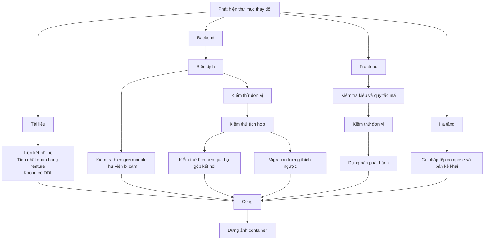

# Tích hợp liên tục và triển khai

Quy trình chạy trên mỗi pull request và mỗi lần phát hành: kiểm tra gì, theo thứ
tự nào, chặn ở đâu, và triển khai lên bậc nào.

**Liên quan:** [git-flow.md](git-flow.md) · [environments.md](environments.md) · [testing-strategy.md](testing-strategy.md) · [infrastructure.md](infrastructure.md) · [observability-and-ops.md](observability-and-ops.md)

---

## Nguyên tắc

1. **Mỗi kiểm tra phải trả lời được câu hỏi "nó ngăn được lỗi gì".** Kiểm tra
   không chỉ ra được loại lỗi cụ thể thì chỉ là tiếng ồn làm chậm pipeline
2. **Chỉ chạy phần liên quan.** Sửa tài liệu không được kích hoạt bộ kiểm thử
   tích hợp. Đây là cái giá đã biết trước của việc để mọi thứ trong một repository
3. **Một cổng duy nhất để chặn merge.** Danh sách kiểm tra bắt buộc thay đổi theo
   thời gian; nếu cấu hình bảo vệ nhánh liệt kê từng cái thì mỗi lần thêm một
   kiểm tra lại phải sửa cấu hình. Thay vào đó, một công việc tổng hợp duy nhất
   xét kết quả của tất cả công việc trước nó
4. **Công việc bị bỏ qua không được tính là thành công.** Đây là cái bẫy phổ biến
   nhất của pipeline lọc theo đường dẫn: một công việc bị bỏ qua có trạng thái
   `skipped`, và nếu cổng chỉ hỏi "có cái nào `failure` không" thì một công việc
   lẽ ra phải chạy mà không chạy sẽ lọt qua

---

## Cấu trúc

```
.github/
├── workflows/
│   ├── ci.yml              # trên mỗi pull request và mỗi lần đẩy lên nhánh chính
│   ├── release.yml         # trên mỗi thẻ phiên bản
│   ├── security.yml        # theo lịch, cộng thêm khi phụ thuộc thay đổi
│   └── pr-hygiene.yml      # tiêu đề pull request, kích thước thay đổi
├── scripts/                # script kiểm tra dùng chung, gọi được từ máy cá nhân
└── dependabot.yml
```

Mọi script kiểm tra phải **chạy được từ máy cá nhân** bằng đúng một lệnh. Kiểm tra
chỉ tồn tại bên trong tệp cấu hình của dịch vụ CI là kiểm tra không ai gỡ lỗi được.

---

## Quy trình chính



### Vì sao tách kiểm thử tích hợp làm hai lần chạy

Công việc `Kiểm thử tích hợp qua bộ gộp kết nối` chạy **đúng bộ test đó** nhưng
qua bộ gộp ở chế độ gộp theo giao dịch. Nó không kiểm tra thêm logic nghiệp vụ nào
— nó kiểm tra rằng code không dựa vào trạng thái ở phạm vi phiên (`CON-62`) và
rằng kết nối lắng nghe thông báo được định tuyến riêng (`CON-25`).

Đây là `KJ-PLT-23`, và là **cách tự động duy nhất** bắt được hai vi phạm đó. Không
có nó thì cả hai chỉ lộ ra vào ngày thêm bộ gộp kết nối ở môi trường thật vì lý do
chịu tải, khi đã có hàng nghìn dòng code dựa trên giả định sai.

#### Công việc này phải chạy song song, với pool nhỏ

Chi tiết dễ bỏ qua, và bỏ qua thì cả công việc trở nên vô dụng.

Chế độ gộp theo giao dịch **không** tự nó làm hỏng trạng thái phiên. Nó chỉ trả
kết nối server về pool sau mỗi giao dịch. Nếu pool đủ rộng và chỉ có một client,
client đó gần như luôn nhận lại **đúng kết nối cũ**, nên một biến đặt ở phạm vi
phiên vẫn còn nguyên ở giao dịch sau và test vẫn xanh.

Vi phạm chỉ lộ ra khi **nhiều client tranh nhau một số ít kết nối server**, vì lúc
đó client B nhận được kết nối vừa bị client A bỏ lại, mang theo trạng thái của A.

| Cấu hình bắt buộc của công việc này | |
|---|---|
| Kích thước pool của bộ gộp | Nhỏ — vài kết nối, không phải vài chục |
| Cách chạy test | **Song song**, nhiều luồng |

Chạy tuần tự qua bộ gộp với pool rộng là một công việc CI xanh không kiểm tra gì cả.

---

## Từng công việc

### Tài liệu

| Kiểm tra | Ngăn lỗi gì |
|---|---|
| Liên kết nội bộ và neo tiêu đề | Đổi tên tiêu đề làm gãy liên kết ở tài liệu khác — im lặng cho tới khi có người bấm vào |
| Định danh feature không trùng, mọi phụ thuộc trỏ tới định danh có thật | Bảng theo dõi tiến độ mất giá trị ngay khi có một dòng sai |
| Không có câu lệnh định nghĩa cấu trúc dữ liệu trong `docs/` | Phân tích mô hình dữ liệu đang hoãn; DDL lọt vào tài liệu nghĩa là có người đã quyết định mà không ghi lại |

### Backend

| Công việc | Ngăn lỗi gì |
|---|---|
| Biên dịch | |
| Kiểm thử đơn vị | Logic miền |
| **Kiểm tra biên giới module** | Một module gọi vào phần nội bộ của module khác. Xem [backend-modules.md](backend-modules.md#ba-luật-biên-giới) |
| **Quét tên bảng theo tiền tố** | Truy vấn bảng của module khác — công cụ kiểm tra biên giới **không** bắt được việc này (`CON-55`) |
| **Quét classpath** | Thư viện bị cấm, đặc biệt là thư viện tạo ra cơ chế chuyển tiếp sự kiện thứ hai (`CON-56`) |
| Kiểm thử tích hợp | Chạy trên cơ sở dữ liệu thật trong container. Bảo mật mức dòng, phân vùng, khoá dòng và cơ chế thông báo không giả lập được |
| **Kiểm thử tích hợp qua bộ gộp kết nối** | `CON-62`, `CON-25` |
| **Migration tương thích ngược** | Chạy migration mới trên cơ sở dữ liệu đã có phiên bản ứng dụng cũ đang chạy. Bắt được thay đổi phá vỡ trong thời gian hai phiên bản chạy song song |
| Kiểm thử cách ly tenant | Rò rỉ dữ liệu xuyên workspace. Xem [testing-strategy.md](testing-strategy.md) |

### Frontend

| Công việc | Ngăn lỗi gì |
|---|---|
| Kiểm tra kiểu | |
| Quy tắc mã nguồn | Gồm **luật riêng của dự án**: cấm Server Action cho mutation nghiệp vụ, cấm lấy dữ liệu nghiệp vụ trong server component (`CON-35`, `CON-36`) |
| Kiểm thử đơn vị | Gồm kiểm thử offline và hoàn tác lạc quan |
| Dựng bản phát hành | Lỗi chỉ xuất hiện khi dựng bản phát hành, không xuất hiện khi chạy phát triển |

Luật riêng của dự án ở dòng thứ hai đáng chú ý: đó là hai ràng buộc **kiến trúc**
được enforce bằng công cụ kiểm tra mã nguồn. Không có chúng thì cả hai chỉ là câu
văn trong tài liệu.

### Hạ tầng

Kiểm tra cú pháp tệp compose và bản kê khai của nền tảng điều phối. Rẻ, và bắt
được lỗi gõ sai vốn chỉ lộ ra lúc triển khai.

| Kiểm tra | Ngăn lỗi gì |
|---|---|
| Cú pháp compose, bản kê khai, cấu hình máy chủ trung gian, script vận hành | Lỗi gõ sai chỉ lộ ra lúc triển khai |
| Định dạng và cú pháp của stack hạ tầng, cú pháp playbook | Như trên, cho OpenTofu và Ansible |
| **Phiên bản nền của CI khớp ảnh nền của container** | Công cụ nâng phụ thuộc chỉ sửa `FROM` trong Dockerfile — nó không biết `JAVA_VERSION` và `NODE_VERSION` trong `ci.yml` tồn tại. Nhận một bản nâng như vậy nghĩa là CI biên dịch và chạy test trên một phiên bản, còn ảnh phát hành chạy trên phiên bản khác. Lỗi loại này hiện ra ở môi trường thật, không bao giờ hiện ra thành một lần build đỏ |

### Bảo mật

Chạy theo lịch hằng tuần, và chạy thêm khi tệp khai báo phụ thuộc thay đổi.

| Kiểm tra | |
|---|---|
| Lỗ hổng đã biết trong phụ thuộc | Cả backend lẫn frontend |
| Phân tích mã tĩnh | |
| Quét ảnh container | Lỗ hổng trong ảnh nền, không phải trong code của dự án |
| Quét bí mật lọt vào lịch sử | Chạy trên toàn bộ lịch sử, không chỉ trên thay đổi mới |

---

## Cổng

Một công việc duy nhất, chạy sau tất cả, và là **kiểm tra bắt buộc duy nhất áp cho
mọi nhánh** trong cấu hình bảo vệ nhánh.

> **Đã thay đổi (2026-09-18):** trước đây câu này viết `Gate` là kiểm tra bắt buộc
> *duy nhất*, không kèm điều kiện. Nay hai nhánh môi trường có thêm một kiểm tra bắt
> buộc thứ hai là `Promotion order` (xem ngay bên dưới). Lý do ban đầu vẫn nguyên
> giá trị và vẫn được giữ: thêm một công việc vào `ci.yml` **không** kéo theo việc
> sửa cấu hình bảo vệ nhánh. Kiểm tra thứ hai này không nằm trong `ci.yml` và chỉ áp
> cho `staging` với `production`.

Nó áp dụng đúng một luật:

> Công việc nào lẽ ra phải chạy theo thư mục đã thay đổi mà kết thúc ở trạng thái
> khác `success` thì chặn. Trạng thái bị bỏ qua **chỉ** chấp nhận được khi thư mục
> tương ứng không thay đổi.

Lý do viết tường minh như vậy: mặc định của phần lớn cấu hình CI coi công việc bị
bỏ qua là đã qua. Kết hợp với lọc theo đường dẫn, đó là cách một thay đổi backend
merge được mà chưa từng chạy một test nào — vì bộ lọc đường dẫn viết sai.

### Khi ứng dụng chưa tồn tại

`backend/` và `frontend/` chưa có. Nhưng `infra/docker/backend.Dockerfile` và
`infra/docker/frontend.Dockerfile` **thì có**, và chúng nằm trong bộ lọc của hai
thư mục ấy — nên một pull request nâng phiên bản ảnh nền sẽ kích hoạt công việc
backend hoặc frontend, rồi hỏng vì thiếu `gradlew` hoặc thiếu tệp khoá phụ thuộc.
Đó là tiếng ồn, không phải phát hiện, và nó chặn mọi lần nâng phụ thuộc cho hai
tệp đó.

Công việc phát hiện thư mục thay đổi vì vậy còn xét thêm một điều kiện: **tệp
build của ứng dụng có tồn tại không** (`backend/settings.gradle.kts`,
`frontend/package.json`). Chưa có thì công việc tương ứng bị bỏ qua và cổng chấp
nhận trạng thái đó.

Điều kiện này **tự biến mất**: ngày tệp build xuất hiện, bộ lọc quay lại tự quyết
định một mình. Nó khoá theo *tệp build* chứ không theo thư mục là có chủ đích —
một thư mục khung rỗng không được bật lại các kiểm tra trước khi có thứ để kiểm tra.

Quy trình phát hành dùng **đúng điều kiện đó**, vì cùng một lý do: chưa có mã
nguồn thì việc dựng ảnh hỏng ở mọi lần đẩy lên `dev`, và một quy trình đỏ thường
trực là quy trình mà lần hỏng thật tiếp theo sẽ không ai nhìn. Hai nơi khoá theo
cùng một tệp để chúng không thể bất đồng về thời điểm một ứng dụng được coi là
đã tồn tại.

### Thứ tự thăng cấp

Một cổng thứ hai, nhỏ hơn, nằm trong `pr-hygiene.yml`: pull request vào
`production` chỉ được đến từ `staging`, và vào `staging` chỉ được đến từ `dev`
([ADR-0015](../adr/0015-branch-per-environment.md)).

Nó nằm ở đây chứ không nằm trong cấu hình bảo vệ nhánh vì GitHub chỉ bắt được
"nhánh này phải đi qua pull request", **không** nói được pull request ấy đến từ
đâu. Thiếu nó thì một pull request thẳng từ `dev` vào `production` vẫn merge được
và bỏ qua toàn bộ bậc 3.

Hệ quả phải chấp nhận: **không có đường tắt cho bản vá khẩn**. Sửa gấp cho
production vẫn phải đi `dev` → `staging` → `production`. Đó là chủ đích — bản vá
khẩn là lúc dễ làm hỏng nhất, và cũng là lúc ít ai chịu chờ bậc 3 nhất.

Kiểm tra này có **đúng một ngoại lệ**: nhánh tên `rollback/*` được vào thẳng nhánh
môi trường. Nó chỉ mang commit revert, tức là không có code mới nào — chi tiết và
bốn bước bắt buộc nằm ở [git-flow.md](git-flow.md#quay-lui).

> **Đã thay đổi (2026-09-18):** khi mới thêm, kiểm tra này không có ngoại lệ nào.
> Điều đó chặn luôn cả pull request quay lui, nghĩa là cơ chế an toàn quan trọng
> nhất của bậc 4 không có đường thi hành. [ADR-0016](../adr/0016-git-branching-workflow.md)
> miễn trừ `rollback/*`, và chỉ `rollback/*`. Bản vá khẩn vẫn không có ngoại lệ —
> câu ngay phía trên vẫn nguyên giá trị.

---

## Phát hành và triển khai

### Ảnh container

Dựng **một ảnh duy nhất cho backend** — bốn vai trò dùng chung ảnh đó và khác nhau
ở profile lúc khởi động ([environments.md](environments.md#nguyên-tắc-một-artifact-bốn-cấu-hình)).

| | |
|---|---|
| Gắn thẻ theo mã băm của commit | Luôn truy được ảnh nào ứng với code nào |
| Gắn thêm thẻ phiên bản khi phát hành | |
| **Không dùng thẻ động khi triển khai** | Triển khai theo thẻ động nghĩa là không biết bản nào đang chạy |
| Ảnh nhiều tầng, tầng phụ thuộc tách khỏi tầng mã nguồn | Dựng lại nhanh khi chỉ đổi mã nguồn |

### Đường đi lên các bậc

**Mỗi môi trường là một nhánh** ([ADR-0015](../adr/0015-branch-per-environment.md)):

```
dev ──PR──> staging ──PR──> production
```

| Sự kiện | Hành động | Thứ thi hành |
|---|---|---|
| Merge vào `dev` | Dựng ảnh, ghim thẻ vào `k8s/base`, mở pull request thăng cấp. **Không triển khai** | — |
| Merge pull request vào `staging` | Triển khai bậc 3, rồi mở pull request thăng cấp tiếp | Ansible + Argo CD |
| Merge pull request vào `production` | Triển khai bậc 4 | Argo CD |

Bậc 1 và bậc 2 không nằm trong đường đi này — chúng chạy trên máy cá nhân và không
có gì để triển khai.

Hai bậc dùng **hai cơ chế khác nhau**, vì bậc 3 chạy compose trên một máy chủ đơn
còn bậc 4 chạy trên cụm. Trình tự nghiệp vụ thì giống hệt nhau; chỉ khác thứ thi
hành nó.

> **Đã thay đổi (2026-09-18):** hai lần, trong cùng một ngày.
>
> Trước đó cổng vào `production` là một lần **duyệt thủ công trong giao diện
> pipeline**, và pipeline tự phát lệnh vào cụm. [ADR-0014](../adr/0014-declarative-infra-gitops.md)
> thay nó bằng GitOps: pipeline mở pull request sửa thẻ ảnh trong overlay, và merge
> pull request đó là hành động triển khai.
>
> [ADR-0015](../adr/0015-branch-per-environment.md) giữ nguyên GitOps nhưng đổi cách
> thăng cấp: **mỗi môi trường là một nhánh**. Lý do là cơ chế cũ chỉ thăng cấp được
> thẻ ảnh — mọi thay đổi khác, như sửa manifest hay đổi ngưỡng mở rộng, có hiệu lực
> ở mọi môi trường cùng lúc mà không qua bước thăng cấp nào. Nó cũng chặn `staging`
> sau thẻ phát hành, khiến bậc 3 luôn bắt lỗi muộn hơn thời điểm nó cần bắt.

### Thứ tự triển khai

Bắt buộc theo thứ tự này, ở cả bậc 3 và bậc 4:

```
migration → worker và scheduler → api và realtime
```

Lý do: tiến trình nền phải hiểu được định dạng sự kiện mới **trước khi** có ai
sinh ra chúng. Triển khai `api` trước nghĩa là trong vài chục giây, sự kiện định
dạng mới được ghi vào bảng chuyển tiếp và bị xử lý bởi worker chưa biết định dạng đó.

Migration chạy như một **công việc riêng trước khi triển khai**. Nó không bao giờ
chạy lúc ứng dụng khởi động, ở bất kỳ bậc nào — xem
[ADR-0013](../adr/0013-explicit-two-way-migration.md).

Ở bậc 4, thứ tự này **do engine cưỡng chế** chứ không còn là một chuỗi lệnh xếp
cạnh nhau: migration là `PreSync` hook, `worker` và `scheduler` ở sync wave 1,
`api` và `realtime` ở wave 2. Ở bậc 3 nó vẫn là trình tự trong playbook, vì compose
không có khái niệm tương đương.

> **Chưa chốt:** kiểm tra sau triển khai ở bậc 4 chưa chạy được như một `PostSync`
> hook. `scripts/smoke.sh` nằm ngoài thư mục gốc của overlay nên bộ dựng manifest
> không nạp được nó vào một `ConfigMap` mà không nới lỏng ràng buộc nạp tệp — và
> Argo CD cũng phải được cấu hình nới lỏng y hệt. Chép script thành bản thứ hai thì
> vi phạm CON-72. Ở bậc 3 kiểm tra này vẫn chạy bình thường trong playbook.

> **Đã thay đổi (2026-09-18):** trước đây thứ tự này chỉ được ghi thành chú thích
> trong `deploy-staging.sh` và mấy dòng `echo` trong pipeline — tức là không có gì
> bảo đảm nó được tuân thủ. Xem [ADR-0014](../adr/0014-declarative-infra-gitops.md).

> **Đã thay đổi (2026-09-17):** trước đây quy tắc này chỉ áp dụng cho bậc 4, với
> lý do nhiều bản cùng khởi động sẽ cùng chạy migration. Lý do đó vẫn đúng nhưng
> chưa đủ: để đường chạy ở bậc 4 được diễn tập thay vì chỉ chạy thật lần đầu lúc
> triển khai, cả bốn bậc phải gọi migration theo cùng một cách.

### Quay lui

Quay lui = triển khai lại thẻ ảnh trước đó. Nó **chỉ an toàn khi migration tương
thích ngược**, và đó chính là thứ công việc `Migration tương thích ngược` trong
pipeline bảo vệ.

**Quay lui không phải là chạy migration lùi.** Công cụ migration có chiều đi
xuống, nhưng chiều đó không khôi phục dữ liệu đã bị xoá bởi chiều đi lên, nên ở
bậc 4 nó **không được dùng**: sửa tiến bằng một migration mới, tương thích ngược.

Thay đổi phá vỡ cấu trúc dữ liệu phải chia làm ba bước qua ba lần phát hành: thêm
cái mới → chuyển dữ liệu và chuyển code → xoá cái cũ. Trong ba lần đó, **chỉ lần
thứ ba là không quay lui được**.

Thao tác git cụ thể — `git revert -m 1` trên nhánh môi trường, và nghĩa vụ mang
commit revert ấy về `dev` — nằm ở [git-flow.md](git-flow.md#quay-lui).

### Kiểm tra sau triển khai

Tự động, ngay sau mỗi lần triển khai:

| Kiểm tra | |
|---|---|
| Điểm kiểm tra sức khoẻ của **từng vai trò** | Một điểm kiểm tra chung là vô dụng — xem [observability-and-ops.md](observability-and-ops.md#kiểm-tra-sức-khoẻ) |
| Mở một luồng đồng bộ và nhận được nhịp tim | Bắt được lỗi cấu hình đệm ở máy chủ trung gian, loại lỗi không sinh ra thông báo lỗi nào |
| Độ trễ hàng đợi sự kiện dưới ngưỡng | Bắt được việc tiến trình chuyển tiếp không khởi động |

Kiểm tra thứ hai đáng giá nhất trong ba cái: nó là cách duy nhất phát hiện tự động
rằng "realtime không chạy", vốn là chế độ hỏng đặc trưng của kiến trúc này.

---

## Bí mật dùng trong pipeline

| Quy ước | |
|---|---|
| Không bí mật nào nằm trong repository | Kể cả cho bậc 1 |
| Công việc chỉ nhận đúng bí mật nó cần | Không đưa toàn bộ vào mọi công việc |
| Pull request từ nhánh ngoài **không** nhận bí mật | Đây là dự án cá nhân nên rủi ro thấp, nhưng cấu hình sai ở chỗ này là cách lộ thông tin phổ biến nhất |
| Triển khai lên `production` đi qua một pull request được merge | Thay cho nút duyệt thủ công trước đây — xem [ADR-0014](../adr/0014-declarative-infra-gitops.md) |
| Tệp trạng thái của OpenTofu **không nằm trong repository** | Nó chứa mật khẩu và khoá truy cập ở dạng đọc được; backend từ xa phải có mã hoá |
