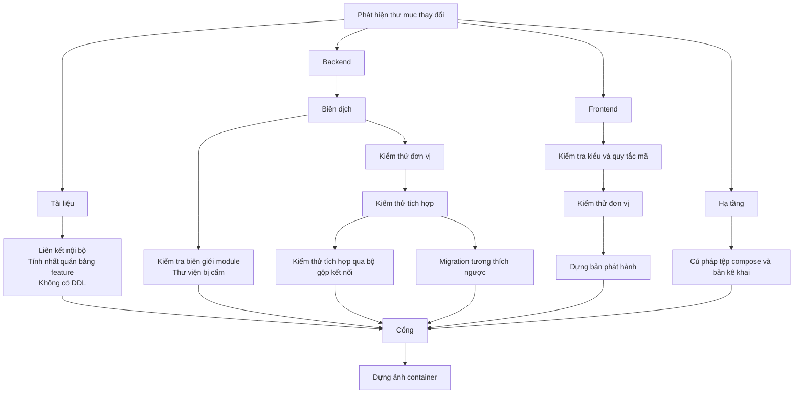

# Tích hợp liên tục và triển khai

Quy trình chạy trên mỗi pull request và mỗi lần phát hành: kiểm tra gì, theo thứ
tự nào, chặn ở đâu, và triển khai lên bậc nào.

**Liên quan:** [environments.md](environments.md) · [testing-strategy.md](testing-strategy.md) · [infrastructure.md](infrastructure.md) · [observability-and-ops.md](observability-and-ops.md)

---

## Nguyên tắc

1. **Mỗi kiểm tra phải trả lời được câu hỏi "nó ngăn được lỗi gì".** Kiểm tra
   không chỉ ra được loại lỗi cụ thể thì chỉ là tiếng ồn làm chậm pipeline
2. **Chỉ chạy phần liên quan.** Sửa tài liệu không được kích hoạt bộ kiểm thử
   tích hợp. Đây là cái giá đã biết trước của việc để mọi thứ trong một repository
3. **Một cổng duy nhất để chặn merge.** Danh sách kiểm tra bắt buộc thay đổi theo
   thời gian; nếu cấu hình bảo vệ nhánh liệt kê từng cái thì mỗi lần thêm một
   kiểm tra lại phải sửa cấu hình. Thay vào đó, một công việc tổng hợp duy nhất
   xét kết quả của tất cả công việc trước nó
4. **Công việc bị bỏ qua không được tính là thành công.** Đây là cái bẫy phổ biến
   nhất của pipeline lọc theo đường dẫn: một công việc bị bỏ qua có trạng thái
   `skipped`, và nếu cổng chỉ hỏi "có cái nào `failure` không" thì một công việc
   lẽ ra phải chạy mà không chạy sẽ lọt qua

---

## Cấu trúc

```
.github/
├── workflows/
│   ├── ci.yml              # trên mỗi pull request và mỗi lần đẩy lên nhánh chính
│   ├── release.yml         # trên mỗi thẻ phiên bản
│   ├── security.yml        # theo lịch, cộng thêm khi phụ thuộc thay đổi
│   └── pr-hygiene.yml      # tiêu đề pull request, kích thước thay đổi
├── scripts/                # script kiểm tra dùng chung, gọi được từ máy cá nhân
└── dependabot.yml
```

Mọi script kiểm tra phải **chạy được từ máy cá nhân** bằng đúng một lệnh. Kiểm tra
chỉ tồn tại bên trong tệp cấu hình của dịch vụ CI là kiểm tra không ai gỡ lỗi được.

---

## Quy trình chính



### Vì sao tách kiểm thử tích hợp làm hai lần chạy

Công việc `Kiểm thử tích hợp qua bộ gộp kết nối` chạy **đúng bộ test đó** nhưng
qua bộ gộp ở chế độ gộp theo giao dịch. Nó không kiểm tra thêm logic nghiệp vụ nào
— nó kiểm tra rằng code không dựa vào trạng thái ở phạm vi phiên (`CON-62`) và
rằng kết nối lắng nghe thông báo được định tuyến riêng (`CON-25`).

Đây là `KJ-PLT-23`, và là **cách tự động duy nhất** bắt được hai vi phạm đó. Không
có nó thì cả hai chỉ lộ ra vào ngày thêm bộ gộp kết nối ở môi trường thật vì lý do
chịu tải, khi đã có hàng nghìn dòng code dựa trên giả định sai.

#### Công việc này phải chạy song song, với pool nhỏ

Chi tiết dễ bỏ qua, và bỏ qua thì cả công việc trở nên vô dụng.

Chế độ gộp theo giao dịch **không** tự nó làm hỏng trạng thái phiên. Nó chỉ trả
kết nối server về pool sau mỗi giao dịch. Nếu pool đủ rộng và chỉ có một client,
client đó gần như luôn nhận lại **đúng kết nối cũ**, nên một biến đặt ở phạm vi
phiên vẫn còn nguyên ở giao dịch sau và test vẫn xanh.

Vi phạm chỉ lộ ra khi **nhiều client tranh nhau một số ít kết nối server**, vì lúc
đó client B nhận được kết nối vừa bị client A bỏ lại, mang theo trạng thái của A.

| Cấu hình bắt buộc của công việc này | |
|---|---|
| Kích thước pool của bộ gộp | Nhỏ — vài kết nối, không phải vài chục |
| Cách chạy test | **Song song**, nhiều luồng |

Chạy tuần tự qua bộ gộp với pool rộng là một công việc CI xanh không kiểm tra gì cả.

---

## Từng công việc

### Tài liệu

| Kiểm tra | Ngăn lỗi gì |
|---|---|
| Liên kết nội bộ và neo tiêu đề | Đổi tên tiêu đề làm gãy liên kết ở tài liệu khác — im lặng cho tới khi có người bấm vào |
| Định danh feature không trùng, mọi phụ thuộc trỏ tới định danh có thật | Bảng theo dõi tiến độ mất giá trị ngay khi có một dòng sai |
| Không có câu lệnh định nghĩa cấu trúc dữ liệu trong `docs/` | Phân tích mô hình dữ liệu đang hoãn; DDL lọt vào tài liệu nghĩa là có người đã quyết định mà không ghi lại |

### Backend

| Công việc | Ngăn lỗi gì |
|---|---|
| Biên dịch | |
| Kiểm thử đơn vị | Logic miền |
| **Kiểm tra biên giới module** | Một module gọi vào phần nội bộ của module khác. Xem [backend-modules.md](backend-modules.md#ba-luật-biên-giới) |
| **Quét tên bảng theo tiền tố** | Truy vấn bảng của module khác — công cụ kiểm tra biên giới **không** bắt được việc này (`CON-55`) |
| **Quét classpath** | Thư viện bị cấm, đặc biệt là thư viện tạo ra cơ chế chuyển tiếp sự kiện thứ hai (`CON-56`) |
| Kiểm thử tích hợp | Chạy trên cơ sở dữ liệu thật trong container. Bảo mật mức dòng, phân vùng, khoá dòng và cơ chế thông báo không giả lập được |
| **Kiểm thử tích hợp qua bộ gộp kết nối** | `CON-62`, `CON-25` |
| **Migration tương thích ngược** | Chạy migration mới trên cơ sở dữ liệu đã có phiên bản ứng dụng cũ đang chạy. Bắt được thay đổi phá vỡ trong thời gian hai phiên bản chạy song song |
| Kiểm thử cách ly tenant | Rò rỉ dữ liệu xuyên workspace. Xem [testing-strategy.md](testing-strategy.md) |

### Frontend

| Công việc | Ngăn lỗi gì |
|---|---|
| Kiểm tra kiểu | |
| Quy tắc mã nguồn | Gồm **luật riêng của dự án**: cấm Server Action cho mutation nghiệp vụ, cấm lấy dữ liệu nghiệp vụ trong server component (`CON-35`, `CON-36`) |
| Kiểm thử đơn vị | Gồm kiểm thử offline và hoàn tác lạc quan |
| Dựng bản phát hành | Lỗi chỉ xuất hiện khi dựng bản phát hành, không xuất hiện khi chạy phát triển |

Luật riêng của dự án ở dòng thứ hai đáng chú ý: đó là hai ràng buộc **kiến trúc**
được enforce bằng công cụ kiểm tra mã nguồn. Không có chúng thì cả hai chỉ là câu
văn trong tài liệu.

### Hạ tầng

Kiểm tra cú pháp tệp compose và bản kê khai của nền tảng điều phối. Rẻ, và bắt
được lỗi gõ sai vốn chỉ lộ ra lúc triển khai.

### Bảo mật

Chạy theo lịch hằng tuần, và chạy thêm khi tệp khai báo phụ thuộc thay đổi.

| Kiểm tra | |
|---|---|
| Lỗ hổng đã biết trong phụ thuộc | Cả backend lẫn frontend |
| Phân tích mã tĩnh | |
| Quét ảnh container | Lỗ hổng trong ảnh nền, không phải trong code của dự án |
| Quét bí mật lọt vào lịch sử | Chạy trên toàn bộ lịch sử, không chỉ trên thay đổi mới |

---

## Cổng

Một công việc duy nhất, chạy sau tất cả, và là **kiểm tra bắt buộc duy nhất** được
khai báo trong cấu hình bảo vệ nhánh.

Nó áp dụng đúng một luật:

> Công việc nào lẽ ra phải chạy theo thư mục đã thay đổi mà kết thúc ở trạng thái
> khác `success` thì chặn. Trạng thái bị bỏ qua **chỉ** chấp nhận được khi thư mục
> tương ứng không thay đổi.

Lý do viết tường minh như vậy: mặc định của phần lớn cấu hình CI coi công việc bị
bỏ qua là đã qua. Kết hợp với lọc theo đường dẫn, đó là cách một thay đổi backend
merge được mà chưa từng chạy một test nào — vì bộ lọc đường dẫn viết sai.

---

## Phát hành và triển khai

### Ảnh container

Dựng **một ảnh duy nhất cho backend** — bốn vai trò dùng chung ảnh đó và khác nhau
ở profile lúc khởi động ([environments.md](environments.md#nguyên-tắc-một-artifact-bốn-cấu-hình)).

| | |
|---|---|
| Gắn thẻ theo mã băm của commit | Luôn truy được ảnh nào ứng với code nào |
| Gắn thêm thẻ phiên bản khi phát hành | |
| **Không dùng thẻ động khi triển khai** | Triển khai theo thẻ động nghĩa là không biết bản nào đang chạy |
| Ảnh nhiều tầng, tầng phụ thuộc tách khỏi tầng mã nguồn | Dựng lại nhanh khi chỉ đổi mã nguồn |

### Đường đi lên các bậc

| Sự kiện | Hành động |
|---|---|
| Merge vào nhánh phát triển | Dựng ảnh, gắn thẻ theo commit. **Không triển khai tự động** |
| Gắn thẻ phiên bản | Dựng ảnh, gắn thẻ phiên bản, triển khai lên `staging` |
| Duyệt thủ công | Triển khai lên `production` |

Bậc 1 và bậc 2 không nằm trong đường đi này — chúng chạy trên máy cá nhân và không
có gì để triển khai.

### Thứ tự triển khai

Bắt buộc theo thứ tự này, ở cả bậc 3 và bậc 4:

```
migration → worker và scheduler → api và realtime
```

Lý do: tiến trình nền phải hiểu được định dạng sự kiện mới **trước khi** có ai
sinh ra chúng. Triển khai `api` trước nghĩa là trong vài chục giây, sự kiện định
dạng mới được ghi vào bảng chuyển tiếp và bị xử lý bởi worker chưa biết định dạng đó.

Migration chạy như một **công việc riêng trước khi triển khai**. Nó không bao giờ
chạy lúc ứng dụng khởi động, ở bất kỳ bậc nào — xem
[ADR-0013](../adr/0013-explicit-two-way-migration.md).

> **Đã thay đổi (2026-09-17):** trước đây quy tắc này chỉ áp dụng cho bậc 4, với
> lý do nhiều bản cùng khởi động sẽ cùng chạy migration. Lý do đó vẫn đúng nhưng
> chưa đủ: để đường chạy ở bậc 4 được diễn tập thay vì chỉ chạy thật lần đầu lúc
> triển khai, cả bốn bậc phải gọi migration theo cùng một cách.

### Quay lui

Quay lui = triển khai lại thẻ ảnh trước đó. Nó **chỉ an toàn khi migration tương
thích ngược**, và đó chính là thứ công việc `Migration tương thích ngược` trong
pipeline bảo vệ.

**Quay lui không phải là chạy migration lùi.** Công cụ migration có chiều đi
xuống, nhưng chiều đó không khôi phục dữ liệu đã bị xoá bởi chiều đi lên, nên ở
bậc 4 nó **không được dùng**: sửa tiến bằng một migration mới, tương thích ngược.

Thay đổi phá vỡ cấu trúc dữ liệu phải chia làm ba bước qua ba lần phát hành: thêm
cái mới → chuyển dữ liệu và chuyển code → xoá cái cũ. Trong ba lần đó, **chỉ lần
thứ ba là không quay lui được**.

### Kiểm tra sau triển khai

Tự động, ngay sau mỗi lần triển khai:

| Kiểm tra | |
|---|---|
| Điểm kiểm tra sức khoẻ của **từng vai trò** | Một điểm kiểm tra chung là vô dụng — xem [observability-and-ops.md](observability-and-ops.md#kiểm-tra-sức-khoẻ) |
| Mở một luồng đồng bộ và nhận được nhịp tim | Bắt được lỗi cấu hình đệm ở máy chủ trung gian, loại lỗi không sinh ra thông báo lỗi nào |
| Độ trễ hàng đợi sự kiện dưới ngưỡng | Bắt được việc tiến trình chuyển tiếp không khởi động |

Kiểm tra thứ hai đáng giá nhất trong ba cái: nó là cách duy nhất phát hiện tự động
rằng "realtime không chạy", vốn là chế độ hỏng đặc trưng của kiến trúc này.

---

## Bí mật dùng trong pipeline

| Quy ước | |
|---|---|
| Không bí mật nào nằm trong repository | Kể cả cho bậc 1 |
| Công việc chỉ nhận đúng bí mật nó cần | Không đưa toàn bộ vào mọi công việc |
| Pull request từ nhánh ngoài **không** nhận bí mật | Đây là dự án cá nhân nên rủi ro thấp, nhưng cấu hình sai ở chỗ này là cách lộ thông tin phổ biến nhất |
| Triển khai lên `production` cần duyệt thủ công | |
