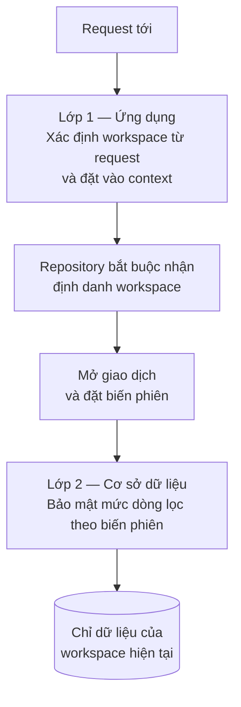
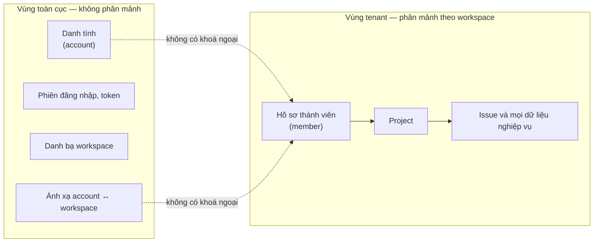

# Truy cập dữ liệu và cách ly tenant

Tầng ghi dùng Spring Data JDBC, truy vấn động dùng jOOQ, truy vấn đơn giản dùng
`JdbcClient`. Mọi dữ liệu nghiệp vụ thuộc về đúng một workspace, và việc cách ly
được phòng thủ ở cả tầng ứng dụng lẫn tầng cơ sở dữ liệu.

> **Phạm vi:** tài liệu này mô tả **chiến lược**. Mô hình dữ liệu cụ thể — entity,
> quan hệ, chỉ mục, DDL — thuộc về [06-erd](../06-erd/) và **chưa được phân tích**.

**Liên quan:** [ADR-0004](../adr/0004-spring-data-jdbc.md) · [ADR-0011](../adr/0011-account-vs-member.md) · [ADR-0012](../adr/0012-shared-schema-tenancy-rls.md) · [backend-modules.md](backend-modules.md) · [06-erd](../06-erd/)

---

## Ba công cụ, ba vai trò

| Việc | Công cụ | Vì sao |
|---|---|---|
| Ghi, giữ invariant, domain logic | **Spring Data JDBC** | Mô hình aggregate rõ ràng, không có trạng thái ẩn |
| Đọc đơn giản: chi tiết một bản ghi, danh sách có cấu trúc cố định | **`JdbcClient`** | Trả thẳng DTO, không dựng aggregate cho việc chỉ để đọc |
| Đọc động: truy vấn do người dùng nhập, board, backlog, báo cáo | **jOOQ** | Dựng SQL động an toàn kiểu, xử lý được trường tuỳ biến |

Quy ước đặt tên: `XxxRepository` cho đường ghi, `XxxQueryService` cho đường đọc.
Nhìn tên là biết đi đường nào.

**Không trộn.** Một `QueryService` không được gọi repository để lấy aggregate rồi
map sang DTO; nó truy vấn thẳng và trả DTO. Ngược lại, một command handler không
được đọc dữ liệu qua `QueryService` để rồi ghi — nó phải làm việc trên aggregate.

---

## Sống chung với Spring Data JDBC

Năm đặc tính dưới đây định hình cách viết code, và bốn trong số đó là **hệ quả
tốt** — chúng ép đúng kỷ luật mà dự án cần.

### 1. Không có dirty checking

Framework không tự phát hiện thay đổi. Nghĩa là **việc tính ra trường nào đã đổi
là code tường minh của ta**, và đó chính xác là thứ sync engine cần:

```
load aggregate hiện tại
→ áp thay đổi trong domain
→ diff bản trước và bản sau
→ ghi aggregate, ghi patch vào nhật ký thay đổi, ghi sự kiện
   (tất cả trong một giao dịch)
```

Đây là lý do chính chọn Spring Data JDBC. Với Hibernate, thông tin này nằm trong
cơ chế nội bộ và phải móc vào listener để lấy ra.

Hệ quả bắt buộc: **command handler phải load trạng thái trước khi ghi**, kể cả
với thao tác tưởng như chỉ cần một câu update. Không có đường tắt.

### 2. Không có lazy loading

Load một aggregate là load trọn vẹn nó. Vì thế aggregate phải nhỏ — xem
[nguyên tắc chia aggregate](backend-modules.md#nguyên-tắc-chia-aggregate).

### 3. Collection con bị xoá và chèn lại

Khi lưu một aggregate có collection con, framework xoá toàn bộ dòng con rồi chèn
lại. Hai hệ quả:

- **Hiệu năng**: collection lớn biến một thay đổi nhỏ thành hàng trăm thao tác ghi
- **Nhật ký thay đổi**: mọi dòng con trông như vừa được tạo mới, làm hỏng patch

**Luật:** chỉ map vào aggregate những collection nhỏ và có chặn trên rõ ràng.
Mọi thứ có thể lên tới hàng trăm dòng phải là aggregate riêng với repository riêng.

### 4. Tham chiếu xuyên aggregate bằng định danh

Framework có kiểu dành riêng cho tham chiếu tới aggregate khác. Không có tham
chiếu đối tượng, nên không có cách nào vô tình load cả một cây dữ liệu.

### 5. Không có cache ẩn

Không session cache, không second-level cache. Mỗi lần gọi repository là một lần
xuống cơ sở dữ liệu. Với hệ nhiều vai trò ứng dụng, đây là điều **mong muốn**:
không có trạng thái ẩn gây lệch giữa các instance.

Cái giá: lỗi N+1 không còn được framework che giấu. Gọi repository trong vòng lặp
là một lỗi thật, và phải bắt trong code review.

### Khoá lạc quan

Dùng trường phiên bản trên aggregate. Sync engine dùng nó để phát hiện xung đột
khi hai người sửa cùng một issue.

---

## Chuyển đổi kiểu

Hai việc phải làm ở Phase 0, trước khi có bất kỳ module nghiệp vụ nào:

| Việc | Vì sao phải làm sớm |
|---|---|
| Converter cho kiểu JSON của PostgreSQL | Payload sự kiện, patch của nhật ký thay đổi, và trường tuỳ biến đều cần. Thiếu nó thì mọi thao tác ghi báo lỗi kiểu dữ liệu |
| Converter cho mặt nạ quyền | Kiểu lưu quyền không phải kiểu nguyên thuỷ của Java, xem [identity-and-permission.md](identity-and-permission.md) |

Đăng ký tập trung ở `platform/persistence`, không rải trong từng module.

---

## Cách ly tenant

### Nguyên tắc nền

**Mọi bảng nghiệp vụ mang định danh workspace**, kể cả khi đã có định danh
project. Việc lặp lại này là **denormalize có chủ đích**: nhờ nó, mọi truy vấn
lọc được tenant ngay tại bảng của mình, không phải join ngược lên project.

### Hai lớp phòng thủ



**Lớp 1 — tầng ứng dụng.** Một context giữ workspace hiện tại, thiết lập từ
request và truyền xuống theo luồng xử lý. Mọi repository bắt buộc nhận định danh
workspace như một tham số, không được tự lấy ngầm.

**Lớp 2 — tầng cơ sở dữ liệu.** Bảo mật ở mức dòng bật trên mọi bảng nghiệp vụ,
lọc theo một biến phiên được đặt ở **đầu mỗi giao dịch**.

### Vì sao bật lớp 2 ngay từ đầu

Một câu truy vấn quên điều kiện lọc là rò rỉ dữ liệu xuyên khách hàng — loại lỗi
nghiêm trọng nhất hệ thống này có thể mắc. Chi phí bật ngay bây giờ gần như bằng
không; thêm vào sau khi đã có hàng trăm bảng thì vừa mệt vừa dễ sót.

Kỷ luật của con người không phải là biện pháp kiểm soát đủ tốt cho việc này.

### Những chỗ dễ sai

| Chỗ | Cách xử lý |
|---|---|
| Tiến trình xử lý nền không có request | Phải tự đặt biến phiên từ dữ liệu của sự kiện trước khi chạy bất kỳ truy vấn nào |
| Tác vụ theo lịch chạy cho mọi workspace | Lặp theo từng workspace và đặt lại biến phiên mỗi vòng, không chạy một truy vấn xuyên tất cả |
| Thao tác quản trị cần bỏ qua giới hạn | Dùng một vai trò cơ sở dữ liệu riêng, được giới hạn chặt và **không** dùng cho đường request thông thường |
| Connection pool tái sử dụng kết nối | Biến phiên phải đặt ở phạm vi giao dịch, không phải phạm vi kết nối, nếu không nó rò sang request sau |
| Migration chạy với quyền cao | Migration không bị bảo mật mức dòng chặn; đây là chủ ý, nhưng nghĩa là script migration phải tự lọc đúng |

---

## Vùng dữ liệu toàn cục và vùng dữ liệu tenant



### Bất biến về khoá ngoại

**Không bảng nghiệp vụ nào được có khoá ngoại tới bảng thuộc vùng toàn cục**,
ngoài bảng workspace. Các cột nối giữa hai vùng tồn tại, nhưng **không khai báo
ràng buộc khoá ngoại**, vì tương lai chúng có thể nằm ở hai nơi khác nhau.

Đây là điều kiện duy nhất cần giữ để có thể phân mảnh về sau, và là thứ **không
sửa được** khi đã có dữ liệu. Xem [ADR-0011](../adr/0011-account-vs-member.md).

**Phải có một test tự động quét siêu dữ liệu của cơ sở dữ liệu** và báo lỗi khi
xuất hiện khoá ngoại vi phạm. Chỉ dựa vào kỷ luật thì sớm muộn sẽ lọt.

---

## Chuẩn bị cho phân mảnh

**Chưa phân mảnh, và chưa có kế hoạch phân mảnh.** Toàn bộ giá trị nằm ở việc giữ
đúng các bất biến, không ở việc thật sự tách cơ sở dữ liệu.

| Cần giữ ngay từ bây giờ | Không làm bây giờ |
|---|---|
| Khoá phân mảnh là định danh workspace, có mặt ở mọi bảng nghiệp vụ | Tách cơ sở dữ liệu |
| Không có khoá ngoại xuyên vùng | Định tuyến theo mảnh |
| Một chỗ duy nhất quyết định kết nối nào phục vụ workspace nào, hiện trả về kết nối mặc định | Đồng bộ dữ liệu giữa các mảnh |
| Truy vấn xuyên workspace đã được viết theo kiểu lặp qua từng workspace | Giao dịch phân tán |

**Điều kiện xem xét phân mảnh thật:** một instance PostgreSQL không còn đủ, và có
số đo chứng minh — không phải vì linh cảm.

### Cái giá đã chấp nhận

Truy vấn gộp dữ liệu của một người **xuyên nhiều workspace** không còn là một câu
truy vấn. Ví dụ màn hình "công việc của tôi ở mọi nơi": tra bảng ánh xạ để lấy
các cặp workspace và hồ sơ tương ứng, truy vấn từng workspace, rồi gộp kết quả.

Chấp nhận được vì số workspace của một người thường rất nhỏ, các truy vấn chạy
song song được, và đây **chính là** cách bắt buộc phải làm sau khi phân mảnh —
tức là trả giá một lần bây giờ thay vì phải viết lại sau.

---

## Migration

> **Đã thay đổi (2026-09-17):** trước đây công cụ là Flyway và migration chạy lúc
> ứng dụng khởi động ở bậc 1–3, chỉ tách thành công việc riêng ở bậc 4. Bây giờ
> công cụ là **Liquibase bản Community** và migration **không bao giờ chạy lúc
> khởi động ở bất kỳ bậc nào**. Lý do: cần điều khiển được cả chiều đi xuống —
> bản miễn phí của Flyway không có — và cần đường chạy ở bậc 4 được diễn tập mỗi
> ngày thay vì chỉ chạy thật lần đầu lúc triển khai. Xem
> [ADR-0013](../adr/0013-explicit-two-way-migration.md).

Migration là **một thao tác được gọi tường minh**, không phải tác dụng phụ của
lệnh khởi động, và gọi được **cả hai chiều**.

| Quy ước | |
|---|---|
| Công cụ | Liquibase bản Community, script đặt trong `backend/platform/persistence` |
| Định dạng | SQL thô. Phần trừu tượng XML/YAML không diễn đạt nổi chính sách bảo mật mức dòng và chỉ mục đặc thù, và cũng không cần |
| Cách gọi | Vai trò `migrate` của chính ảnh container đã có, không phải binary riêng |
| Đặt tên | Số phiên bản tăng dần, mô tả ngắn bằng tiếng Anh |
| Không sửa script đã chạy | Sai thì viết script mới sửa lại |
| **Phần lùi** | **Bắt buộc cho mọi changeset**, viết tay ngay cạnh phần đi lên. Bản Community không sinh giúp |
| Tương thích ngược | Trong thời gian triển khai cuốn chiếu có hai phiên bản ứng dụng chạy song song |
| Thay đổi phá vỡ | Chia làm ba bước qua ba lần phát hành: thêm cái mới → chuyển dữ liệu và chuyển code → xoá cái cũ |
| Bảng mới | Bắt buộc có định danh workspace và bật bảo mật mức dòng ngay trong chính script tạo bảng |
| Dữ liệu mẫu | Không nằm trong migration; nằm ở script riêng trong `infra/` |

### Chiều đi xuống dùng ở đâu

**Đi xuống không phải là khôi phục dữ liệu.** Lùi một migration đã bỏ cột sẽ dựng
lại cột rỗng; dữ liệu trong đó đã mất và không có script nào lấy lại được.

| Bậc | Đi xuống |
|---|---|
| `local-mini`, `dev` | Dùng thoải mái — đây chính là chỗ nó có giá trị: viết, chạy, thấy sai, lùi, sửa |
| `staging` | Dè dặt, và chỉ khi biết chắc dữ liệu mất là dữ liệu bỏ đi được |
| `production` | **Không**. Quay lui ở đây là sửa tiến kèm migration tương thích ngược, xem [ci-cd.md](ci-cd.md#quay-lui) |

### Hệ quả với việc khởi động

Ứng dụng khởi động được khi schema chưa đúng phiên bản, nên vai trò `api` phải
**kiểm tra phiên bản schema trong health check** và báo chưa sẵn sàng, thay vì
chạy rồi lỗi ở câu truy vấn nghiệp vụ đầu tiên.

---

## Mô hình dữ liệu chi tiết

> **Chưa phân tích.** Entity, quan hệ, chỉ mục và DDL sẽ được làm ở
> [06-erd](../06-erd/), ngay trước khi implement Phase 0 và mở rộng dần theo từng phase.
>
> Các bất biến mà mô hình đó bắt buộc phải tuân theo đã được liệt kê tại
> [06-erd/README.md](../06-erd/README.md).
