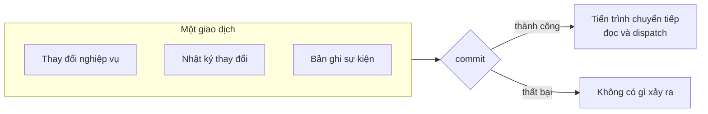
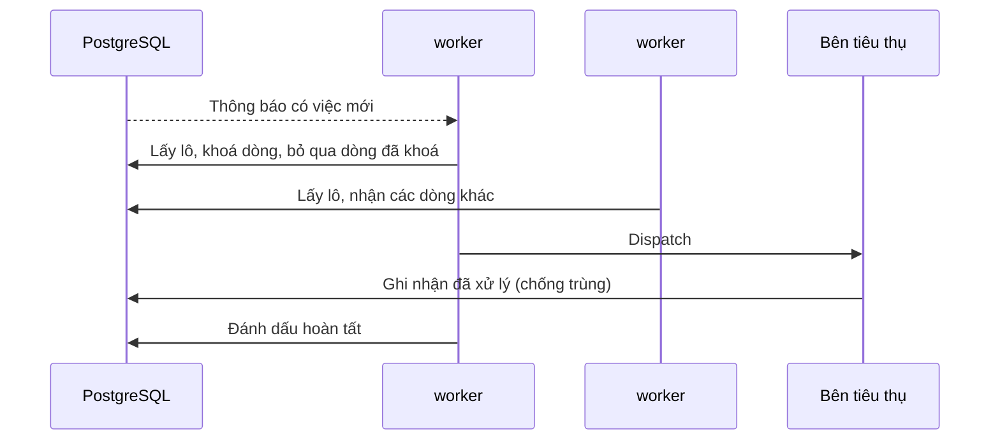

# Domain event và outbox

Module giao tiếp bất đồng bộ bằng domain event. Sự kiện được ghi vào một bảng
chuyển tiếp **trong cùng giao dịch** với thay đổi nghiệp vụ, rồi một tiến trình
nền đọc bảng đó và dispatch tới các bên tiêu thụ.

**Liên quan:** [ADR-0005](../adr/0005-outbox-db-job.md) · [ADR-0003](../adr/0003-redis-scope.md) · [backend-modules.md](backend-modules.md) · [realtime-and-sync.md](realtime-and-sync.md)

---

## Vì sao cần outbox

Nếu phát sự kiện trực tiếp trong bộ nhớ ngay sau khi ghi dữ liệu, sẽ có một
khoảng thời gian mà dữ liệu đã đổi nhưng sự kiện chưa phát. Tiến trình chết trong
khoảng đó là mất sự kiện vĩnh viễn — và **không có cách nào biết để sửa**, vì
không còn dấu vết nào cho thấy nó từng cần được phát.

Ghi sự kiện vào cùng giao dịch loại bỏ hoàn toàn khoảng thời gian đó: hoặc cả hai
cùng xảy ra, hoặc không có gì xảy ra.

---

## Chỉ có một cơ chế chuyển tiếp sự kiện

Framework nền có sẵn một cơ chế theo dõi và chuyển tiếp sự kiện riêng. Dự án
**không dùng** nó ([ADR-0005](../adr/0005-outbox-db-job.md)), nhưng lý do không
dùng không tự bảo vệ được — cơ chế đó **tự bật khi thư viện tương ứng xuất hiện
trên classpath**, không cần ai gọi tới nó.

### Ba điều cấm

| Cấm | Vì sao |
|---|---|
| Thêm bất kỳ thư viện lưu trữ sự kiện nào của framework nền | Nó tự tạo bảng riêng và tự chặn mọi listener giao dịch, tạo ra **cơ chế chuyển tiếp thứ hai** chạy song song với cơ chế của dự án |
| Dùng annotation listener giao dịch của framework nền cho giao tiếp giữa các module | Sự kiện sẽ đi đường vòng, không qua bảng chuyển tiếp, và **không tới được vai trò ứng dụng `worker`** |
| Dùng cơ chế externalize sự kiện ra message broker | Dự án không có broker ([ADR-0005](../adr/0005-outbox-db-job.md)) |

Danh sách thư viện được phép và không được phép nằm ở
[backend-modules.md](backend-modules.md#thư-viện-được-phép-và-không-được-phép).

### Vì sao đây là loại lỗi khó nhận ra

Nếu hai cơ chế cùng chạy, **mọi thứ vẫn hoạt động**: sự kiện vẫn tới nơi, test vẫn
xanh. Triệu chứng chỉ xuất hiện về sau và trông như chuyện khác hẳn — bên tiêu thụ
chạy hai lần, một bảng lạ phình to trong cơ sở dữ liệu, thứ tự xử lý sai lệch
không giải thích được.

Vì thế cần một **test chặn từ đầu**: kiểm tra classpath và báo lỗi nếu phát hiện
thư viện bị cấm. Rẻ hơn nhiều so với việc gỡ rối sau sáu tháng.

### Điều này không có nghĩa cơ chế sẵn có là tệ

Cơ chế sẵn có hiện đã khá đầy đủ: ghi cùng giao dịch, theo dõi trạng thái từng
listener, tự phát lại khi khởi động lại, có cơ chế phát hiện listener treo, và có
nhiều chế độ dọn dẹp bản ghi đã hoàn tất.

Lý do không dùng **không phải** vì nó thiếu tính năng, mà vì **bên tiêu thụ của
Kaiju chạy ở một tiến trình khác** (vai trò ứng dụng `worker`), còn cơ chế đó chỉ
dispatch trong cùng tiến trình. Đây là khác biệt về kiến trúc, không phải về chất
lượng — và nếu về sau bỏ mô hình nhiều vai trò ứng dụng thì quyết định này đáng
được xem xét lại.

---

## Domain event

### Đặt tên

Danh từ chấm động từ ở **thì quá khứ**: `issue.transitioned`, `member.removed`,
`sprint.completed`. Thì quá khứ không phải chi tiết thẩm mỹ — nó nhắc rằng sự
kiện mô tả việc **đã xảy ra**, không phải một mệnh lệnh yêu cầu ai đó làm gì.

Nếu thấy mình muốn đặt tên kiểu `notification.send`, thì đó không phải sự kiện mà
là một lời gọi trá hình, và thiết kế đang sai chỗ nào đó.

### Nội dung

| Phần | Chứa gì |
|---|---|
| Danh tính sự kiện | Định danh duy nhất, dùng cho việc chống trùng ở bên tiêu thụ |
| Loại và phiên bản | Tên sự kiện và số phiên bản của định dạng |
| Đối tượng | Loại và định danh của aggregate phát sinh sự kiện |
| Dữ liệu | Thông tin nghiệp vụ, đủ để bên tiêu thụ làm việc **mà không phải truy vấn ngược** |
| Siêu dữ liệu | Người thực hiện, định danh workspace, định danh tương quan để lần vết |

**Sự kiện phải đủ dữ liệu để bên tiêu thụ làm việc.** Nếu mọi bên tiêu thụ đều
phải truy vấn ngược để lấy thêm thông tin thì sự kiện đang quá nghèo, và ta đang
gánh chi phí bất đồng bộ mà không hưởng lợi ích tách rời.

Ngược lại, đừng nhồi cả aggregate vào sự kiện — payload phình to và mọi thay đổi
cấu trúc dữ liệu đều trở thành thay đổi phá vỡ.

### Phiên bản

**Trường phiên bản phải có ngay từ sự kiện đầu tiên.** Thêm vào sau khi đã có dữ
liệu trong bảng là việc rất tốn kém.

| Loại thay đổi | Cách xử lý |
|---|---|
| Thêm trường tuỳ chọn | Giữ nguyên phiên bản |
| Đổi ý nghĩa hoặc xoá trường | Tăng phiên bản, bên tiêu thụ phải xử lý cả hai trong thời gian chuyển tiếp |
| Đổi tên sự kiện | Sự kiện mới, phát song song một thời gian rồi ngừng phát cái cũ |

---

## Tiến trình chuyển tiếp

Chạy trong vai trò ứng dụng `worker`, nhiều instance song song.

### Lấy việc song song

Dùng khoá ở mức dòng kèm cơ chế bỏ qua dòng đang bị khoá. Nhờ đó nhiều instance
`worker` chạy cùng lúc mà không giẫm chân nhau, và **không cần message broker**.

### Đánh thức

Dựa vào cơ chế thông báo của PostgreSQL để đánh thức tiến trình ngay khi có sự
kiện mới, thay vì chờ đến chu kỳ quét tiếp theo. Độ trễ giảm từ vài trăm mili
giây xuống vài chục.

> ⚠️ **Cảnh báo cụ thể:** kết nối dùng để lắng nghe thông báo **không được lấy từ
> connection pool chung**. Pool sẽ thu hồi và reset kết nối, và listener biến mất
> một cách âm thầm — không có lỗi nào, chỉ là realtime chậm lại về mức chu kỳ quét.
> Phải mở một kết nối riêng nằm ngoài pool, chạy trong một luồng riêng.

Vẫn giữ **chu kỳ quét định kỳ làm dự phòng**. Nếu chỉ dựa vào thông báo thì một
lần mất kết nối là hàng đợi đứng im mãi mãi.

### Giữ thứ tự

Sự kiện của **cùng một aggregate** phải được xử lý tuần tự — nếu không, hai thay
đổi liên tiếp của một issue có thể được xử lý ngược thứ tự và cho kết quả sai.

Cách làm: chia việc theo hàm băm của định danh aggregate, mỗi instance `worker`
chỉ nhận phần của mình. Sự kiện của hai aggregate khác nhau vẫn chạy song song.

**Không đảm bảo thứ tự toàn cục**, và không cần: không có logic nào phụ thuộc vào
thứ tự giữa hai aggregate khác nhau.

---

## Giao hàng ít nhất một lần

Sự kiện **có thể được giao nhiều hơn một lần**: tiến trình có thể chết sau khi
dispatch nhưng trước khi đánh dấu hoàn tất.

**Hệ quả bắt buộc: mọi bên tiêu thụ phải chống trùng.** Đây là ràng buộc khó nhất
của toàn bộ thiết kế hướng sự kiện, và là nguồn gốc của những lỗi khó chịu nhất —
gửi hai email cho cùng một việc, cộng đôi một con số, tạo hai issue con.

### Cách chống trùng

Mỗi bên tiêu thụ ghi nhận cặp (tên bên tiêu thụ, định danh sự kiện) đã xử lý, với
ràng buộc duy nhất, **trong cùng giao dịch với việc nó làm**. Xử lý lại một sự
kiện đã ghi nhận thì bỏ qua.

Khi tác dụng phụ nằm ngoài cơ sở dữ liệu — chẳng hạn gửi email — thì ghi nhận
trước, gửi sau. Chấp nhận khả năng mất một email hiếm hoi còn hơn gửi trùng.

**Việc tự nhiên idempotent thì không cần bảng ghi nhận.** Đặt một trường về một
giá trị cố định chạy lại bao nhiêu lần cũng cho kết quả như nhau.

---

## Thử lại, hoãn và thư chết

| Cơ chế | Mô tả |
|---|---|
| Thử lại | Lỗi tạm thời được thử lại với khoảng chờ tăng dần |
| Hoãn | Bản ghi mang mốc thời gian sớm nhất được thử lại, tiến trình bỏ qua cho tới lúc đó |
| Thư chết | Vượt số lần thử tối đa thì chuyển sang khu vực riêng, kèm thông tin lỗi lần cuối |
| Phát lại | Công cụ dòng lệnh để xem, sửa và phát lại sự kiện trong khu vực thư chết |
| Cảnh báo | Có bản ghi mới trong khu vực thư chết là tín hiệu phải xem ngay |

**Không được lược bớt phần nào.** Thiếu thư chết thì một sự kiện hỏng sẽ hoặc
chặn hàng đợi, hoặc lặp vô hạn và làm ngập nhật ký. Thiếu công cụ phát lại thì
khi có sự cố sẽ phải sửa dữ liệu bằng tay.

---

## Bên tiêu thụ dự kiến

| Bên tiêu thụ | Nghe gì | Làm gì | Phase |
|---|---|---|---|
| Phát tán đồng bộ | Mọi sự kiện có ảnh hưởng tới dữ liệu client | Đẩy delta qua Redis tới các instance `realtime` | 0 |
| Nhật ký hoạt động | Mọi sự kiện nghiệp vụ | Ghi mục hoạt động hiển thị cho người dùng | 4 |
| Thông báo | Sự kiện liên quan tới con người: được gán, được nhắc tên, có bình luận | Tạo thông báo trong ứng dụng và xếp hàng gửi email | 4 |
| Gửi email | Sự kiện thông báo và lời mời | Gọi dịch vụ gửi email | 1 |
| Chỉ mục tìm kiếm | Issue và bình luận thay đổi | Cập nhật chỉ mục | 7 |
| Rollup roadmap | Issue con đổi ngày hoặc trạng thái | Tính lại ngày và tiến độ của epic | 10 |
| Automation | Sự kiện khớp với điều kiện kích hoạt của quy tắc | Chạy quy tắc tự động | 14 |
| Webhook | Sự kiện có đăng ký webhook | Gọi ra ngoài, thử lại, ghi nhật ký gửi | 16 |

Đây cũng là minh hoạ rõ nhất cho giá trị của kiến trúc hướng sự kiện: thêm bất kỳ
dòng nào trong bảng trên **không phải sửa module `issue`**.

---

## Giữ dữ liệu

Bảng chuyển tiếp sẽ là một trong những bảng ghi nhiều nhất hệ thống. Cần:

- Phân vùng theo thời gian
- Tác vụ định kỳ xoá các bản ghi đã hoàn tất quá một khoảng thời gian
- Giữ khu vực thư chết **lâu hơn** hẳn, vì đó là thứ cần điều tra
- Bảng ghi nhận chống trùng cũng cần dọn, theo cùng mốc thời gian với bảng chuyển tiếp

---

## Quan hệ với nhật ký thay đổi

Hai thứ này dễ nhầm và phục vụ hai mục đích khác nhau:

| | Bảng chuyển tiếp sự kiện | Nhật ký thay đổi |
|---|---|---|
| Dành cho | Bên tiêu thụ **phía server** | **Client** đồng bộ dữ liệu |
| Nội dung | Ý nghĩa nghiệp vụ của việc đã xảy ra | Trường nào đã đổi thành giá trị gì |
| Thứ tự | Theo aggregate | Theo sync scope, đánh số liên tục |
| Vòng đời | Xoá sau khi đã xử lý | Giữ lâu hơn để client vắng mặt còn bắt kịp |

Cả hai được ghi trong **cùng một giao dịch** với thay đổi nghiệp vụ. Chi tiết
nhật ký thay đổi: [realtime-and-sync.md](realtime-and-sync.md).
