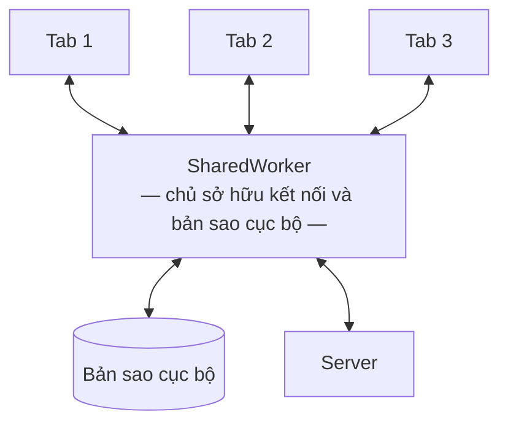

# Kiến trúc bên trong `frontend/`

Next.js được dùng như một SPA framework có routing và build tool tốt, không phải
như một framework full-stack. Khu vực ứng dụng render hoàn toàn ở phía client và
đọc dữ liệu từ bản sao cục bộ.

**Liên quan:** [ADR-0007](../adr/0007-build-own-sync-engine.md) · [ADR-0008](../adr/0008-nextjs-as-spa-shell.md) · [ADR-0017](../adr/0017-shadcn-and-tanstack-frontend-stack.md) · [realtime-and-sync.md](realtime-and-sync.md) · [sync-engine.md](sync-engine.md) · [identity-and-permission.md](identity-and-permission.md)

---

## Phân vùng render

| Vùng | Render | Vì sao |
|---|---|---|
| Trang giới thiệu, tài liệu, bảng giá | Tĩnh hoặc phía server | Cần SEO và tải nhanh lần đầu; Next làm tốt nhất ở đây |
| Trang nhập email, trang nhận liên kết đăng nhập | Phía server | Cần đặt cookie và điều hướng; server component là công cụ đúng |
| **Toàn bộ khu vực ứng dụng** | **Chỉ phía client** | Dữ liệu thật nằm trong bản sao cục bộ; server không biết gì về nó |

Khu vực ứng dụng có một layout gốc đánh dấu là client component; mọi thứ bên dưới
nằm ở phía client.

### Hai điều cấm

| Cấm | Vì sao |
|---|---|
| **Server Action cho thay đổi dữ liệu nghiệp vụ** | Bỏ qua hoàn toàn sync engine: không có cập nhật lạc quan, không có hàng đợi offline, không có hoàn tác. Một màn hình dùng Server Action sẽ hoạt động khác hẳn phần còn lại của ứng dụng |
| **Lấy dữ liệu nghiệp vụ trong server component** | Server không có bản sao cục bộ của người dùng, nên kết quả là nhấp nháy nội dung sai rồi mới đúng, chậm hơn, và logic bị nhân đôi ở hai nơi |

**Nếu thấy mình đang viết Server Action để sửa một issue, tức là đã đi sai hướng.**

Quy tắc này đi ngược thói quen mặc định khi làm Next, nên nó được nhắc lại ở
[CLAUDE.md](../../CLAUDE.md) và ở [constraints.md](../02-requirement/constraints.md).

---

## Cấu trúc thư mục

```
frontend/
├── app/
│   ├── (marketing)/           # trang giới thiệu — render phía server
│   ├── (auth)/                # nhập email, nhận liên kết — render phía server
│   └── (app)/                 # khu vực ứng dụng — chỉ phía client
│       ├── layout.tsx         # gốc client, khởi tạo sync engine
│       └── w/[slug]/...       # mọi màn hình nghiệp vụ
├── src/
│   ├── sync/                  # sync engine
│   │   ├── worker/            # chạy trong SharedWorker
│   │   │   ├── transport/     # tầng truyền tải, hiện tại là SSE
│   │   │   ├── store/         # bản sao cục bộ đã chuẩn hoá
│   │   │   ├── mutation/      # hàng đợi bền, hoàn tác, rebase
│   │   │   └── bootstrap/     # tải trạng thái đầy đủ
│   │   └── client/            # API dùng từ React
│   │       ├── useLocalEntity.ts
│   │       ├── useLocalQuery.ts
│   │       └── useMutator.ts
│   ├── features/              # theo bounded context, ánh xạ với module backend
│   │   ├── issue/  board/  sprint/  workspace/  ...
│   │   └── <feature>/remote/  # lời gọi server không qua đồng bộ (TanStack Query)
│   ├── remote/                # thiết lập TanStack Query dùng chung
│   ├── ui/                    # component shadcn/ui, không biết nghiệp vụ
│   └── lib/                   # tiện ích
└── tests/
```

`src/features/*` ánh xạ một-một với module backend. Một feature ở frontend chỉ
đọc thực thể thuộc phạm vi của nó; cần dữ liệu của feature khác thì đi qua API
công khai của feature đó, giống luật biên giới ở backend.

`@tanstack/react-query` chỉ được import trong thư mục `remote/`. Luật kiểm tra mã
nguồn chặn mọi chỗ khác — xem [ADR-0017](../adr/0017-shadcn-and-tanstack-frontend-stack.md).

> **Changed (2026-09-23):** ba hook của sync engine trước đây tên là `useEntity`,
> `useQuery` và `useMutation`. Đổi thành `useLocalEntity`, `useLocalQuery` và
> `useMutator` vì TanStack Query được đưa vào stack
> ([ADR-0017](../adr/0017-shadcn-and-tanstack-frontend-stack.md)) và có hook
> trùng tên — giữ tên cũ thì đọc code không phân biệt được dữ liệu đến từ bản sao
> cục bộ hay từ server. Thư mục `remote/` cũng được thêm vào cùng lúc.

---

## Sync engine phía client

### Vì sao SharedWorker

Người dùng mở năm tab Kaiju. Nếu mỗi tab tự mở kết nối và tự ghi vào bản sao cục
bộ thì có năm kết nối, năm bên ghi tranh nhau, và các tab lệch nhau.

SharedWorker cho **một** kết nối và **một** bên ghi duy nhất; các tab chỉ đăng ký
nhận thay đổi.



**Phương án dự phòng** khi trình duyệt không hỗ trợ: bầu một tab làm chủ bằng cơ
chế khoá của trình duyệt và truyền tin giữa các tab qua kênh phát sóng nội bộ.
Tab chủ đóng thì tab khác nhận vai trò. Interface hướng ra React giữ nguyên trong
cả hai trường hợp.

### Bản sao cục bộ

Lưu trữ **đã chuẩn hoá theo thực thể**, không lưu theo kết quả truy vấn. Một
delta về một issue phải cập nhật **mọi** màn hình đang hiển thị issue đó — bảng
backlog, thẻ trên board, ô chi tiết đang mở — bằng một lần ghi duy nhất.

Đây là lý do **không dùng thư viện cache theo khoá truy vấn** cho dữ liệu nghiệp
vụ: cache của chúng tổ chức theo khoá truy vấn, nên cùng một issue nằm rải rác ở
nhiều mục và phải vô hiệu hoá bằng tay từng chỗ. TanStack Query có trong stack,
nhưng chỉ cho dữ liệu **không có sync scope** — ranh giới ở
[ADR-0017](../adr/0017-shadcn-and-tanstack-frontend-stack.md#phạm-vi-của-tanstack-query).

Cách engine lưu trữ, rebase và chạy truy vấn bên trong:
[sync-engine.md](sync-engine.md#phía-client).

Hai tầng, theo mô tả ở [realtime-and-sync.md](realtime-and-sync.md#hoà-giải-rebase):
tầng **đã xác nhận** do server quyết định, và tầng **hiển thị** là tầng đã xác
nhận cộng các mutation đang chờ.

### Tầng truy vấn phản ứng

React đăng ký một truy vấn cục bộ (ví dụ "mọi issue trong project P có trạng thái
X, sắp theo thứ hạng"), và được render lại khi có thực thể liên quan thay đổi.
Truy vấn chạy trên bản sao cục bộ, không đi mạng.

### Giới hạn dung lượng

Trình duyệt có thể xoá dữ liệu lưu trữ bất cứ lúc nào. Ứng dụng phải chịu được
việc mở lên và thấy trống rỗng — đó chỉ là bootstrap lại.

Cần chính sách dọn dẹp: các scope lâu không truy cập bị xoá để nhường chỗ.

---

## Thư viện

| Việc | Chọn | Lý do |
|---|---|---|
| Component giao diện | shadcn/ui | Mã component nằm trong `src/ui/`, dựng trên primitive trợ năng của Radix; xem [ADR-0017](../adr/0017-shadcn-and-tanstack-frontend-stack.md) |
| Tạo kiểu | Tailwind CSS | Không có runtime; token thiết kế là biến CSS theo quy ước theme của shadcn, gồm cả chế độ tối |
| Lưu trữ cục bộ | Dexie | API dễ chịu trên IndexedDB, có giao dịch và truy vấn phản ứng |
| Trạng thái giao diện | Zustand | Nhẹ, không nghi thức; chỉ dùng cho trạng thái giao diện, **không** cho dữ liệu nghiệp vụ |
| Kéo thả | dnd-kit | Hỗ trợ bàn phím và trợ năng, phù hợp cho board và backlog |
| Soạn thảo văn bản | Tiptap | Có đường nâng cấp lên soạn thảo cộng tác ở phase sau |
| Danh sách dài | TanStack Virtual | Backlog hàng nghìn dòng phải ảo hoá |
| Bảng | TanStack Table | Headless; chạy ở chế độ sắp xếp và lọc **thủ công** — việc sắp xếp và lọc thuộc về truy vấn cục bộ trong engine |
| Form | TanStack Form | Kiểu dữ liệu chặt; nộp form là gọi một mutator, không phải một request riêng |
| Lời gọi server không qua đồng bộ | TanStack Query | **Chỉ** cho dữ liệu không có sync scope, chỉ import trong `remote/` |
| Biểu đồ | *chưa chọn* | Quyết định ở Phase 9 khi làm báo cáo agile |

> **Changed (2026-09-23):** bản trước ghi *"Chưa chốt: thư viện component giao
> diện. Quyết định cùng với 05-ux-ui-design."* Đã chốt shadcn/ui trên Tailwind,
> cùng TanStack Table, Form và Query, trước khi bắt đầu 05-ux-ui-design — để
> design system được viết thẳng dưới dạng token theme của shadcn thay vì phải
> chuyển đổi về sau. Lý do và phạm vi của TanStack Query:
> [ADR-0017](../adr/0017-shadcn-and-tanstack-frontend-stack.md).

---

## Xác thực phía client

| Thành phần | Nơi lưu | Lý do |
|---|---|---|
| Token truy cập (ngắn hạn) | Trong bộ nhớ của SharedWorker | Không lưu vào lưu trữ trình duyệt để giảm rủi ro khi có lỗ hổng chèn mã |
| Token làm mới | Cookie chỉ đọc được bởi server | Mã JavaScript không chạm tới được |

SharedWorker tự làm mới token và đính kèm vào cả luồng đồng bộ lẫn các request
mutation. Các tab không tự quản token.

**Middleware của Next chỉ kiểm tra sự tồn tại của cookie** để quyết định điều
hướng. Nó **không** xác thực token — việc đó thuộc về backend. Middleware chỉ
tránh việc hiển thị khung ứng dụng cho người chắc chắn chưa đăng nhập.

---

## Trạng thái kết nối và mutation đang chờ

Người dùng phải luôn trả lời được câu hỏi "việc tôi vừa làm đã tới server chưa".

| Trạng thái | Hiển thị |
|---|---|
| Đã đồng bộ | Không hiển thị gì — trạng thái bình thường không cần nhắc |
| Đang gửi | Chỉ báo nhẹ, không chặn thao tác |
| Offline, có mutation chờ | Chỉ báo rõ kèm số lượng đang chờ |
| Mutation bị từ chối | Thông báo có thể thao tác được, nêu rõ lý do |
| Đang tải lại toàn bộ | Khung xương cho scope đang tải; phần còn lại vẫn dùng được |

**Không dùng ô xoay chờ cho thao tác thông thường.** Nếu một thao tác cần ô xoay
chờ thì hoặc nó chưa được làm lạc quan, hoặc nó không thuộc luồng chính.

---

## Hiệu năng

| Nguyên tắc | |
|---|---|
| Sync engine chạy ngoài luồng chính | Áp delta và truy vấn cục bộ không được làm giật giao diện |
| Danh sách dài phải ảo hoá | Backlog và kết quả tìm kiếm |
| Chia nhỏ gói theo tuyến đường | Board, roadmap, báo cáo là các gói riêng |
| Ưu tiên tải scope đang mở | Các scope khác tải nền sau |

---

## Test

| Tầng | Nội dung |
|---|---|
| Sync engine | Chạy không cần trình duyệt thật: offline, nối lại, hoàn tác, rebase, thu hồi quyền |
| Component | Render với bản sao cục bộ dựng sẵn, không gọi mạng |
| Đầu cuối | Các luồng chính, gồm cả kịch bản hai tab và kịch bản mất mạng |

Chi tiết: [testing-strategy.md](testing-strategy.md).
