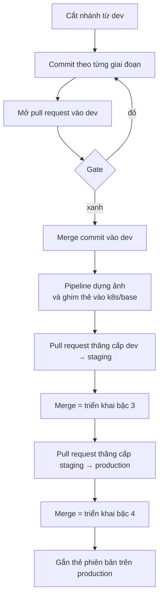

# Quy trình nhánh git

Code đi từ máy cá nhân tới `production` bằng đường nào: nhánh nào tồn tại, mở từ
đâu, merge kiểu gì, và khi hỏng thì lùi ra sao.

**Liên quan:** [ADR-0015](../adr/0015-branch-per-environment.md) · [ADR-0016](../adr/0016-git-branching-workflow.md) · [ci-cd.md](ci-cd.md) · [environments.md](environments.md)

---

## Nguyên tắc

1. **Nhánh môi trường là bản ghi trạng thái, không phải nhánh làm việc.** `dev`,
   `staging`, `production` ghi lại môi trường tương ứng *đang chạy gì*. Không bao
   giờ xoá, không bao giờ force-push, không bao giờ rebase
2. **Một thay đổi vào hệ thống bằng đúng một đường:** nhánh ngắn hạn → `dev` →
   `staging` → `production`. Ngoại lệ duy nhất là quay lui
3. **Merge phải giữ được quan hệ tổ tiên.** Mọi thứ trong mô hình này — diff của
   pull request thăng cấp, "production đang sau dev bao nhiêu", `git revert` —
   đều dựa vào việc nhánh nguồn thật sự là tổ tiên của nhánh đích
4. **Quay lui phải nhanh hơn sửa tiến.** Nếu quay lui cũng phải chờ đủ vòng như
   một thay đổi bình thường thì lúc có sự cố sẽ không ai dùng nó

---

## Bản đồ nhánh

```mermaid
%%{init: {'gitGraph': {'mainBranchName': 'dev'}}}%%
gitGraph
   commit id: "..."
   branch staging
   branch production
   checkout dev
   branch feat/kj-sync-07
   commit id: "feat: change log"
   commit id: "test: catch-up"
   checkout dev
   merge feat/kj-sync-07
   commit id: "ci: pin image tag"
   checkout staging
   merge dev tag: "triển khai bậc 3"
   checkout production
   merge staging tag: "v0.1.0"
```

| Nhánh | Tuổi thọ | Mở từ | Merge vào | Ai đẩy lên |
|---|---|---|---|---|
| `dev` | Vĩnh viễn | — | `staging` | Người qua pull request, **và pipeline** (commit ghim thẻ ảnh) |
| `staging` | Vĩnh viễn | — | `production` | Chỉ qua pull request từ `dev` |
| `production` | Vĩnh viễn | — | — | Chỉ qua pull request từ `staging` |
| `<type>/<slug>` | Vài giờ tới vài ngày | `dev` | `dev` | Người |
| `rollback/<slug>` | Vài phút | Nhánh môi trường đang hỏng | Chính nhánh đó | Người |

`dev` là nhánh mặc định của repository. Dự án **không có nhánh `main`**.

---

## Đặt tên nhánh làm việc

```
<type>/<slug>
<type>/<feature-id>-<slug>
```

`type` lấy đúng tập hợp mà `pr-hygiene.yml` đã dùng cho tiêu đề pull request, nên
tên nhánh và tiêu đề pull request luôn khớp loại với nhau:

`feat` · `fix` · `docs` · `refactor` · `test` · `chore` · `perf` · `build` · `ci` · `infra`

| Ví dụ | |
|---|---|
| `feat/kj-sync-07-catch-up-cursor` | Có định danh feature — **nên dùng** khi thay đổi ứng với một dòng trong [feature catalog](../03-features/README.md) |
| `fix/sse-heartbeat-buffering` | Không có định danh feature thì mô tả triệu chứng, không mô tả cách sửa |
| `docs/git-flow` | |
| `rollback/2026-09-18-outbox-relay` | Ngày + thứ bị lùi. Ngày quan trọng vì có thể có nhiều lần lùi cùng một thành phần |

Hai tiền tố nữa tồn tại nhưng không do người tạo: `dependabot/*` và `claude/*`.

---

## Vòng đời một thay đổi



Ba điểm dễ hiểu sai:

- **Merge vào `dev` không triển khai gì cả.** Nó chỉ dựng ảnh và ghim thẻ
- **Không có nút triển khai nào.** Merge pull request *chính là* hành động triển
  khai ([CON-77](../02-requirement/constraints.md))
- **Thẻ phiên bản gắn sau khi triển khai**, không phải trước. Nó là nhãn đặt lên
  thứ đã chạy thật, không phải lệnh kích hoạt bất cứ gì

---

## Commit

| | |
|---|---|
| Ngôn ngữ | **Tiếng Anh**, kể cả khi tài liệu trong commit đó viết tiếng Việt (`CON-50`) |
| Định dạng | Conventional Commits: `<type>(<scope>)!: <mô tả>` |
| Độ lớn | **Một commit cho một giai đoạn công việc.** Không gom cả nhánh thành một commit ở phút cuối |
| Thân commit | Dùng khi cần nói *vì sao*. Phần *cái gì* đã nằm trong diff rồi |
| Tài liệu | Thay đổi tài liệu đi **cùng commit** với code đi chệch khỏi nó, không phải commit sau |

Quy ước độ lớn ở dòng thứ ba là lý do dự án **không dùng squash merge**: squash
làm đúng cái việc mà quy ước này cấm, chỉ là làm ở bước cuối
([ADR-0016](../adr/0016-git-branching-workflow.md)).

---

## Pull request

| Nhánh đích | Bắt buộc pull request | Kiểm tra bắt buộc |
|---|---|---|
| `dev` | Không *(xem bên dưới)* | Không có |
| `staging` | Có | `Gate` · `Promotion order` |
| `production` | Có | `Gate` · `Promotion order` |

Tiêu đề pull request phải đúng dạng Conventional Commits và viết bằng tiếng Anh —
đây là kiểm tra tự động, vì tiêu đề chính là thứ đi vào thông điệp của merge commit.

### Những thứ không cưỡng chế được

**`dev` không thể có kiểm tra bắt buộc.** Pipeline đẩy commit ghim thẻ ảnh thẳng
lên `dev`, và cấu hình kiểm tra bắt buộc sẽ chặn cả những lần đẩy như vậy, không
chỉ chặn pull request. Hệ quả:

- Kiểm tra tên nhánh **hiện ra đỏ** trên pull request vào `dev` nhưng không chặn
  merge được
- Về mặt kỹ thuật vẫn đẩy thẳng lên `dev` được. Quy ước là không làm thế; thứ duy
  nhất thật sự chặn là `production` không nhận được gì ngoài đường qua `staging`

Đây là đánh đổi có ý thức. Cách duy nhất để vừa bắt buộc pull request trên `dev`
vừa giữ được commit ghim thẻ là cấp cho pipeline quyền vượt qua bảo vệ nhánh —
tức là đổi một quy ước lỏng lấy một đường vòng có thật.

---

## Kiểu merge

**Merge commit ở cả ba cấp.** Squash merge và rebase merge bị tắt ở cấp
repository, nên không phải nhớ chọn đúng nút.

| | Vì sao không dùng |
|---|---|
| Squash merge | Gộp cả nhánh thành một commit — trái quy ước commit theo giai đoạn. Và nó đổi mã băm, làm nhánh nguồn không còn là tổ tiên của nhánh đích |
| Rebase merge | Giữ từng commit nhưng xoá ranh giới pull request, nên không còn trả lời được "thay đổi này vào theo pull request nào". Cũng đổi mã băm |

Hệ quả phải sống chung: **lịch sử `dev` là hình bện, không thẳng**. Đọc theo dòng
chính bằng:

```bash
git log --first-parent --oneline dev
```

Nhánh làm việc thì ngược lại — **cứ rebase thoải mái** khi nó chưa merge và chưa
ai khác dùng. Ba nhánh môi trường thì không bao giờ.

---

## Thăng cấp

Pull request thăng cấp luôn là **toàn bộ nhánh nguồn**, không phải một tập commit
chọn lọc. Không cherry-pick giữa các nhánh môi trường: cherry-pick tạo commit mới
với mã băm mới, và lần thăng cấp sau sẽ thấy lại đúng thay đổi đó lần nữa.

```bash
gh pr create --base staging --head dev --title "chore: promote to staging"
gh pr create --base production --head staging --title "chore: promote to production"
```

Diff của pull request thăng cấp **là đúng thứ sắp xảy ra** ở môi trường đó — gồm
cả thay đổi không phải thẻ ảnh. Đọc nó trước khi merge là bước kiểm tra cuối cùng,
và là lý do chính khiến mô hình này tốt hơn cách đổi thẻ ảnh trong overlay
([ADR-0015](../adr/0015-branch-per-environment.md)).

`production` tụt lại sau `dev` khá xa là **bình thường**. Đó chính là thứ mô hình
này sinh ra để biểu diễn.

---

## Quay lui

Quay lui là **triển khai lại trạng thái trước đó**, không phải chạy migration lùi
— xem [ci-cd.md](ci-cd.md#quay-lui) và [ADR-0013](../adr/0013-explicit-two-way-migration.md).

`rollback/*` là nhánh duy nhất được phép mở pull request thẳng vào một nhánh môi
trường. Kiểm tra `Promotion order` miễn trừ đúng tiền tố này, vì một commit revert
không mang code mới nào — nó đưa môi trường về đúng trạng thái mà chính nó vừa
chạy ([ADR-0016](../adr/0016-git-branching-workflow.md)).

### Bốn bước, và bước thứ tư là bắt buộc

```bash
# 1. Cắt nhánh từ chính nhánh môi trường đang hỏng
git fetch origin && git switch -c rollback/2026-09-18-outbox-relay origin/production

# 2. Lùi merge commit thăng cấp. -m 1 nghĩa là "giữ phía production"
git revert -m 1 <sha-của-merge-commit>
git push -u origin HEAD

# 3. Pull request vào production, merge. Argo CD đồng bộ về trạng thái cũ
gh pr create --base production --title "fix: roll back the outbox relay change"

# 4. BẮT BUỘC: mang chính commit revert đó về dev, qua pull request thường
git switch -c fix/revert-outbox-relay origin/dev
git cherry-pick <sha-của-commit-revert>
```

### Vì sao bước 4 không phải là dọn dẹp cho gọn

Sau khi revert trên `production`, các commit bị lùi **vẫn là tổ tiên** của
`production`. Lần merge `staging` → `production` kế tiếp, git không thấy gì để
merge và **sẽ không mang chúng trở lại** — kể cả khi bản vá đã sẵn sàng. Thiếu
bước 4, `dev` và `production` phân kỳ theo cách không ai nhìn thấy cho tới lần
phát hành sau.

Bước 4 làm revert đi hết vòng `dev` → `staging` → `production`, nên ba nhánh lại
nói cùng một chuyện. Khi bản vá xong, đưa thay đổi trở lại bằng cách **revert
chính commit revert đó** trên `dev`, kèm bản vá, rồi thăng cấp như bình thường:

```bash
git revert <sha-của-commit-revert>
```

### Không có đường tắt cho bản vá khẩn

Ngoại lệ ở trên **chỉ dành cho revert**. Sửa gấp cho `production` là code mới, và
code mới vẫn đi `dev` → `staging` → `production`. Đó là chủ đích: bản vá khẩn là
lúc dễ làm hỏng nhất, và cũng là lúc ít ai chịu chờ bậc 3 nhất.

Thứ tự đúng khi production hỏng là: **lùi trước, sửa sau.** Lùi mất vài phút và
không cần ai bình tĩnh.

---

## Thẻ phiên bản

Thẻ `vX.Y.Z` gắn lên **merge commit trên `production`**, sau khi triển khai xong.

Từ [ADR-0015](../adr/0015-branch-per-environment.md), thẻ phiên bản **không còn
kích hoạt triển khai** — merge mới là thứ triển khai. Thẻ giữ lại hai việc:

| | |
|---|---|
| Đánh dấu điểm mốc con người đọc được | `v0.3.0` dễ nói hơn `sha-a8afd02` |
| Cho biên bản phát hành một khoảng để lấy commit | Khoảng giữa thẻ trước và thẻ này, theo dòng `--first-parent` của `production` |

---

## Điều cấm

| Không bao giờ | Vì sao |
|---|---|
| Force-push lên `dev`, `staging`, `production` | Chúng là bản ghi trạng thái môi trường. Viết lại nghĩa là xoá dấu vết môi trường từng chạy gì |
| Rebase một nhánh môi trường | Như trên, kèm việc phá quan hệ tổ tiên mà thăng cấp dựa vào |
| Xoá một nhánh môi trường | [ADR-0015](../adr/0015-branch-per-environment.md) |
| Cherry-pick giữa các nhánh môi trường | Tạo mã băm mới, nên thay đổi sẽ xuất hiện lại ở lần thăng cấp sau |
| Mở pull request từ `dev` thẳng vào `production` | Bỏ qua toàn bộ bậc 3. `Promotion order` chặn |
| Merge một nhánh làm việc thẳng vào `staging` hay `production` | Như trên, trừ `rollback/*` |
| Đổi ý nghĩa một thẻ phiên bản đã đẩy lên | Thẻ là bất biến, giống thẻ ảnh (`CON-70`) |

---

## Tình huống thường gặp

**Nhánh làm việc đã cũ so với `dev`:**

```bash
git fetch origin && git rebase origin/dev
```

Được phép vì nhánh chưa merge và không ai khác dùng. Nếu đã đẩy lên rồi thì
force-push nhánh *của mình* cũng không sao — điều cấm chỉ áp cho nhánh môi trường.

**Muốn biết `production` đang sau `dev` những gì:**

```bash
git fetch origin && git log --first-parent --oneline origin/production..origin/dev
```

**Muốn biết môi trường đang chạy ảnh nào:**

```bash
git show origin/production:infra/k8s/base/kustomization.yaml | grep newTag
```

**Pull request thăng cấp báo xung đột:** gần như luôn là hệ quả của một lần quay
lui chưa đi hết vòng về `dev`. Hoàn thành bước 4 ở phần [Quay lui](#quay-lui)
trước, đừng gỡ xung đột bằng tay trên nhánh môi trường.
