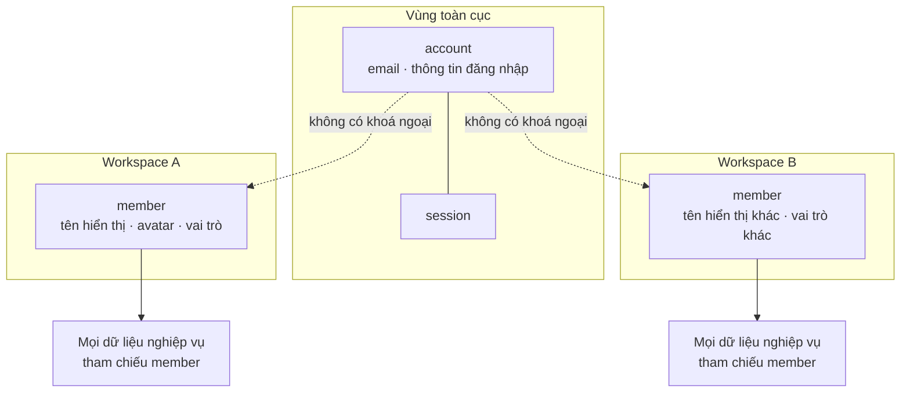
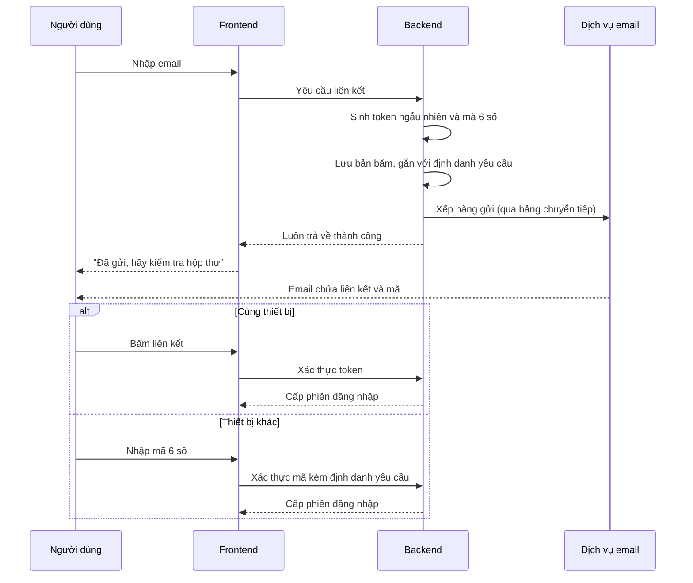

# Danh tính và phân quyền

Danh tính chia làm hai tầng: một `account` toàn cục dùng để đăng nhập, và một
`member` cho mỗi workspace dùng cho mọi việc còn lại. Xác thực chỉ có magic link.
Phân quyền dùng mặt nạ bit ở hai cấp, kèm một tầng điều kiện cho các quyền phụ
thuộc dữ liệu.

Tài liệu này mô tả **cơ chế**. Luồng người dùng đầy đủ kèm các nhánh ngoại lệ nằm
ở [use case](../03-features/usecases/).

**Liên quan:** [ADR-0009](../adr/0009-magic-link-only.md) · [ADR-0010](../adr/0010-bitmask-permission.md) · [ADR-0011](../adr/0011-account-vs-member.md) · [uc-auth.md](../03-features/usecases/uc-auth.md) · [uc-member-invite.md](../03-features/usecases/uc-member-invite.md)

---

## Mô hình danh tính hai tầng



| | `account` | `member` |
|---|---|---|
| Phạm vi | Toàn hệ thống | Một workspace |
| Định danh bằng | Email | Cặp workspace và người |
| Giữ gì | Email, thông tin đăng nhập, giá trị mặc định để điền sẵn | Tên hiển thị, avatar, múi giờ, ngôn ngữ, vai trò, trạng thái |
| Dữ liệu nghiệp vụ tham chiếu | **Không bao giờ** | **Luôn luôn** |
| Có thể tồn tại độc lập | Có (chưa tham gia workspace nào) | Có (được mời nhưng chưa có tài khoản) |

Lý do tách và hệ quả đầy đủ: [ADR-0011](../adr/0011-account-vs-member.md).

### Ba tình huống mà mô hình này giải quyết

| Tình huống | Cách hoạt động |
|---|---|
| Gán việc cho người chưa đăng ký | `member` được tạo ngay lúc mời, ở trạng thái chờ. Gán issue, cấp quyền bình thường. Khi người đó chấp nhận thì chỉ gắn `account` vào |
| Người rời workspace | `member` chuyển sang vô hiệu, dòng vẫn còn. Issue họ tạo hai năm trước vẫn hiển thị đúng tên |
| Xoá tài khoản | Các `member` mất liên kết tới `account` và bị vô hiệu; dữ liệu nghiệp vụ nguyên vẹn |

### Đồng bộ thông tin giữa hai tầng

Đổi tên hiển thị ở một workspace **không** lan sang workspace khác. Giá trị mặc
định ở `account` chỉ dùng để **điền sẵn** khi tạo `member` mới.

Muốn áp dụng cho tất cả thì phải là một hành động tường minh của người dùng, và
hành động đó ghi vào từng workspace. Giữ như vậy để **mọi thao tác đọc đều nằm
gọn trong một tenant** — điều kiện để phân mảnh về sau.

Tuỳ chọn thông báo và múi giờ cũng thuộc `member`: người ta muốn nhận email từ
workspace công ty nhưng im lặng ở workspace cá nhân.

---

## Magic link

### Cơ chế



### Các thuộc tính bảo mật

| Thuộc tính | Cách làm | Vì sao |
|---|---|---|
| Token không lưu dạng rõ | Chỉ lưu bản băm | Rò rỉ cơ sở dữ liệu không cho phép đăng nhập |
| Dùng một lần | Đánh dấu đã dùng ngay khi xác thực | Chặn việc dùng lại liên kết đã bị chuyển tiếp |
| Thời hạn ngắn | Khoảng mười phút | Thu hẹp cửa sổ tấn công |
| Vô hiệu hàng loạt | Dùng một token thì các token chưa dùng của cùng email bị vô hiệu | Tránh tồn đọng nhiều liên kết còn hiệu lực |
| Không tiết lộ sự tồn tại | Luôn trả về thành công dù email có tài khoản hay không | Chặn việc dò danh sách email |
| Giới hạn tần suất | Theo email và theo địa chỉ IP | Chặn lạm dụng và chặn dùng hệ thống để gửi thư rác |
| Ràng buộc thiết bị | Token gắn với định danh yêu cầu sinh ra lúc gửi | Mở liên kết ở thiết bị khác thì phải nhập mã, giảm rủi ro bị lừa chuyển tiếp email |

### Vì sao bắt buộc có mã 6 số

Người dùng thường mở hộp thư trên điện thoại trong khi đang đăng nhập trên máy
tính. Nếu chỉ có liên kết, họ đăng nhập được trên điện thoại chứ không phải trên
thiết bị đang cần. **Đây không phải tính năng phụ mà là điều kiện để luồng đăng
nhập dùng được trong thực tế.**

### Phiên đăng nhập

| Thành phần | Tính chất |
|---|---|
| Token truy cập | Thời hạn ngắn, chỉ mang danh tính `account`, **không mang danh sách quyền** |
| Token làm mới | Lưu dạng băm, xoay vòng mỗi lần dùng, gắn với một phiên cụ thể |
| Phiên | Ghi thiết bị, địa chỉ IP, lần truy cập gần nhất; người dùng xem và thu hồi được |

**Token truy cập không mang quyền.** Nếu mang thì khi đuổi ai đó khỏi workspace,
họ vẫn giữ quyền cho tới khi token hết hạn. Quyền được tra và cache theo từng
request, xoá cache ngay khi có thay đổi.

Phát hiện dùng lại token làm mới đã bị xoay vòng thì thu hồi toàn bộ phiên của
tài khoản đó — dấu hiệu token đã bị đánh cắp.

---

## Token lời mời

**Token lời mời chính là một magic link.** Người bấm được liên kết trong hộp thư
của họ đã chứng minh sở hữu email đó, nên không cần thêm bước xác thực email nào
nữa. Người chưa có tài khoản đi thẳng từ email vào workspace.

Khác biệt duy nhất so với magic link thông thường: thời hạn dài hơn (khoảng một
tuần), và khi xác thực thì ngoài việc cấp phiên còn gắn `account` vào `member` đã
tạo sẵn.

Các nhánh xử lý đầy đủ: [uc-member-invite.md](../03-features/usecases/uc-member-invite.md).

---

## Phân quyền bằng mặt nạ bit

### Bố trí

Quyền chia hai nhóm theo phạm vi:

| Nhóm | Ví dụ |
|---|---|
| Cấp workspace | Quản trị workspace, mời thành viên, xoá thành viên, tạo project, sửa cấu hình |
| Cấp project | Xem issue, tạo issue, sửa issue, xoá issue, gán người, thực hiện bước chuyển, quản trị workflow, quản trị board, quản lý sprint |

### Tính quyền hiệu lực

```
mặt nạ hiệu lực = mặt nạ vai trò workspace
                ∪ mặt nạ vai trò project
                ∪ mặt nạ từ các group người dùng thuộc về
```

Kiểm tra một quyền là phép giao bit. Rẻ, và **đẩy được xuống tầng SQL** để lọc
danh sách trong một truy vấn duy nhất thay vì tải về rồi lọc.

### Ràng buộc về kích thước

Một số nguyên 64 bit chỉ an toàn cho khoảng 63 quyền. Riêng phần quản lý issue và
workflow đã chiếm phần lớn con số đó, chưa kể quyền cấp workspace.

**Phải thiết kế cho trường hợp vượt 64 bit ngay từ đầu** — nhiều phần ghép lại,
hoặc một kiểu chuỗi bit. Nếu bắt đầu bằng một số nguyên đơn rồi mới đổi thì phải
sửa mọi truy vấn đã viết.

### Vị trí bit là hợp đồng dữ liệu

**Không bao giờ đổi ý nghĩa hay dùng lại một vị trí bit đã cấp.** Quyền bị bỏ thì
để trống vị trí đó vĩnh viễn. Dùng lại một vị trí nghĩa là mọi vai trò đã lưu
trong cơ sở dữ liệu đột nhiên mang một quyền khác — và không có cách nào phát
hiện bằng test.

### Cache

Mặt nạ hiệu lực được cache theo cặp người dùng và phạm vi. Xoá cache khi vai trò
đổi, khi thành viên bị thêm hoặc bớt, khi group đổi thành viên.

**Việc xoá cache phải đi kèm phát sự kiện thu hồi quyền cho sync engine**
([realtime-and-sync.md](realtime-and-sync.md#khi-quyền-bị-thu-hồi)). Xoá cache mà
không báo cho client thì client vẫn giữ nguyên dữ liệu đã tải về.

### Gỡ lỗi

Mặt nạ thô không đọc được bằng mắt. Cần một tiện ích giải mã mặt nạ thành danh
sách tên quyền, và **nhật ký phải ghi tên quyền, không ghi con số**.

---

## Permission condition

Mặt nạ bit không biểu diễn được quyền phụ thuộc dữ liệu: "chỉ sửa issue mình
tạo", "chỉ xem issue của team mình". Đó không phải một bit.

Giải pháp: một tầng mỏng chạy **sau** khi mặt nạ đã cho phép.

```
kiểm tra quyền = mặt nạ cho phép
                 VÀ mọi điều kiện gắn với quyền đó đều thoả
```

Các điều kiện dự kiến: chỉ người báo cáo, chỉ người được gán, chỉ người dẫn dắt
project, chỉ thành viên của một group.

**Chỗ nối cho tầng này phải có ngay từ Phase 1**, dù chưa hiện thực điều kiện
nào. Nghĩa là mọi lời gọi kiểm tra quyền đi qua một điểm vào duy nhất nhận cả
ngữ cảnh dữ liệu, không phải chỉ nhận mặt nạ. Thêm vào sau nghĩa là sửa mọi chỗ
gọi trong toàn bộ hệ thống.

---

## Bốn vai trò mặc định

| Vai trò | Phạm vi |
|---|---|
| `OWNER` | Toàn quyền, gồm xoá workspace và chuyển quyền sở hữu. Luôn phải có ít nhất một |
| `ADMIN` | Quản trị workspace, mời và xoá thành viên, tạo project |
| `MEMBER` | Tham gia các project được cấp quyền |
| `GUEST` | **Chỉ** thấy project được mời đích danh; không thấy danh bạ thành viên workspace |

### Vì sao `GUEST` phải có từ Phase 1

`GUEST` là ca kiểm thử buộc hệ thống **không được giả định** rằng thành viên
workspace thì thấy mọi project, và không được giả định rằng ai cũng nhận được
scope workspace đầy đủ.

Nếu Phase 1 bỏ qua vai trò này, giả định sai sẽ nằm rải khắp code — trong truy
vấn danh sách project, trong ô chọn người, trong việc cấp scope đồng bộ — và
Phase sau sẽ phải đi gỡ từng chỗ.

---

## Liên kết với sync engine

Bốn sự kiện nối phân quyền với đồng bộ, phải được xử lý ngay từ Phase 0:

| Sự kiện | Client phải làm gì |
|---|---|
| Thành viên được thêm vào project hoặc workspace | Mở đăng ký scope mới và tải trạng thái ban đầu |
| Thành viên bị xoá | **Xoá sạch dữ liệu cục bộ của scope đó**, huỷ mutation đang chờ thuộc scope, điều hướng khỏi màn hình đang mở |
| Vai trò thay đổi theo hướng thu hẹp | Xử lý như bị xoá đối với những scope không còn quyền |
| Lời mời được chấp nhận | Cập nhật danh bạ thành viên trong scope workspace |
