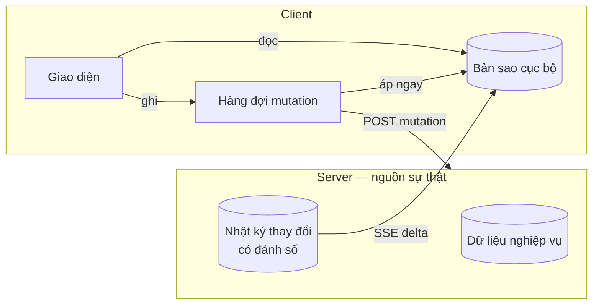
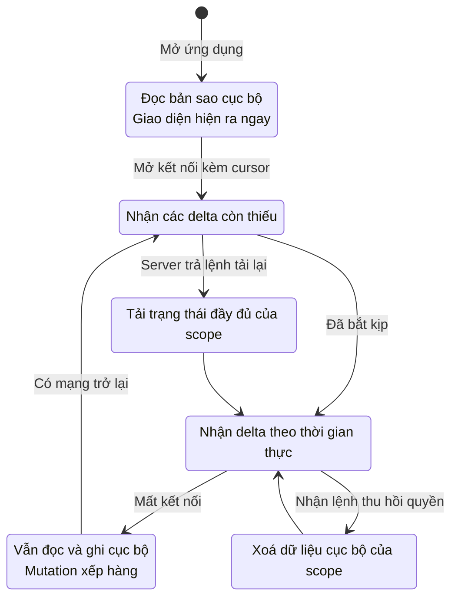
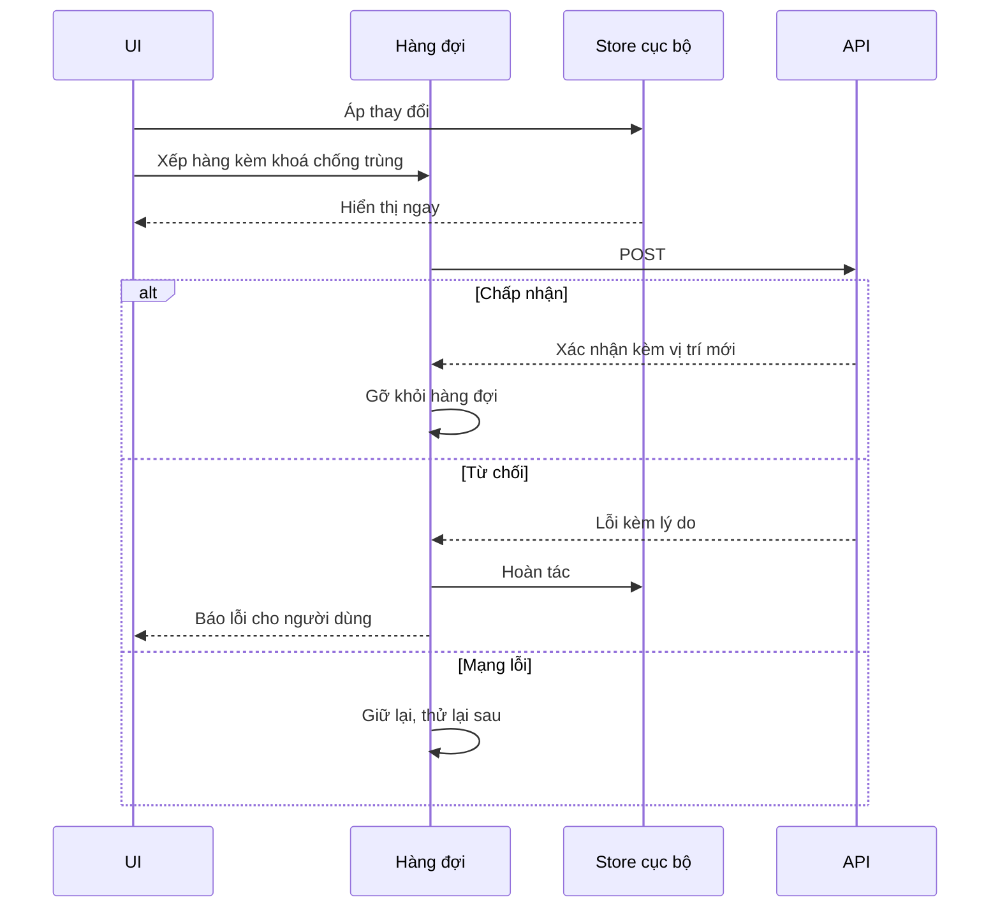
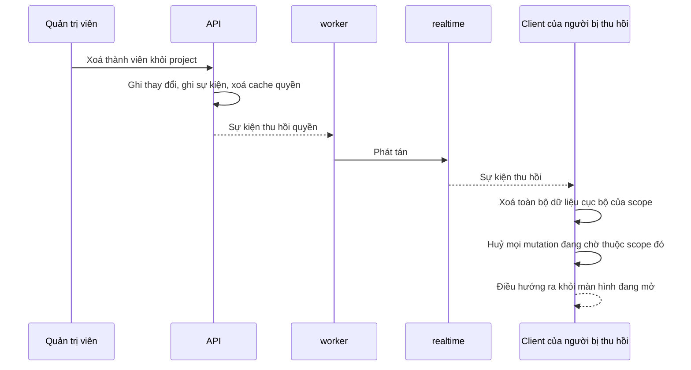
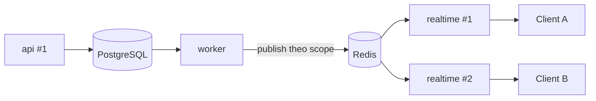

# Realtime và sync engine

Server là nguồn sự thật; client giữ một bản sao đầy đủ của phần dữ liệu nó được
phép xem và làm việc trên bản sao đó. Đồng bộ diễn ra một chiều qua SSE cho
hướng server → client, và qua HTTP POST cho hướng ngược lại.

Đây là tài liệu cốt lõi của dự án. Kiến trúc mô tả ở đây thuộc Phase 0 và **không
thể bổ sung sau**.

**Liên quan:** [ADR-0006](../adr/0006-sse-over-websocket.md) · [ADR-0007](../adr/0007-build-own-sync-engine.md) · [events-and-outbox.md](events-and-outbox.md) · [frontend.md](frontend.md) · [identity-and-permission.md](identity-and-permission.md)

---

## Mô hình



Ba khẳng định định hình toàn bộ thiết kế:

1. **Giao diện không bao giờ chờ mạng.** Nó đọc và ghi vào bản sao cục bộ.
2. **Server quyết định cuối cùng.** Client đề xuất; server chấp nhận hoặc từ chối.
3. **Không delta nào được phép mất.** Client biết chính xác mình đang ở đâu và
   yêu cầu đúng phần còn thiếu khi nối lại.

---

## Sync scope

Đơn vị đăng ký nhận thay đổi, đồng thời là ranh giới phân quyền của luồng đồng bộ.

| Scope | Chứa | Client đăng ký khi nào |
|---|---|---|
| `ws:{workspaceId}` | Danh sách project, danh bạ thành viên, vai trò, cấu hình workspace, lời mời | Mọi workspace người dùng thuộc về — dữ liệu nhẹ, giữ thường trực |
| `proj:{projectId}` | Issue, bình luận, đính kèm, sprint, board, trường tuỳ biến | Project đang mở và project được đánh dấu yêu thích |

Danh bạ thành viên nằm ở scope workspace là một lựa chọn có chủ đích: nhờ đó mọi
ô chọn người (người được gán, người theo dõi, nhắc tên) hoạt động **hoàn toàn cục
bộ**, không gọi API và dùng được khi offline.

---

## Nhật ký thay đổi và số thứ tự

Mỗi scope có một dòng thay đổi được đánh số tăng dần. Mỗi bản ghi mang: scope, số
thứ tự, loại thực thể, định danh thực thể, thao tác (tạo/sửa hoặc xoá), và
**patch chỉ chứa trường đã đổi**.

Patch chứ không phải bản ghi đầy đủ, vì hai lý do: giảm băng thông, và cho phép
ghép thay đổi của server lên trên thay đổi cục bộ chưa gửi mà không đè mất chúng.

### Cấp số thứ tự

Yêu cầu: số phải tăng đơn điệu trong scope và **không được có lỗ hổng mà client
nhìn thấy**. Nếu client nhận số 5 rồi số 7, nó không có cách nào biết số 6 là
chưa tồn tại hay là đã bị mất.

| Phương án | Cách làm | Ưu | Nhược |
|---|---|---|---|
| **A — bộ đếm theo scope** (chọn) | Tăng bộ đếm của scope ngay trong giao dịch ghi | Không bao giờ có lỗ hổng; đơn giản và đúng | Các thao tác ghi trên cùng một project bị tuần tự hoá |
| B — số toàn cục kèm mốc an toàn | Dùng bộ sinh số toàn cục, client chỉ tin phần số đã "đóng" | Ghi song song tự do | Phức tạp hơn nhiều; cần theo dõi giao dịch đang mở |

**Chọn phương án A.** Với vài chục người cùng làm trên một project, việc tuần tự
hoá thao tác ghi ở mức một project không phải vấn đề, và tính đúng đắn quan trọng
hơn thông lượng ở đây.

> **Ngưỡng để xem lại:** khi thời gian chờ khoá ở mức project trở nên đáng kể
> trong số đo. Phương án B phải được thiết kế sẵn trên giấy trước khi cần tới,
> không phải thiết kế lúc đang có sự cố.

### Giữ dữ liệu

Nhật ký thay đổi giữ **lâu hơn** bảng chuyển tiếp sự kiện, vì nó phục vụ những
client vắng mặt nhiều ngày. Quá thời hạn đó thì client phải tải lại trạng thái
đầy đủ thay vì bắt kịp từng thay đổi.

---

## Cursor

Client đồng bộ nhiều scope cùng lúc, nên một con số đơn lẻ không mô tả được vị
trí của nó. Cursor là **vị trí trên nhiều scope**, mã hoá thành một chuỗi mờ.

```
cursor = base64( { "ws:a1b2": 88, "proj:c3d4": 1043, "proj:e5f6": 217 } )
```

Client không diễn giải cursor; nó chỉ lưu và gửi lại. Nhờ vậy định dạng bên trong
đổi được mà không phá client cũ.

**Kiểm soát kích thước:** chỉ đưa vào cursor những scope client đang đăng ký chủ
động. Người tham gia nhiều project thì các project không mở sẽ được tải lại trạng
thái khi mở, thay vì làm cursor phình ra.

---

## Giao thức SSE

### Định dạng

```
id: eyJwcm9qOmMzZDQiOjEwNDN9
event: delta
data: {"scope":"proj:c3d4","seq":1043,"entity":"issue","op":"upsert",
       "id":"...","patch":{"status":"done","assigneeId":"..."}}

: ping

id: eyJwcm9qOmMzZDQiOjEwNDR9
event: delta
data: {...}
```

| Loại | Mục đích |
|---|---|
| `delta` | Một thay đổi trong một scope |
| `ack` | Xác nhận một mutation đã được áp, kèm vị trí mới |
| `revoked` | Quyền với một scope đã bị thu hồi; client phải xoá dữ liệu cục bộ của scope đó |
| `reset` | Cursor quá cũ hoặc không hợp lệ; client phải tải lại trạng thái đầy đủ |
| `: ping` | Dòng chú thích giữ kết nối sống, không phải sự kiện |

### Kết nối lại

Đây là lý do chính chọn SSE. Trình duyệt tự nối lại và **tự gửi lại `id` cuối
cùng nhận được** qua header `Last-Event-ID`. Server giải mã cursor đó và phát lại
phần còn thiếu của từng scope.

Toàn bộ logic nối lại, khoảng chờ tăng dần, và ghi nhớ vị trí — trình duyệt lo.
Với WebSocket, đây là phần phải tự viết, và là phần dễ sai nhất.

### Yêu cầu vận hành

| Yêu cầu | Hệ quả nếu thiếu |
|---|---|
| Nhịp tim mỗi 15–30 giây | Máy chủ trung gian đóng kết nối nhàn rỗi, client nối lại liên tục |
| Tắt đệm ở máy chủ trung gian | Delta bị giữ lại; triệu chứng là "realtime không chạy" mà không có lỗi nào |
| Virtual thread phía server | Mỗi kết nối ghim một luồng hệ điều hành thì không giữ nổi nhiều kết nối |
| Bật HTTP/2 | Giới hạn số kết nối trên mỗi nguồn không còn là vấn đề |

---

## Vòng đời client



**Điểm quan trọng nhất:** giao diện hiển thị nội dung ở bước đầu tiên, trước khi
có bất kỳ phản hồi nào từ server. Mọi bước sau chỉ làm dữ liệu mới hơn.

### Bootstrap

Xảy ra khi client chưa có dữ liệu của scope, hoặc cursor cũ hơn thời hạn giữ nhật
ký thay đổi. Server trả trạng thái đầy đủ của scope kèm số thứ tự tại thời điểm
chụp, client thay thế toàn bộ dữ liệu cục bộ của scope rồi tiếp tục nhận delta từ
số đó.

Bootstrap phải **nhất quán**: ảnh chụp và số thứ tự đi kèm phải thuộc cùng một
thời điểm, nếu không sẽ có thay đổi bị lặp hoặc bị bỏ sót.

---

## Mutation

Đi qua HTTP POST, **không** đi qua luồng đồng bộ.



### Khoá chống trùng

Client sinh một định danh cho mỗi mutation và gửi kèm. Khi mạng chập chờn, client
gửi lại cùng một khoá; server nhận ra và không áp thay đổi hai lần, chỉ trả lại
kết quả cũ.

Không có cơ chế này thì một lần timeout có thể tạo ra hai bình luận hoặc hai issue.

### Hàng đợi bền

Hàng đợi mutation phải **sống sót qua việc tải lại trang và đóng trình duyệt**.
Người dùng sửa một issue lúc mất mạng, đóng máy, mở lại ngày hôm sau — thay đổi
đó vẫn phải được gửi đi.

Hàng đợi xử lý **tuần tự trong phạm vi một thực thể**, để hai thay đổi liên tiếp
lên cùng một issue không tới server ngược thứ tự.

### Xử lý từ chối

| Lý do từ chối | Cách xử lý |
|---|---|
| Không đủ quyền | Hoàn tác, báo rõ lý do |
| Vi phạm quy tắc nghiệp vụ (bước chuyển không hợp lệ, thiếu trường bắt buộc) | Hoàn tác, hiển thị lỗi cụ thể từ server |
| Xung đột phiên bản | Áp trạng thái server, báo cho người dùng biết thay đổi của họ đã bị thay thế |
| Thực thể không còn tồn tại | Hoàn tác, xoá khỏi bản sao cục bộ |

**Không bao giờ âm thầm bỏ qua một mutation bị từ chối.** Người dùng đã thấy thay
đổi của mình trên màn hình; nếu nó biến mất mà không có giải thích thì họ sẽ mất
niềm tin vào công cụ.

---

## Hoà giải: rebase

Vấn đề: client có ba mutation chưa được xác nhận, và nhận về một delta từ người
khác trên cùng issue đó. Nếu áp thẳng delta, ba thay đổi cục bộ biến mất khỏi màn
hình dù chưa bị từ chối.

Cách xử lý:

```
1. Áp trạng thái từ server vào tầng "đã xác nhận"
2. Áp lại lần lượt các mutation chưa được xác nhận lên trên
3. Kết quả là thứ giao diện hiển thị
```

Bản sao cục bộ vì thế có hai tầng: **trạng thái đã xác nhận** (do server quyết
định) và **trạng thái hiển thị** (đã xác nhận cộng các mutation đang chờ). Khi
một mutation được xác nhận hoặc bị từ chối, nó rời khỏi tầng thứ hai.

---

## Xung đột

**Dữ liệu có cấu trúc: ghi sau thắng, ở mức từng trường.** Hai người sửa hai
trường khác nhau của cùng một issue thì cả hai thay đổi đều được giữ — vì delta
mang patch chứ không mang cả bản ghi. Hai người sửa cùng một trường thì người ghi
sau thắng.

Cách này dễ hiểu và đúng với kỳ vọng của người dùng trong bối cảnh quản lý công
việc. Không cần CRDT.

**Văn bản phong phú là chuyện khác.** Soạn thảo cộng tác thời gian thực trên cùng
một đoạn mô tả cần CRDT. Đó là một hệ thống riêng ở phase sau, có kho lưu riêng
và kênh truyền riêng qua WebSocket, **không trộn vào sync engine này**.

---

## Phân quyền

Phần khó nhất, và là lý do chính tự xây sync engine
([ADR-0007](../adr/0007-build-own-sync-engine.md)).

### Khi mở kết nối

Server tính danh sách scope người dùng được phép nhận, từ mặt nạ quyền hiệu lực.
Client **không** tự khai mình muốn scope nào; nó chỉ nhận những gì được phép.

### Khi quyền bị thu hồi



**Thiếu bước này thì người bị đuổi khỏi workspace vẫn giữ nguyên toàn bộ dữ liệu
trên máy và ứng dụng vẫn hiển thị bình thường cho tới khi họ tải lại trang.** Đây
là cái giá của local-first và phải được xử lý ngay từ Phase 0.

Quyền bị **thu hẹp** (đổi vai trò, mất quyền xem một project) xử lý y như bị thu
hồi hoàn toàn với scope tương ứng.

---

## Phát tán nhiều instance

Client kết nối tới một instance `realtime` bất kỳ, nhưng thay đổi phát sinh ở một
instance `api` bất kỳ. Cầu nối là cơ chế phát tán của Redis.



Mỗi instance `realtime` giữ ánh xạ từ scope tới các kết nối đang mở của nó, nhận
thông điệp và chỉ đẩy xuống những kết nối liên quan.

**Việc phát tán là gửi rồi quên.** Thông điệp phát ra lúc một instance đang khởi
động lại coi như mất — và điều đó **chấp nhận được**, vì client luôn bắt kịp được
bằng cursor. Nói cách khác, việc phát tán chỉ dùng để **thúc** gửi cho nhanh;
nguồn sự thật vẫn là nhật ký thay đổi trong PostgreSQL.

---

## Tầng truyền tải

Toàn bộ phần giao thức nằm sau một interface ở phía client: mở kết nối kèm
cursor, nhận delta, đóng. Đổi từ SSE sang WebSocket về sau chỉ phải sửa một chỗ.

Điều này không phải trừu tượng hoá phòng xa vô ích — nó có chi phí gần bằng
không, và khi thêm kênh WebSocket cho soạn thảo cộng tác thì hai tầng truyền tải
sẽ tồn tại song song.

---

## Những gì phải có test riêng

Sync engine không kiểm chứng được bằng test đơn vị thông thường. Danh sách bắt
buộc, chi tiết ở [testing-strategy.md](testing-strategy.md):

| Kịch bản | Kết quả mong đợi |
|---|---|
| Mất kết nối giữa lúc đang nhận delta | Nối lại và không bỏ sót delta nào |
| Cursor quá cũ | Nhận lệnh tải lại và trạng thái cuối cùng đúng |
| Mutation trong lúc offline, tải lại trang, có mạng lại | Mutation vẫn được gửi |
| Mutation bị từ chối | Hoàn tác đúng, các mutation khác không bị ảnh hưởng |
| Delta tới trong lúc có mutation chưa xác nhận | Rebase đúng, thay đổi cục bộ không mất |
| Thu hồi quyền | Dữ liệu cục bộ của scope bị xoá sạch |
| Nhiều tab | Chỉ một kết nối, mọi tab nhất quán |
| Khởi động lại server | Client tự nối lại và bắt kịp |
