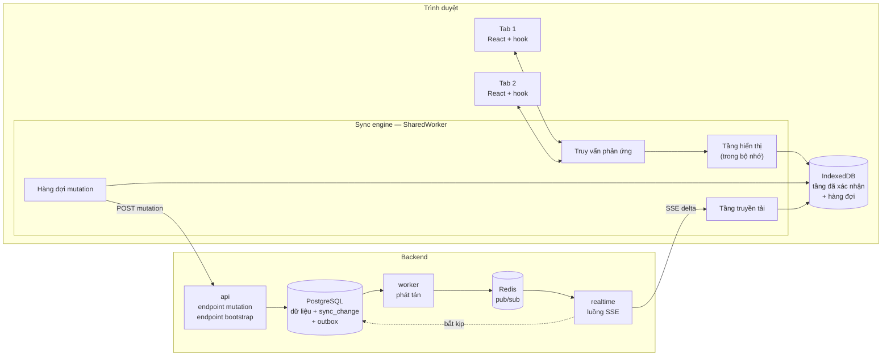
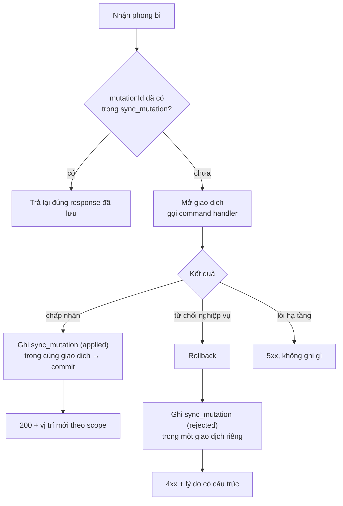
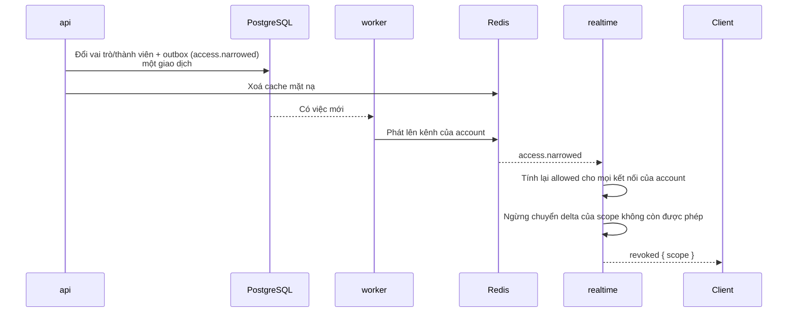
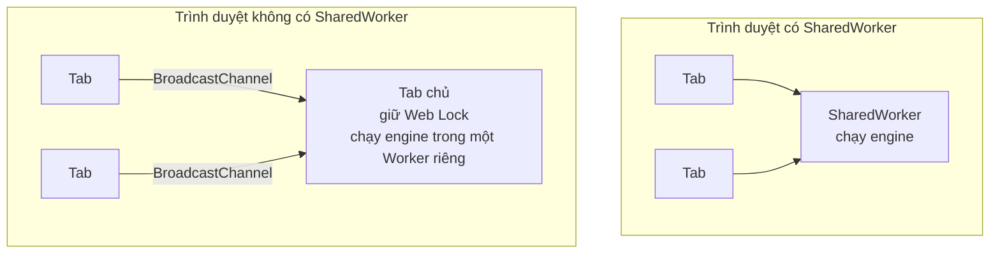
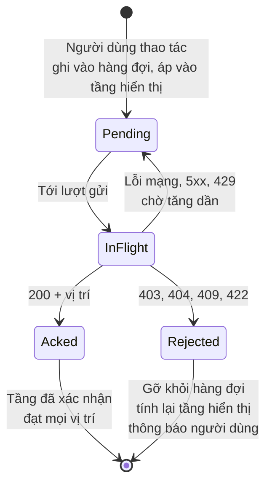
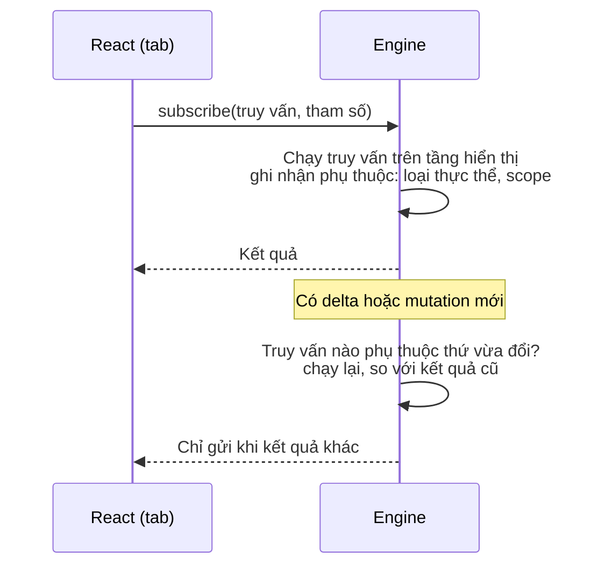

# Sync engine — mục đích, cách hoạt động, cách triển khai

Tài liệu này mô tả sync engine **từ góc nhìn của người sẽ xây nó**: gồm những
thành phần nào, dữ liệu nằm ở đâu, từng thuật toán chạy ra sao, và nên dựng theo
thứ tự nào.

Nó không lặp lại hai thứ đã có chỗ riêng:

| Muốn biết | Đọc |
|---|---|
| Giao thức: scope, seq, cursor, định dạng SSE, vòng đời client, quy tắc xung đột | [realtime-and-sync.md](realtime-and-sync.md) |
| Hành vi người dùng nhìn thấy và các nhánh ngoại lệ | [uc-19-sync.md](../03-features/usecases/uc-19-sync.md) |
| Vì sao tự xây thay vì dùng thư viện | [ADR-0007](../adr/0007-build-own-sync-engine.md) |

**Liên quan:** [realtime-and-sync.md](realtime-and-sync.md) · [frontend.md](frontend.md) · [events-and-outbox.md](events-and-outbox.md) · [identity-and-permission.md](identity-and-permission.md) · [ADR-0006](../adr/0006-sse-over-websocket.md) · [ADR-0007](../adr/0007-build-own-sync-engine.md) · [ADR-0017](../adr/0017-shadcn-and-tanstack-frontend-stack.md)

> Đường dẫn endpoint, tên bảng và tên hàm trong tài liệu này là **minh hoạ** để
> mô tả cơ chế. Tên chính thức chốt ở [07-detail-design](../07-detail-design/)
> khi viết code của Phase 0.

---

## Mục đích

Sync engine tồn tại để giữ bốn lời hứa của sản phẩm. Mỗi lời hứa kéo theo một
phần của cơ chế:

| Lời hứa với người dùng | Yêu cầu | Phần của cơ chế gánh nó |
|---|---|---|
| Mọi thao tác phản hồi **tức thì** | FR-SYN-01, FR-SYN-02 | Bản sao cục bộ, áp lạc quan, truy vấn cục bộ |
| **Mất mạng vẫn làm việc được** | FR-SYN-03 | Hàng đợi mutation bền, định danh do client sinh |
| Thấy thay đổi của người khác **không cần tải lại** | FR-SYN-05, FR-SYN-06 | Nhật ký thay đổi có đánh số, luồng SSE, cursor |
| **Không bao giờ thấy thứ mình không được thấy** | FR-SYN-09, NFR-20, NFR-22 | Phân quyền theo scope ở server, thu hồi và xoá dữ liệu cục bộ |

Lời hứa thứ tư là lý do dự án tự xây: mọi quyết định phân quyền đều đi qua
Spring, không có đường tắt nào từ PostgreSQL thẳng xuống trình duyệt.

---

## Toàn cảnh



Đọc sơ đồ theo hai vòng:

1. **Vòng ghi** — người dùng thao tác → hàng đợi → áp ngay vào tầng hiển thị →
   POST lên `api` → một giao dịch ghi dữ liệu, nhật ký thay đổi và bản ghi outbox.
2. **Vòng đọc** — `worker` đọc outbox → phát delta qua Redis → `realtime` đẩy
   xuống qua SSE → engine ghi vào tầng đã xác nhận → truy vấn phản ứng báo cho
   các tab.

Hai vòng chỉ gặp nhau ở một chỗ: **tầng đã xác nhận ở client chỉ được đổi bởi
vòng đọc**. Mutation của chính người dùng cũng phải đi hết vòng đọc rồi mới trở
thành "đã xác nhận". Quy tắc này giữ cho client không bao giờ có hai nguồn sự
thật.

---

## Hợp đồng dữ liệu: bản trình bày đồng bộ

Client không nhìn thấy bảng của server. Nó nhìn thấy **bản trình bày đồng bộ**
(sync representation) của từng loại thực thể: một đối tượng phẳng, chỉ gồm các
trường mà client được phép và cần giữ.

| Quy tắc | Vì sao |
|---|---|
| Mỗi loại thực thể có **một** bản trình bày, do module sở hữu thực thể đó định nghĩa trong package `api` | Một khái niệm chỉ có một chủ, đúng [luật biên giới](backend-modules.md#ba-luật-biên-giới) |
| Khoá của một thực thể là cặp `(loại, định danh)` | Định danh do client sinh ([CON-61](../02-requirement/constraints.md)), duy nhất toàn cục |
| Mỗi thực thể thuộc **đúng một** scope | Để việc thu hồi quyền có ranh giới rõ ràng: xoá scope là xoá sạch |
| Patch được tính trên bản trình bày, **không** trên cột của bảng | Đổi schema cơ sở dữ liệu không được làm đổi giao thức |
| Tham chiếu tới người luôn là định danh `member` | [CON-17](../02-requirement/constraints.md); danh bạ member nằm trong scope workspace |

Việc thực thể chuyển scope (ví dụ chuyển issue sang project khác) được biểu diễn
bằng **hai** delta: `delete` ở scope cũ và `upsert` đầy đủ ở scope mới. Client
không cần hiểu khái niệm "di chuyển".

---

## Phía server

Toàn bộ phần dùng chung nằm ở `platform/sync` ([backend-modules.md](backend-modules.md#cấu-trúc-gradle)).
`platform` không được phụ thuộc `modules/*`, nên mọi chỗ cần biết về một loại
thực thể cụ thể đều đi qua **điểm cắm** mà module tự đăng ký — xem
[điểm cắm cho module](#điểm-cắm-cho-module).

### Bảng

`platform/sync` sở hữu tiền tố `sync_`. Tiền tố này phải được đăng ký vào test
quyền sở hữu bảng như mọi module khác.

| Bảng | Một dòng là | Cột chính | Ghi chú |
|---|---|---|---|
| `sync_scope` | Một scope | `scope`, `workspace_id`, `last_seq`, `min_retained_seq` | Dòng này **là** bộ đếm của phương án A |
| `sync_change` | Một thay đổi của một thực thể | `scope`, `seq`, `workspace_id`, `entity_type`, `entity_id`, `op`, `patch`, `mutation_id`, `actor_member_id`, `created_at` | Khoá chính `(scope, seq)`; chỉ ghi thêm; phân vùng theo thời gian |
| `sync_mutation` | Một mutation đã xử lý | `mutation_id`, `workspace_id`, `account_id`, `name`, `outcome`, `response`, `created_at` | Bảng chống trùng; `account_id` không khai báo khoá ngoại ([CON-18](../02-requirement/constraints.md)) |

Cả ba bảng đều có `workspace_id` và bật bảo mật mức dòng (invariant 9, 10).
`realtime` và `worker` đọc chúng qua cùng cơ chế context workspace như mọi tiến
trình nền khác.

### Ghi một thay đổi

Mọi command handler làm cùng một việc ở cuối giao dịch — đây là lý do chọn
Spring Data JDBC ([data-access-and-tenancy.md](data-access-and-tenancy.md#1-không-có-dirty-checking)):

```
trong giao dịch của command:
    before = load aggregate
    after  = áp thay đổi trong domain
    lưu after

    changes.record(scope, entityType, id, represent(before), represent(after), mutationId)
        → khoá dòng sync_scope của scope và tăng last_seq      (UPDATE … RETURNING)
        → patch = diff(represent(before), represent(after))
        → nếu patch rỗng: không ghi gì, trả seq hiện tại
        → ghi một dòng sync_change với seq vừa cấp

    outbox.append(domain event)
    outbox.append(sync.committed { scope → [seq…] })          ← một bản ghi cho cả giao dịch
commit
```

Ba điểm làm cách này đúng:

| Điểm | Giải thích |
|---|---|
| **Không có lỗ hổng seq** | Việc tăng bộ đếm nằm trong giao dịch. Giao dịch rollback thì số đó chưa từng tồn tại |
| **Thứ tự commit trùng thứ tự seq** | Khoá dòng `sync_scope` được giữ tới lúc commit, nên giao dịch lấy seq 6 chỉ chạy tiếp được sau khi giao dịch lấy seq 5 đã commit. Không bao giờ có chuyện số 6 hiện ra trước số 5 |
| **Patch rỗng không sinh delta** | Người dùng đặt lại đúng giá trị cũ thì không có gì để đồng bộ |

**Giao dịch chạm nhiều scope phải khoá theo thứ tự cố định** (ví dụ sắp theo tên
scope). Không làm vậy thì hai giao dịch khoá chéo nhau sẽ gây deadlock.

Nếu một command không đi qua `changes.record` thì client **không bao giờ** biết
dữ liệu đã đổi. Vì vậy cần một test liệt kê mọi command handler có ghi dữ liệu
và kiểm tra chúng có gọi tới bộ ghi thay đổi, tương tự test "mọi hành động đều
khai báo quyền" ở [identity-and-permission.md](identity-and-permission.md#mặc-định-là-từ-chối).

### Endpoint mutation

Tất cả mutation đi qua **một** endpoint, dưới dạng một phong bì chung:

```json
POST /api/mutations
{
  "mutationId": "0192f…",
  "name": "issue.update",
  "args": { "id": "0192e…", "patch": { "statusId": "…" } },
  "createdAt": "2026-09-23T08:12:03Z"
}
```

Vì sao một endpoint thay vì mỗi thao tác một endpoint REST:

- Hàng đợi ở client chỉ cần biết một dạng request, nên nó xử lý chung được việc
  lưu bền, thử lại và chống trùng
- Việc chống trùng nằm ở **một** chỗ phía server, không phải lặp lại ở từng controller
- `name` ánh xạ tới đúng một command handler qua một danh mục đăng ký. Quyền vẫn
  được kiểm tra ở command handler ([CON-60](../02-requirement/constraints.md)), không
  ở endpoint này

Luồng xử lý:



**Mutation bị từ chối cũng phải được ghi lại.** Nếu không, client gửi lại (vì
chưa nhận được response) có thể được **chấp nhận** ở lần hai — trong khi lần một
nó đã bị từ chối và có thể client đã hoàn tác trên giao diện.

Response và cách client phản ứng:

| Response | Ý nghĩa | Client làm gì |
|---|---|---|
| `200` kèm `positions: { "proj:c3d4": 1044 }` | Đã áp | Chờ tầng đã xác nhận tới vị trí đó rồi mới gỡ mutation — xem [vòng đời mutation](#vòng-đời-một-mutation) |
| `200` kèm `positions: {}` | Đã áp nhưng không đổi gì | Gỡ ngay |
| `403` | Không đủ quyền | Hoàn tác, báo lý do |
| `422` | Vi phạm quy tắc nghiệp vụ | Hoàn tác, hiển thị lỗi cụ thể từ server |
| `409` | Xung đột phiên bản | Bỏ thay đổi cục bộ, giữ trạng thái server, báo người dùng |
| `404` | Thực thể không còn tồn tại | Hoàn tác, xoá khỏi bản sao cục bộ |
| `429`, `5xx`, lỗi mạng, hết giờ | Chưa biết đã áp hay chưa | **Giữ lại**, gửi lại **cùng** `mutationId` với khoảng chờ tăng dần |

Bốn mã từ chối khớp đúng bốn nhánh ngoại lệ của UC-SYN-03.

### Bootstrap

```
GET /api/sync/bootstrap?scope=proj:c3d4

trong một giao dịch chỉ đọc, mức cô lập REPEATABLE READ:
    seq = SELECT last_seq FROM sync_scope WHERE scope = ?
    với mỗi loại thực thể thuộc scope: đọc toàn bộ bản trình bày
trả về dạng luồng: dòng đầu là {scope, seq}, mỗi dòng sau là một thực thể
```

Tính nhất quán giữa ảnh chụp và số thứ tự (QT-SYN-03) **có sẵn nhờ phương án A**.
Mọi giao dịch ghi đều tăng `last_seq` và ghi dữ liệu trong **cùng** một giao
dịch, nên một ảnh chụp REPEATABLE READ hoặc nhìn thấy cả hai, hoặc không thấy
cái nào. Không cần khoá gì thêm.

Scope lớn (hàng chục nghìn issue) được trả dạng luồng, mỗi dòng một thực thể, để
cả server lẫn client không phải giữ toàn bộ ảnh chụp trong bộ nhớ.

Bootstrap đi qua `api`, không qua `realtime`: nó là một request đọc ngắn, có thể
nặng, và nên scale theo `api` thay vì chiếm tài nguyên của vai trò giữ kết nối.

### Điểm cắm cho module

`platform/sync` không biết issue là gì. Mỗi module đăng ký các loại thực thể của
mình qua một interface do `platform/sync` định nghĩa:

| Module khai báo | Dùng cho |
|---|---|
| Tên loại thực thể và phiên bản bản trình bày | Delta, schema cục bộ ở client |
| Hàm xác định scope của một thực thể | Ghi thay đổi, bootstrap |
| Hàm đọc toàn bộ thực thể của một scope | Bootstrap |
| Danh sách mutation và command handler tương ứng | Endpoint mutation |

Đây là **đảo ngược phụ thuộc**: module phụ thuộc vào `platform/sync`, không có
chiều ngược lại. `bootstrap/` (Gradle module lắp ráp ứng dụng) gom mọi đăng ký lại.

### Luồng SSE ở vai trò `realtime`

Phần khó nhất phía server là **nối liền đoạn bắt kịp với đoạn trực tiếp** mà
không sót và không trùng. Thứ tự sau là bắt buộc:

```
1. Xác thực kết nối, xác định account
2. allowed = tập scope được phép, tính từ mặt nạ quyền hiện tại
3. Đăng ký kênh Redis cho mọi scope trong allowed, và kênh riêng của account
   → mọi thông điệp tới từ lúc này được ĐỆM lại, chưa gửi
4. Giải mã cursor (Last-Event-ID, hoặc tham số cursor nếu là kết nối mới)
5. Với mỗi scope trong cursor:
     không thuộc allowed                 → gửi `revoked`
     seq < min_retained_seq              → gửi `reset`
     còn lại                             → đọc sync_change có seq > seq_client, gửi theo thứ tự
6. Xả bộ đệm: bỏ qua delta có seq ≤ seq đã gửi của scope đó
7. Chế độ trực tiếp: nhận delta từ Redis
     seq == đã gửi + 1   → gửi
     seq ≤ đã gửi        → bỏ qua (trùng)
     seq > đã gửi + 1    → có lỗ hổng: đọc phần thiếu từ sync_change rồi mới gửi
8. Nhịp tim mỗi 15–30 giây
```

Đăng ký Redis **trước** khi đọc phần bắt kịp (bước 3 trước bước 5) là mấu chốt.
Đảo ngược thì mọi delta phát ra trong lúc đang đọc cơ sở dữ liệu sẽ rơi vào khe
hở giữa hai bước và mất hẳn.

Bước 7 là thứ biến Redis thành "chỉ để thúc": mất một thông điệp pub/sub thì
delta kế tiếp để lộ lỗ hổng, và `realtime` tự lấp từ PostgreSQL. Không có delta
kế tiếp thì client bắt kịp ở lần nối lại. Không đường nào làm mất dữ liệu.

Mỗi sự kiện `delta` mang `id` là cursor **đầy đủ** tại thời điểm đó, để lần nối
lại tự động của trình duyệt luôn gửi đúng vị trí mới nhất.

### Phát tán ở vai trò `worker`

Bên tiêu thụ "phát tán đồng bộ" ([events-and-outbox.md](events-and-outbox.md#bên-tiêu-thụ-dự-kiến))
nghe bản ghi `sync.committed` mà mỗi giao dịch ghi kèm, đọc các dòng
`sync_change` tương ứng, và phát lên kênh `sync:scope:{scope}`.

| Điểm | |
|---|---|
| Chia việc theo scope | Bản ghi `sync.committed` dùng scope làm khoá phân việc, nên delta của một scope được phát gần đúng thứ tự. Không bắt buộc đúng tuyệt đối — `realtime` tự sắp lại ở bước 7 |
| Chống trùng | Không cần bảng ghi nhận: phát lại một delta chỉ tạo ra bản trùng mà `realtime` bỏ qua theo seq |
| Payload | Gửi luôn delta đầy đủ, để `realtime` không phải xuống cơ sở dữ liệu trong trường hợp bình thường |

### Thu hồi quyền



Hai chốt chặn độc lập, để một cái hỏng thì cái kia vẫn giữ:

1. **Ngay khi nhận thông điệp**, `realtime` ngừng chuyển delta của scope bị thu
   hồi cho kết nối đó — trước cả khi client kịp xoá gì
2. **Khi nối lại**, bước 5 của luồng SSE gửi `revoked` cho mọi scope trong cursor
   không còn thuộc `allowed`. Đây là cách xử lý UC-SYN-09/NL-01 (người dùng đang
   offline lúc bị thu hồi): server chủ động báo, client không phải tự suy ra

### Giữ dữ liệu

Tác vụ định kỳ ở `scheduler` xoá các dòng `sync_change` quá thời hạn và nâng
`min_retained_seq` của scope tương ứng — **trong cùng giao dịch**, để không có
lúc nào dòng đã xoá mà mốc chưa nâng.

> **Chưa chốt:** thời hạn giữ `sync_change` và `sync_mutation`. Ràng buộc duy
> nhất đã biết: thời hạn giữ `sync_mutation` phải **dài hơn hoặc bằng** thời
> hạn giữ `sync_change`, và hàng đợi ở client phải từ chối gửi mutation cũ hơn
> thời hạn đó thay vì gửi mù — nếu không, một mutation đã áp nhưng mất response
> có thể bị áp lần hai sau khi bản ghi chống trùng đã bị xoá.

### Xác thực luồng SSE

> **Chưa chốt — cần quyết định trước KJ-SYN-06.**
>
> [ADR-0006](../adr/0006-sse-over-websocket.md) ghi rằng xác thực SSE "đi tự nhiên
> qua cookie hoặc header". Điều đó chỉ đúng một nửa: `EventSource` của trình
> duyệt **không cho đặt header**, và token truy cập theo
> [frontend.md](frontend.md#xác-thực-phía-client) chỉ nằm trong bộ nhớ của
> SharedWorker. Vậy luồng SSE chỉ còn đường cookie.
>
> Hướng đề xuất:
>
> - Một cookie `HttpOnly`, `Secure`, `SameSite=Strict`, **giới hạn đường dẫn**
>   ở endpoint luồng đồng bộ, sống ngang token truy cập, được đặt lại mỗi lần
>   làm mới token
> - Server chỉ xác thực **lúc mở kết nối**. Kết nối đang mở không bị cắt khi
>   cookie hết hạn; việc cắt khi phiên bị thu hồi đi qua kênh Redis của account
> - Nối lại bị từ chối vì cookie hết hạn → `EventSource` dừng hẳn → engine làm
>   mới token rồi mở `EventSource` mới, truyền cursor qua tham số (vì không đặt
>   được `Last-Event-ID` cho kết nối mới)
>
> Phương án bị cân nhắc và bất lợi: đọc SSE bằng `fetch` để gắn được header —
> nhưng như vậy mất đúng thứ ADR-0006 chọn SSE để có (trình duyệt tự nối lại và
> tự gửi `Last-Event-ID`). Token ngắn hạn trên query string — lộ trong nhật ký
> của máy chủ trung gian.
>
> Chốt phương án nào thì viết ADR mới bổ sung cho ADR-0006.

---

## Phía client

Cấu trúc thư mục đã có ở [frontend.md](frontend.md#cấu-trúc-thư-mục). Phần này
mô tả những gì chạy bên trong.

### Ai chạy engine



Mã của engine giống hệt nhau ở hai trường hợp; chỉ phần "chỗ đặt" và kênh liên
lạc với tab là khác. Tab chủ đóng thì Web Lock được nhả, một tab đang chờ khoá
lấy được nó và khởi động engine, đọc lại hàng đợi từ IndexedDB — không mất gì.

**Khoá ghi luôn đi qua Web Lock, kể cả khi có SharedWorker.** SharedWorker được
định danh theo URL của script. Sau một lần triển khai, tab cũ và tab mới có hai
URL khác nhau, tức là **hai** SharedWorker cùng ghi vào một IndexedDB — đúng thứ
CON-37 cấm. Web Lock tên cố định đảm bảo chỉ một engine ghi; engine của phiên
bản mới thấy khoá đang bị giữ thì phát tín hiệu qua `BroadcastChannel` yêu cầu
các tab cũ tải lại.

### Lưu trữ trong IndexedDB

Dùng Dexie ([frontend.md](frontend.md#thư-viện)).

| Bảng | Chứa | Chỉ mục cần có |
|---|---|---|
| Một bảng cho mỗi loại thực thể | **Tầng đã xác nhận**: bản trình bày mới nhất server gửi | Khoá chính là định danh; chỉ mục theo `scope` để xoá cả scope; chỉ mục theo trường mà truy vấn hay lọc |
| `scope_state` | Mỗi scope một dòng: `seq`, trạng thái (`bootstrapping`, `live`), lần truy cập cuối, có yêu thích không | |
| `mutation` | Hàng đợi bền | Theo thứ tự tạo; theo `scope` |
| `meta` | Phiên bản schema cục bộ, định danh account | |

Tầng **hiển thị không được lưu**. Nó được tính lại trong bộ nhớ từ tầng đã xác
nhận cộng hàng đợi — lúc khởi động, engine đọc hàng đợi và phát lại các mutation
đang chờ lên trên. Lưu tầng hiển thị nghĩa là có hai bản của cùng một sự thật và
phải giữ chúng khớp nhau mãi mãi.

**`seq` của scope và dữ liệu của scope luôn được ghi trong cùng một giao dịch
IndexedDB.** Tách ra thì trình duyệt tắt giữa chừng sẽ để lại dữ liệu mới với
seq cũ (nhận lại delta — vô hại) hoặc seq mới với dữ liệu cũ (**mất delta vĩnh
viễn**).

### Mutator

Mỗi loại mutation được khai báo một lần ở `src/features/<feature>/` và đăng ký
với engine:

```ts
export const updateIssue = defineMutator({
  name: 'issue.update',
  scope: (args, read) => read.issue(args.id)?.scope,
  apply(tx, args) {
    const issue = tx.issue.get(args.id);
    if (!issue) return;
    tx.issue.put({ ...issue, ...args.patch });
  },
});
```

| Quy tắc | Vì sao |
|---|---|
| `apply` chỉ là **dự đoán**. Server có command handler riêng và là nơi quyết định | Client không được tin; `apply` sai thì người dùng thấy thay đổi rồi bị hoàn tác, không bao giờ thấy dữ liệu sai được lưu |
| `apply` phải **tất định**: cùng trạng thái vào, cùng tham số, cùng kết quả | Nó bị chạy lại mỗi lần rebase. Định danh mới, thời điểm, thứ hạng phải được tính **trước** và nằm trong `args`, không sinh bên trong `apply` |
| `args` phải tuần tự hoá được | Hàng đợi lưu chúng vào IndexedDB |
| `name` khớp với danh mục mutation ở server | Một bên đổi tên mà bên kia không đổi thì mọi mutation loại đó bị từ chối |

### Vòng đời một mutation



**Vì sao không gỡ mutation ngay khi nhận `200`.** Lúc response về, delta tương
ứng có thể chưa tới qua SSE. Gỡ ngay thì tầng hiển thị rơi về tầng đã xác nhận
(vẫn là giá trị cũ) và giao diện **nháy ngược** về trạng thái trước rồi mới nhảy
lại khi delta tới. Giữ mutation ở trạng thái `Acked` cho tới khi `seq` của scope
đạt vị trí server trả về thì không có khoảng hở nào. Sự kiện `ack` trên SSE
([realtime-and-sync.md](realtime-and-sync.md#định-dạng)) mang cùng thông tin và
được xử lý y như response HTTP.

Ngoại lệ: vị trí thuộc một scope client **không** đăng ký thì gỡ ngay, vì delta
của scope đó sẽ không bao giờ tới.

**Gửi tuần tự, một mutation một lúc, theo đúng thứ tự tạo.** Đây là cách đơn
giản nhất thoả QT-SYN-07, và còn xử lý luôn quan hệ phụ thuộc: tạo issue rồi
bình luận vào nó thì bình luận không bao giờ tới server trước issue. Với một
người dùng, thông lượng này thừa đủ.

> **Ngưỡng để xem lại:** khi hàng đợi dài sau một phiên offline làm việc gửi bù
> kéo dài tới mức người dùng nhận thấy. Lúc đó mới gửi song song giữa các thực
> thể độc lập, kèm theo dõi phụ thuộc.

Một mutation bị từ chối có thể kéo theo các mutation sau nó bị từ chối theo (tạo
issue bị từ chối → mọi thay đổi trên issue đó nhận `404`). Giao diện nên gom
chúng thành **một** thông báo thay vì bắn ra hàng loạt.

### Áp delta và rebase

Mỗi lô delta nhận từ luồng SSE được xử lý trong **một** giao dịch IndexedDB:

```
với mỗi delta (scope, seq, entity, op, patch):
    s = scope_state[scope]
    nếu scope không đăng ký            → bỏ qua
    nếu seq ≤ s.seq                    → bỏ qua (giao hàng ít nhất một lần)
    nếu seq > s.seq + 1                → lỗ hổng: dừng lô, đóng và mở lại kết nối để bắt kịp
    op = delete  → xoá thực thể
    op = upsert  → có sẵn thì trộn patch; chưa có thì patch chính là bản đầy đủ
                   (chưa có mà patch thiếu trường → bỏ qua, UC-SYN-05/NL-01)
    s.seq = seq
lưu cursor mới
commit

sau commit:
    gỡ các mutation Acked đã đạt đủ vị trí
    với các thực thể vừa đổi: tính lại tầng hiển thị bằng cách phát lại
        mọi mutation còn chờ có chạm tới chúng, theo thứ tự tạo
    báo cho tầng truy vấn danh sách thực thể đã đổi
```

Bước "tính lại tầng hiển thị" chính là **rebase** ở
[realtime-and-sync.md](realtime-and-sync.md#hoà-giải-rebase). Nhờ patch chỉ mang
trường đã đổi, hai người sửa hai trường khác nhau đều thấy kết quả của nhau; sửa
cùng một trường thì mutation cục bộ đang chờ tạm thời thắng trên màn hình, và kết
quả cuối cùng do thứ tự server nhận quyết định (CON-31).

### Truy vấn phản ứng

Truy vấn chạy **trong engine**, không chạy ở tab — áp delta và truy vấn cục bộ
không được làm giật luồng giao diện ([frontend.md](frontend.md#hiệu-năng)).



Phía React chỉ có ba hook, bọc qua `useSyncExternalStore`:

| Hook | Dùng để |
|---|---|
| `useLocalQuery(query, params)` | Danh sách: backlog, cột board, kết quả lọc |
| `useLocalEntity(type, id)` | Một thực thể: màn hình chi tiết issue |
| `useMutator(mutator)` | Trả về hàm gọi mutation; không có trạng thái "đang tải" |

Tên hook cố ý khác `useQuery`/`useMutation` của TanStack Query, để đọc code là
biết ngay dữ liệu đến từ bản sao cục bộ hay từ server
([ADR-0017](../adr/0017-shadcn-and-tanstack-frontend-stack.md)).

Sắp xếp và lọc cho danh sách lớn chạy **trong truy vấn cục bộ**. TanStack Table
chỉ quản lý cột, trạng thái sắp xếp đang chọn và giao diện; nó nhận dữ liệu đã
sắp sẵn (chế độ sắp xếp và lọc thủ công), không tự sắp hàng nghìn dòng trên luồng
giao diện.

### Bootstrap và reset ở client

```
1. Đặt scope_state = bootstrapping
2. Tải luồng bootstrap, ghi vào vùng tạm
3. Trong một giao dịch: xoá toàn bộ dữ liệu cũ của scope, chép vùng tạm vào,
   đặt seq = seq của ảnh chụp, đặt trạng thái = live
4. Tính lại tầng hiển thị cho scope — GIỮ NGUYÊN các mutation đang chờ
```

Bước 4 khác với thu hồi: `reset` chỉ nói "vị trí của bạn đã quá cũ", **không**
nói ý định của người dùng không còn hợp lệ. Các mutation chưa gửi vẫn được gửi
như bình thường.

Trong lúc bootstrap, màn hình thuộc scope đó hiển thị khung xương; các scope khác
vẫn dùng được ([frontend.md](frontend.md#trạng-thái-kết-nối-và-mutation-đang-chờ)).

### Thu hồi và dọn dẹp

| Tình huống | Engine làm gì |
|---|---|
| Nhận `revoked` | Một giao dịch: xoá mọi thực thể theo chỉ mục `scope`, xoá mutation thuộc scope, xoá `scope_state`. Sau đó báo tab điều hướng ra khỏi màn hình thuộc scope |
| Lưu trữ gần đầy | Xoá scope project lâu không truy cập, **không** yêu thích, và **không** có mutation đang chờ |
| Trình duyệt đã xoá dữ liệu | Không thấy `meta` hoặc `scope_state` → coi như lần đầu mở, bootstrap lại |
| Phiên bản schema cục bộ cũ hơn mã | Nâng cấp theo phiên bản của Dexie; không nâng được thì xoá sạch và bootstrap lại, **trừ bảng `mutation`** |
| Đăng xuất hoặc đổi account | Xoá toàn bộ cơ sở dữ liệu cục bộ |

Engine xin quyền lưu trữ bền của trình duyệt khi khởi động, để giảm khả năng dữ
liệu bị xoá ngầm. Không xin được thì vẫn chạy đúng, chỉ phải bootstrap thường hơn.

### Token và lời gọi server không qua đồng bộ

Engine giữ token truy cập trong bộ nhớ và là **nơi duy nhất** gửi request có xác
thực ([frontend.md](frontend.md#xác-thực-phía-client)). Nó cung cấp một hàm
`fetch` ủy quyền cho các tab.

Lời gọi không thuộc đồng bộ (tìm kiếm phía server, báo cáo, danh sách phiên đăng
nhập…) dùng TanStack Query ở tab, và hàm lấy dữ liệu của chúng **gọi qua hàm
`fetch` ủy quyền đó**, không tự đính kèm token. Phạm vi được phép dùng TanStack
Query: [ADR-0017](../adr/0017-shadcn-and-tanstack-frontend-stack.md).

### Trạng thái đưa ra giao diện

Engine đưa ra một nguồn trạng thái duy nhất mà thanh trạng thái đồng bộ đăng ký:

| Trường | Giá trị |
|---|---|
| `connection` | `live`, `catching-up`, `reconnecting`, `offline` |
| `pending` | Số mutation `Pending` + `InFlight` |
| `rejected` | Danh sách mutation vừa bị từ chối, kèm lý do, chờ người dùng xem |
| `bootstrapping` | Các scope đang tải lại |

Cách hiển thị từng trạng thái: [frontend.md](frontend.md#trạng-thái-kết-nối-và-mutation-đang-chờ).

---

## Thứ tự xây dựng

Theo phụ thuộc kỹ thuật, khớp với các feature `KJ-SYN` trong
[feature catalog](../03-features/README.md#phase-0--nền-tảng). Trạng thái của
từng feature chỉ nằm ở catalog.

| Bước | Dựng | Feature | Kiểm chứng được gì |
|---|---|---|---|
| 1 | Bảng `sync_*`, bộ ghi thay đổi, sinh patch | KJ-SYN-01, KJ-SYN-02 | Ghi đồng thời không tạo lỗ hổng seq |
| 2 | Endpoint mutation với chống trùng, định danh do client sinh | KJ-SYN-16, KJ-PLT-21 | Gửi lại cùng khoá không áp hai lần |
| 3 | Endpoint bắt kịp và bootstrap, cursor đa scope | KJ-SYN-03 → KJ-SYN-05 | Ảnh chụp và seq khớp nhau |
| 4 | Luồng SSE, phân quyền scope, phát tán, thu hồi | KJ-SYN-06 → KJ-SYN-09 | Nối lại không mất delta; thu hồi cắt luồng ngay |
| 5 | Engine client: chỗ đặt, lưu trữ, truy vấn phản ứng | KJ-SYN-10 → KJ-SYN-12 | Nhiều tab, một kết nối |
| 6 | Hàng đợi, áp lạc quan, hoàn tác, rebase | KJ-SYN-13 → KJ-SYN-15 | Offline, tải lại trang, delta chen giữa |
| 7 | Trạng thái kết nối, dọn dẹp, tầng truyền tải | KJ-SYN-17 → KJ-SYN-19 | |
| 8 | Bộ test kịch bản, thực thể nháp, bảy bước kiểm chứng | KJ-SYN-20, KJ-SYN-21 | [Cổng ra Phase 0](../03-features/roadmap.md#cách-kiểm-chứng) |

Phía server (bước 1–4) kiểm chứng được hoàn toàn bằng test tích hợp trước khi có
dòng code client nào. Nên làm xong và có test cho phía server trước — gỡ lỗi
đồng bộ khi **cả hai** đầu còn chưa chắc chắn là việc tốn kém nhất có thể.

---

## Những chỗ dễ sai

| Sai | Triệu chứng | Chặn bằng |
|---|---|---|
| Command handler ghi dữ liệu mà không qua bộ ghi thay đổi | Client không bao giờ thấy thay đổi, cho tới lần bootstrap sau | Test liệt kê command handler |
| Đọc phần bắt kịp **trước** khi đăng ký Redis | Thỉnh thoảng mất một delta lúc vừa kết nối, không tái hiện được | Thứ tự ở bước 3 và 5 của luồng SSE; test dựng đúng khe hở đó |
| Ghi `seq` và dữ liệu cục bộ ở hai giao dịch IndexedDB | Mất delta vĩnh viễn sau khi trình duyệt bị tắt giữa chừng | Review; test giết engine giữa lô |
| Gỡ mutation ngay khi nhận `200` | Giao diện nháy ngược một nhịp sau mỗi thao tác | Trạng thái `Acked` |
| `apply` sinh định danh hoặc thời điểm bên trong | Mỗi lần rebase ra một kết quả khác, thực thể "nhảy" trên màn hình | Quy tắc tất định của mutator |
| Không ghi lại mutation bị từ chối | Gửi lại sau timeout được chấp nhận dù lần đầu đã bị từ chối | Luồng endpoint mutation |
| Giao dịch chạm nhiều scope khoá không theo thứ tự | Deadlock ngẫu nhiên khi tải cao | Khoá theo thứ tự cố định |
| Hai phiên bản engine cùng ghi sau khi triển khai | Dữ liệu cục bộ hỏng không rõ lý do | Web Lock cho bên ghi |
| Xoá hàng đợi khi `reset` | Mất việc người dùng làm lúc offline | Bước 4 của bootstrap ở client |
| Dùng TanStack Query cho dữ liệu có scope đồng bộ | Hai bản sao của cùng dữ liệu, màn hình này đúng màn hình kia cũ | Luật kiểm tra mã nguồn, [ADR-0017](../adr/0017-shadcn-and-tanstack-frontend-stack.md) |
